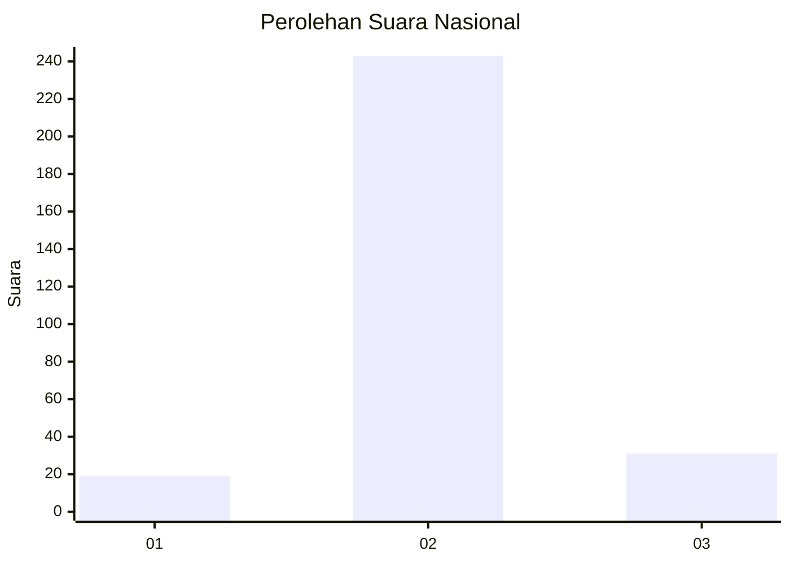
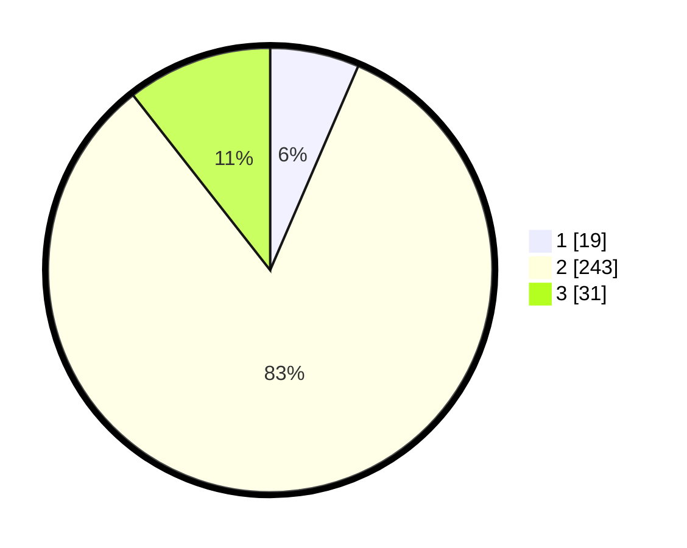

# Hasil

## Grafik

## Tabel

| No. | Nama Paslon    | Suara | Suara (raw) | Persentase |
|:--- |:-------------- | -----:| -----------:| ----------:|
| 1   | ANIES MUHAIMIN | 19    | [19][p-1]   | 6,48       |
| 2   | PRABOWO GIBRAN | 243   | [243][p-2]  | 82,94      |
| 3   | GANJAR MAHFUD  | 31    | [31][p-3]   | 10,58      |

[p-1]: https://github.com/gigit-pemilu/pemilu-2024/blob/main/pilpres/hitung-suara/sub/94-papua-tengah/sub/01-nabire/sub/01-nabire/sub/1001-wonorejo/sub/001-tps/sub/paslon-1.txt
[p-2]: https://github.com/gigit-pemilu/pemilu-2024/blob/main/pilpres/hitung-suara/sub/94-papua-tengah/sub/01-nabire/sub/01-nabire/sub/1001-wonorejo/sub/001-tps/sub/paslon-2.txt
[p-3]: https://github.com/gigit-pemilu/pemilu-2024/blob/main/pilpres/hitung-suara/sub/94-papua-tengah/sub/01-nabire/sub/01-nabire/sub/1001-wonorejo/sub/001-tps/sub/paslon-3.txt

## Foto C Plano

https://sirekap-obj-formc.kpu.go.id/13e1/pemilu/ppwp/94/01/01/10/01/9401011001001-20240216-130428--0cba2920-aa8c-4de5-a961-4df0fd8a2776.jpg

https://sirekap-obj-formc.kpu.go.id/13e1/pemilu/ppwp/94/01/01/10/01/9401011001001-20240216-130430--141235ad-d8a4-4ca5-8a05-c41d83d792cd.jpg

https://sirekap-obj-formc.kpu.go.id/13e1/pemilu/ppwp/94/01/01/10/01/9401011001001-20240216-130429--d9192a8d-7d9a-4baa-8495-899f865b22cf.jpg

## Metadata

| Key        | Value               |
| ---------- | ------------------- |
| Time Stamp | 2024-02-16 23:30:00 |

## DATA PEMILIH TETAP

Jumlah pemilih dalam DPT: **296**.
 * L: **133**.
 * P: **163**.

## DATA PENGGUNA HAK PILIH

Jumlah pengguna hak pilih dalam DPT: **296**.
 * L: **133**.
 * P: **163**.

Jumlah pengguna hak pilih dalam DPTb: **0**.
 * L: **0**.
 * P: **0**.

Jumlah pengguna hak pilih dalam DPK: **0**.
 * L: **0**.
 * P: **0**.

Jumlah pengguna hak pilih: **296**.
 * L: **133**.
 * P: **163**.

## JUMLAH SUARA SAH DAN TIDAK SAH

JUMLAH SELURUH SUARA SAH: **293**.

JUMLAH SUARA TIDAK SAH: **3**.

JUMLAH SELURUH SUARA SAH DAN SUARA TIDAK SAH: **296**.

