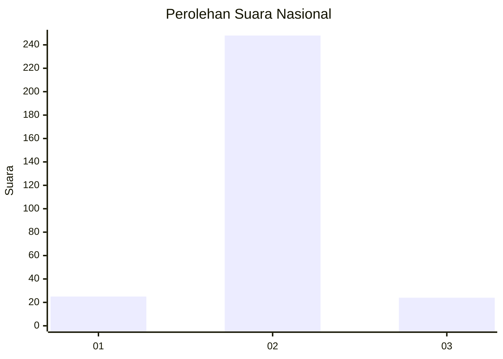
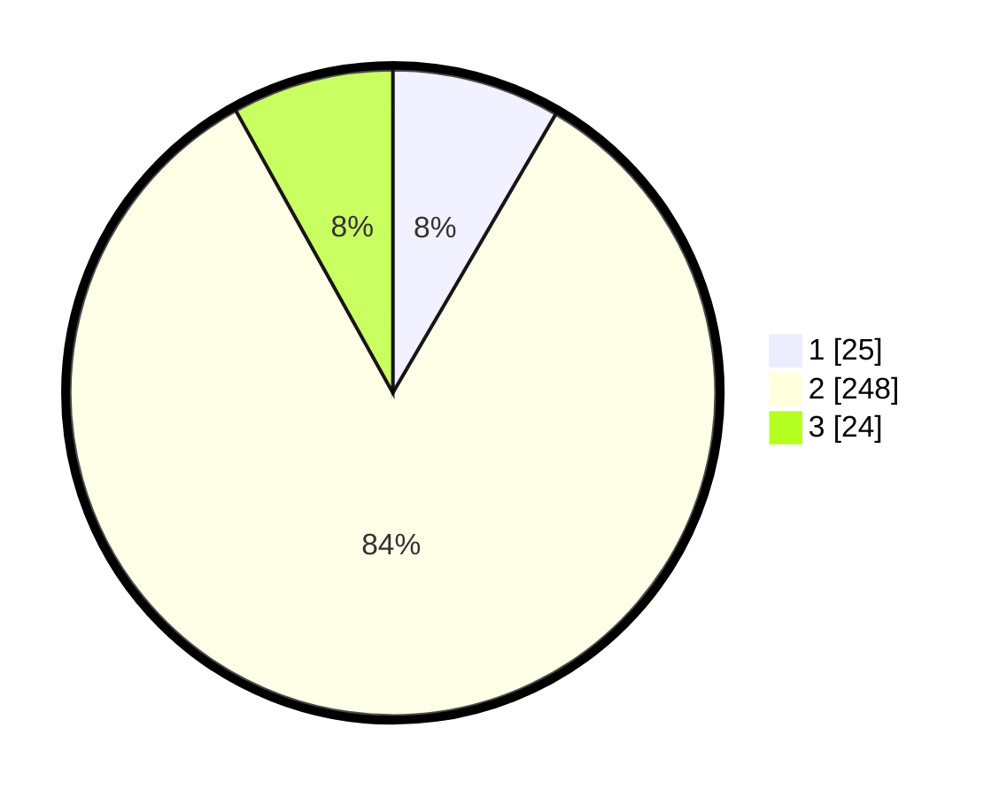

# Hasil

## Grafik

## Tabel

| No. | Nama Paslon    | Suara | Suara (raw) | Persentase |
|:--- |:-------------- | -----:| -----------:| ----------:|
| 1   | ANIES MUHAIMIN | 25    | [25][p-1]   | 8,42       |
| 2   | PRABOWO GIBRAN | 248   | [248][p-2]  | 83,50      |
| 3   | GANJAR MAHFUD  | 24    | [24][p-3]   | 8,08       |

[p-1]: https://github.com/gigit-pemilu/pemilu-2024/blob/main/pilpres/hitung-suara/sub/94-papua-tengah/sub/01-nabire/sub/01-nabire/sub/1001-wonorejo/sub/002-tps/sub/paslon-1.txt
[p-2]: https://github.com/gigit-pemilu/pemilu-2024/blob/main/pilpres/hitung-suara/sub/94-papua-tengah/sub/01-nabire/sub/01-nabire/sub/1001-wonorejo/sub/002-tps/sub/paslon-2.txt
[p-3]: https://github.com/gigit-pemilu/pemilu-2024/blob/main/pilpres/hitung-suara/sub/94-papua-tengah/sub/01-nabire/sub/01-nabire/sub/1001-wonorejo/sub/002-tps/sub/paslon-3.txt

## Foto C Plano

https://sirekap-obj-formc.kpu.go.id/e9c3/pemilu/ppwp/94/01/01/10/01/9401011001002-20240216-152146--7c87b266-5d26-454f-9e28-5363b719989a.jpg

https://sirekap-obj-formc.kpu.go.id/e9c3/pemilu/ppwp/94/01/01/10/01/9401011001002-20240216-152147--ee4b5d03-54f0-45c7-9351-3ebf4c56d149.jpg

https://sirekap-obj-formc.kpu.go.id/e9c3/pemilu/ppwp/94/01/01/10/01/9401011001002-20240216-152146--cb4f7453-21dc-4b8a-a923-f7675e01988b.jpg

## Metadata

| Key        | Value               |
| ---------- | ------------------- |
| Time Stamp | 2024-02-16 23:30:00 |

## DATA PEMILIH TETAP

Jumlah pemilih dalam DPT: **300**.
 * L: **163**.
 * P: **137**.

## DATA PENGGUNA HAK PILIH

Jumlah pengguna hak pilih dalam DPT: **300**.
 * L: **163**.
 * P: **137**.

Jumlah pengguna hak pilih dalam DPTb: **0**.
 * L: **0**.
 * P: **0**.

Jumlah pengguna hak pilih dalam DPK: **0**.
 * L: **0**.
 * P: **0**.

Jumlah pengguna hak pilih: **300**.
 * L: **163**.
 * P: **137**.

## JUMLAH SUARA SAH DAN TIDAK SAH

JUMLAH SELURUH SUARA SAH: **297**.

JUMLAH SUARA TIDAK SAH: **3**.

JUMLAH SELURUH SUARA SAH DAN SUARA TIDAK SAH: **300**.

