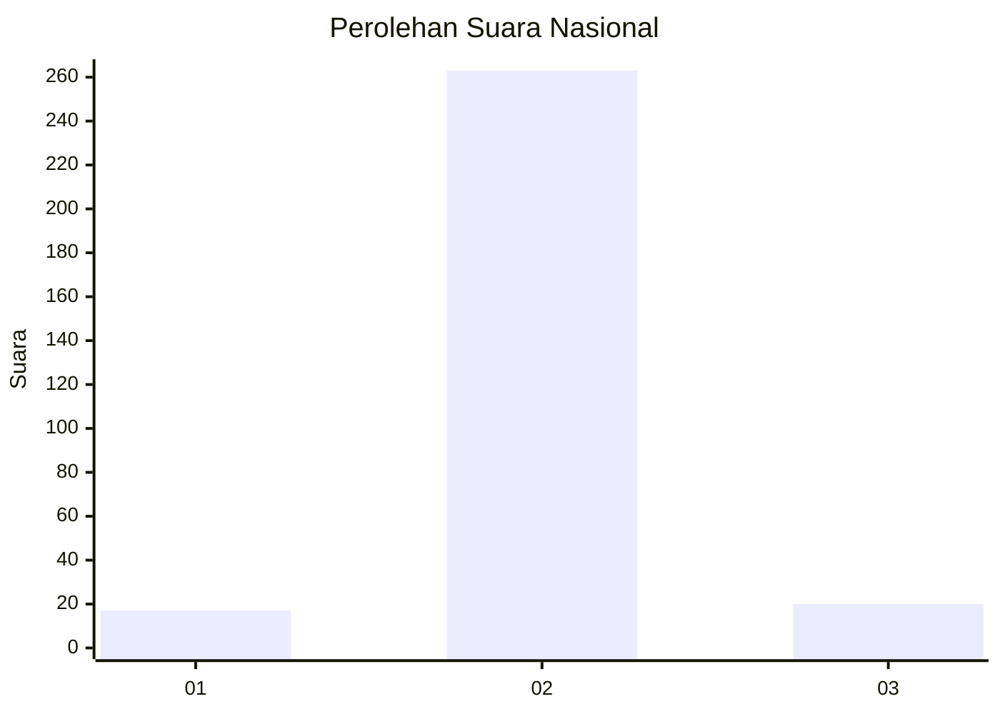
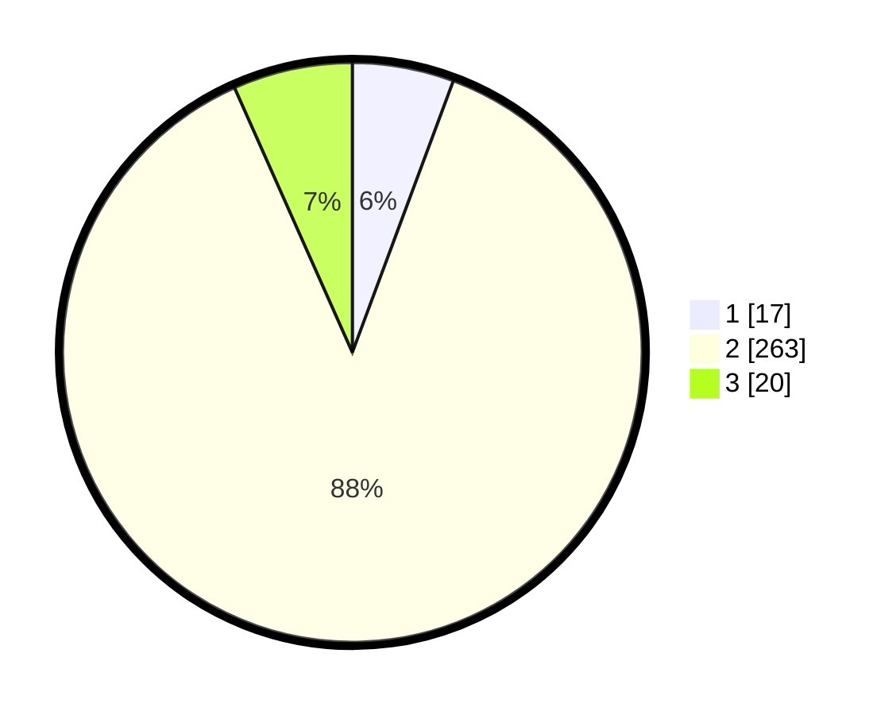

# Hasil

## Grafik

## Tabel

| No. | Nama Paslon    | Suara | Suara (raw) | Persentase |
|:--- |:-------------- | -----:| -----------:| ----------:|
| 1   | ANIES MUHAIMIN | 17    | [17][p-1]   | 5,67       |
| 2   | PRABOWO GIBRAN | 263   | [263][p-2]  | 87,67      |
| 3   | GANJAR MAHFUD  | 20    | [20][p-3]   | 6,67       |

[p-1]: https://github.com/gigit-pemilu/pemilu-2024/blob/main/pilpres/hitung-suara/sub/94-papua-tengah/sub/01-nabire/sub/01-nabire/sub/1001-wonorejo/sub/003-tps/sub/paslon-1.txt
[p-2]: https://github.com/gigit-pemilu/pemilu-2024/blob/main/pilpres/hitung-suara/sub/94-papua-tengah/sub/01-nabire/sub/01-nabire/sub/1001-wonorejo/sub/003-tps/sub/paslon-2.txt
[p-3]: https://github.com/gigit-pemilu/pemilu-2024/blob/main/pilpres/hitung-suara/sub/94-papua-tengah/sub/01-nabire/sub/01-nabire/sub/1001-wonorejo/sub/003-tps/sub/paslon-3.txt

## Foto C Plano

https://sirekap-obj-formc.kpu.go.id/24bf/pemilu/ppwp/94/01/01/10/01/9401011001003-20240214-155047--768f92f7-a592-4e60-ae81-860c2bf281b5.jpg

https://sirekap-obj-formc.kpu.go.id/24bf/pemilu/ppwp/94/01/01/10/01/9401011001003-20240214-213824--1fc35e9c-7cd8-41da-884a-19e4bcfe71cc.jpg

https://sirekap-obj-formc.kpu.go.id/24bf/pemilu/ppwp/94/01/01/10/01/9401011001003-20240214-204252--3de1b9b4-380c-4a0e-abe4-5158c323c03e.jpg

## Metadata

| Key        | Value               |
| ---------- | ------------------- |
| Time Stamp | 2024-02-15 19:30:26 |

## DATA PEMILIH TETAP

Jumlah pemilih dalam DPT: **300**.
 * L: **147**.
 * P: **153**.

## DATA PENGGUNA HAK PILIH

Jumlah pengguna hak pilih dalam DPT: **300**.
 * L: **147**.
 * P: **153**.

Jumlah pengguna hak pilih dalam DPTb: **0**.
 * L: **0**.
 * P: **0**.

Jumlah pengguna hak pilih dalam DPK: **0**.
 * L: **0**.
 * P: **0**.

Jumlah pengguna hak pilih: **300**.
 * L: **147**.
 * P: **153**.

## JUMLAH SUARA SAH DAN TIDAK SAH

JUMLAH SELURUH SUARA SAH: **300**.

JUMLAH SUARA TIDAK SAH: **0**.

JUMLAH SELURUH SUARA SAH DAN SUARA TIDAK SAH: **300**.

