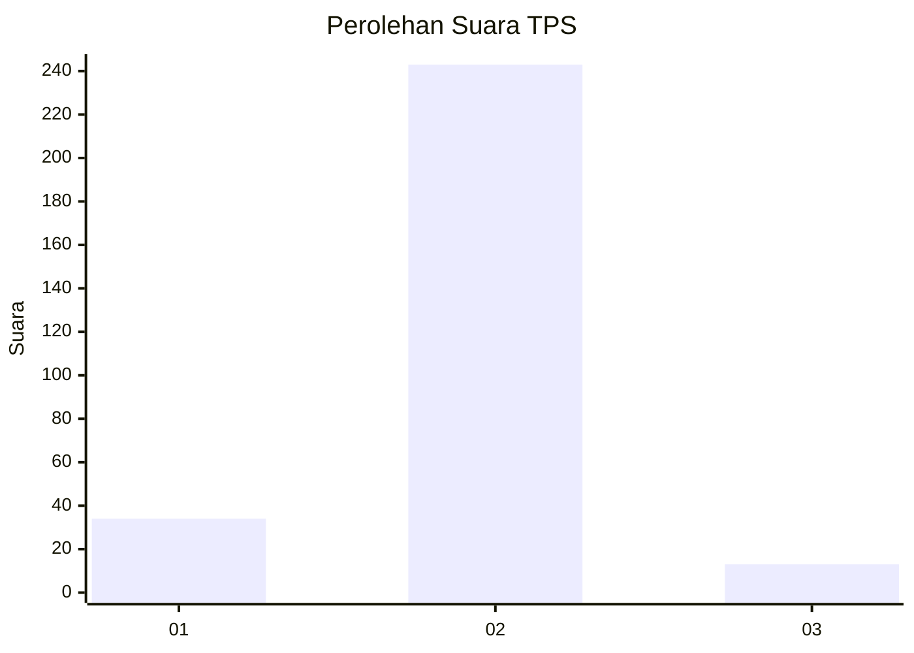
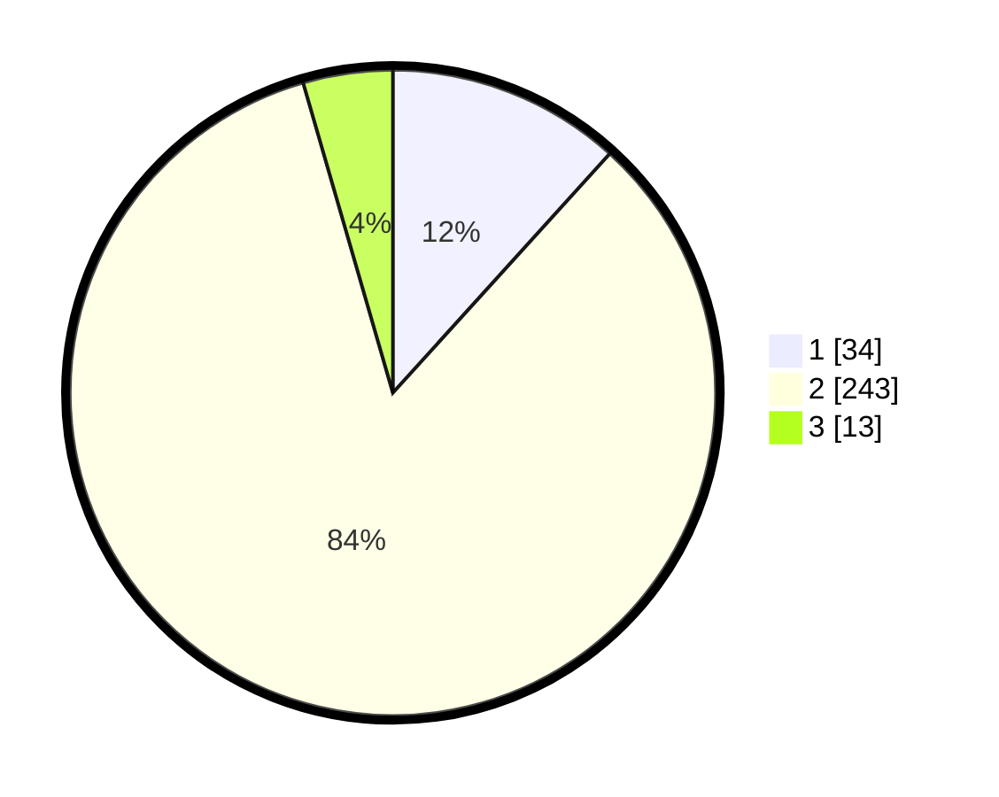

# Hasil

## Grafik

## Tabel

| No. | Nama Paslon    | Suara | Suara (raw) | Persentase |
|:--- |:-------------- | -----:| -----------:| ----------:|
| 1   | ANIES MUHAIMIN | 34    | [34][p-1]   | 11,72      |
| 2   | PRABOWO GIBRAN | 243   | [243][p-2]  | 83,79      |
| 3   | GANJAR MAHFUD  | 13    | [13][p-3]   | 4,48       |

[p-1]: https://github.com/gigit-pemilu/pemilu-2024-94-papua-tengah/blob/main/pilpres/hitung-suara/sub/94-papua-tengah/sub/01-nabire/sub/01-nabire/sub/1001-wonorejo/sub/004-tps/sub/paslon-1.txt
[p-2]: https://github.com/gigit-pemilu/pemilu-2024-94-papua-tengah/blob/main/pilpres/hitung-suara/sub/94-papua-tengah/sub/01-nabire/sub/01-nabire/sub/1001-wonorejo/sub/004-tps/sub/paslon-2.txt
[p-3]: https://github.com/gigit-pemilu/pemilu-2024-94-papua-tengah/blob/main/pilpres/hitung-suara/sub/94-papua-tengah/sub/01-nabire/sub/01-nabire/sub/1001-wonorejo/sub/004-tps/sub/paslon-3.txt

## Foto C Plano

https://sirekap-obj-formc.kpu.go.id/4840/pemilu/ppwp/94/01/01/10/01/9401011001004-20240214-132318--3cd987a9-2490-4611-bffe-114d2e0e34b3.jpg

https://sirekap-obj-formc.kpu.go.id/4840/pemilu/ppwp/94/01/01/10/01/9401011001004-20240214-131856--773f6982-d89f-441a-a46f-27d328533772.jpg

https://sirekap-obj-formc.kpu.go.id/4840/pemilu/ppwp/94/01/01/10/01/9401011001004-20240214-131739--775f79dc-dcf9-4083-bd5d-332f4408407a.jpg

## Metadata

| Key        | Value               |
| ---------- | ------------------- |
| Time Stamp | 2024-02-14 21:46:01 |

## DATA PEMILIH TETAP

Jumlah pemilih dalam DPT: **291**.
 * L: **143**.
 * P: **148**.

## DATA PENGGUNA HAK PILIH

Jumlah pengguna hak pilih dalam DPT: **291**.
 * L: **143**.
 * P: **148**.

Jumlah pengguna hak pilih dalam DPTb: **0**.
 * L: **0**.
 * P: **0**.

Jumlah pengguna hak pilih dalam DPK: **0**.
 * L: **0**.
 * P: **0**.

Jumlah pengguna hak pilih: **291**.
 * L: **143**.
 * P: **148**.

## JUMLAH SUARA SAH DAN TIDAK SAH

JUMLAH SELURUH SUARA SAH: **290**.

JUMLAH SUARA TIDAK SAH: **1**.

JUMLAH SELURUH SUARA SAH DAN SUARA TIDAK SAH: **291**.

