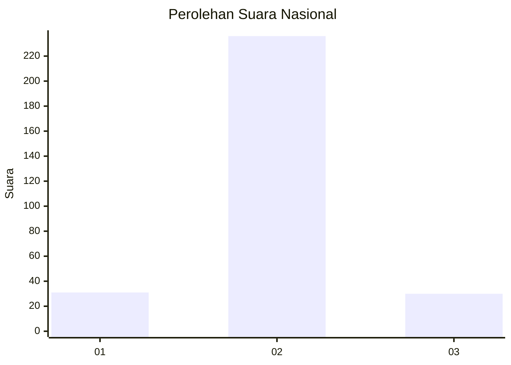
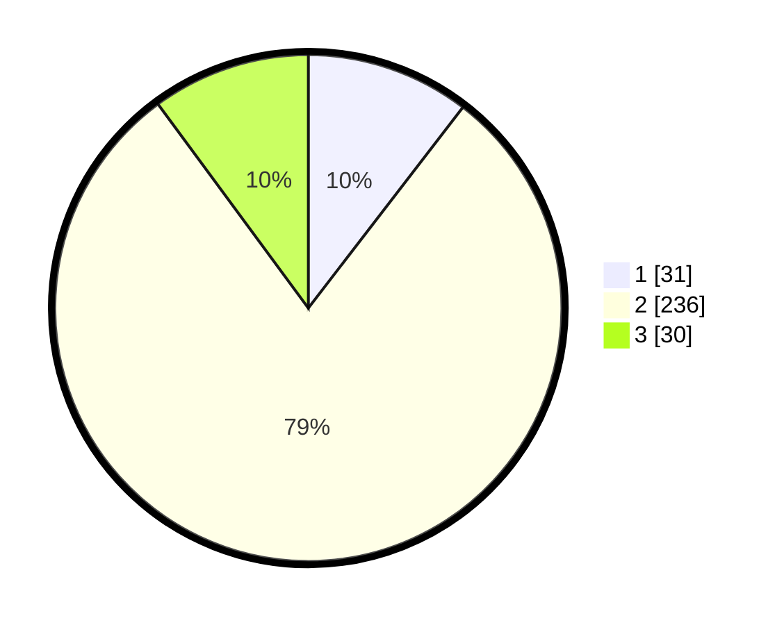

# Hasil

## Grafik

## Tabel

| No. | Nama Paslon    | Suara | Suara (raw) | Persentase |
|:--- |:-------------- | -----:| -----------:| ----------:|
| 1   | ANIES MUHAIMIN | 31    | [31][p-1]   | 10,44      |
| 2   | PRABOWO GIBRAN | 236   | [236][p-2]  | 79,46      |
| 3   | GANJAR MAHFUD  | 30    | [30][p-3]   | 10,10      |

[p-1]: https://github.com/gigit-pemilu/pemilu-2024/blob/main/pilpres/hitung-suara/sub/94-papua-tengah/sub/01-nabire/sub/01-nabire/sub/1001-wonorejo/sub/010-tps/sub/paslon-1.txt
[p-2]: https://github.com/gigit-pemilu/pemilu-2024/blob/main/pilpres/hitung-suara/sub/94-papua-tengah/sub/01-nabire/sub/01-nabire/sub/1001-wonorejo/sub/010-tps/sub/paslon-2.txt
[p-3]: https://github.com/gigit-pemilu/pemilu-2024/blob/main/pilpres/hitung-suara/sub/94-papua-tengah/sub/01-nabire/sub/01-nabire/sub/1001-wonorejo/sub/010-tps/sub/paslon-3.txt

## Foto C Plano

https://sirekap-obj-formc.kpu.go.id/8ff6/pemilu/ppwp/94/01/01/10/01/9401011001010-20240216-035127--ca9c0ef9-7725-4c4e-ad28-53b56fe98970.jpg

https://sirekap-obj-formc.kpu.go.id/8ff6/pemilu/ppwp/94/01/01/10/01/9401011001010-20240216-035135--0af7a6dd-fa45-4762-b6a2-b265c3094875.jpg

https://sirekap-obj-formc.kpu.go.id/8ff6/pemilu/ppwp/94/01/01/10/01/9401011001010-20240216-035129--dece8ab0-d65c-4e23-8197-af9f7cada060.jpg

## Metadata

| Key        | Value               |
| ---------- | ------------------- |
| Time Stamp | 2024-02-16 09:30:28 |

## DATA PEMILIH TETAP

Jumlah pemilih dalam DPT: **300**.
 * L: **146**.
 * P: **154**.

## DATA PENGGUNA HAK PILIH

Jumlah pengguna hak pilih dalam DPT: **292**.
 * L: **141**.
 * P: **151**.

Jumlah pengguna hak pilih dalam DPTb: **0**.
 * L: **0**.
 * P: **0**.

Jumlah pengguna hak pilih dalam DPK: **8**.
 * L: **5**.
 * P: **3**.

Jumlah pengguna hak pilih: **300**.
 * L: **146**.
 * P: **154**.

## JUMLAH SUARA SAH DAN TIDAK SAH

JUMLAH SELURUH SUARA SAH: **297**.

JUMLAH SUARA TIDAK SAH: **3**.

JUMLAH SELURUH SUARA SAH DAN SUARA TIDAK SAH: **300**.

