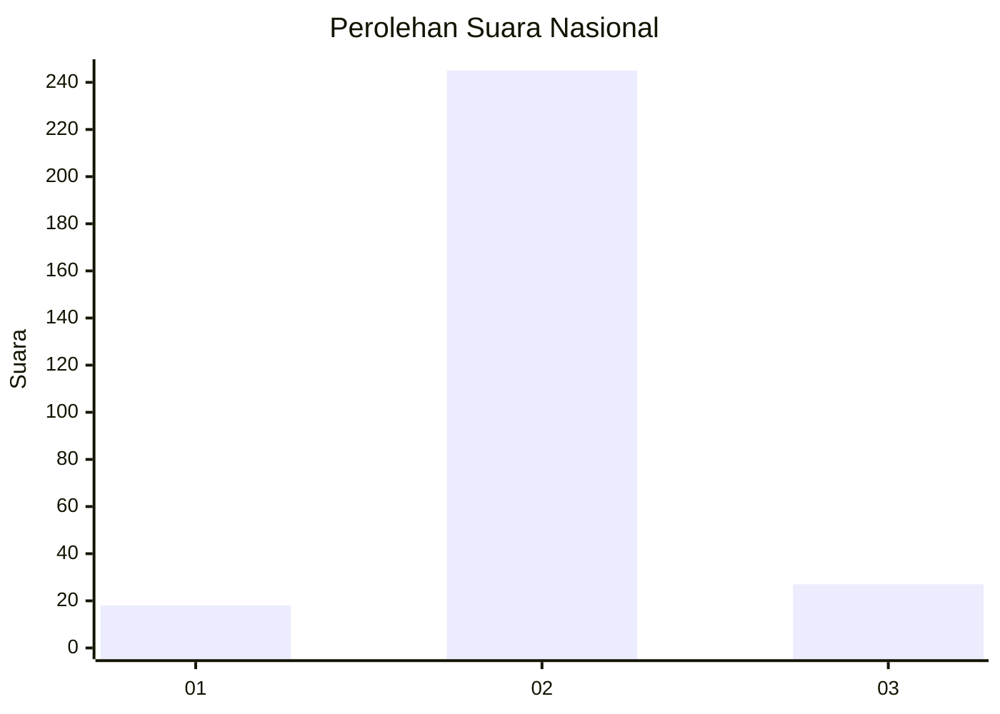
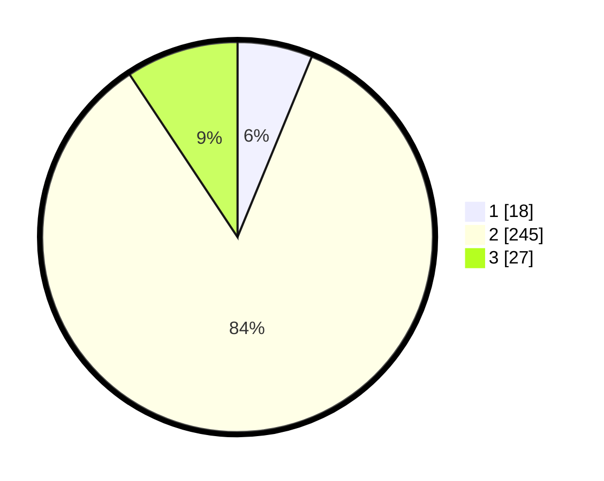

# Hasil

## Grafik

## Tabel

| No. | Nama Paslon    | Suara | Suara (raw) | Persentase |
|:--- |:-------------- | -----:| -----------:| ----------:|
| 1   | ANIES MUHAIMIN | 18    | [18][p-1]   | 6,21       |
| 2   | PRABOWO GIBRAN | 245   | [245][p-2]  | 84,48      |
| 3   | GANJAR MAHFUD  | 27    | [27][p-3]   | 9,31       |

[p-1]: https://github.com/gigit-pemilu/pemilu-2024/blob/main/pilpres/hitung-suara/sub/94-papua-tengah/sub/01-nabire/sub/01-nabire/sub/1001-wonorejo/sub/012-tps/sub/paslon-1.txt
[p-2]: https://github.com/gigit-pemilu/pemilu-2024/blob/main/pilpres/hitung-suara/sub/94-papua-tengah/sub/01-nabire/sub/01-nabire/sub/1001-wonorejo/sub/012-tps/sub/paslon-2.txt
[p-3]: https://github.com/gigit-pemilu/pemilu-2024/blob/main/pilpres/hitung-suara/sub/94-papua-tengah/sub/01-nabire/sub/01-nabire/sub/1001-wonorejo/sub/012-tps/sub/paslon-3.txt

## Foto C Plano

https://sirekap-obj-formc.kpu.go.id/c0d2/pemilu/ppwp/94/01/01/10/01/9401011001012-20240214-215203--38138adf-28ec-455a-974a-aff8abf77462.jpg

https://sirekap-obj-formc.kpu.go.id/c0d2/pemilu/ppwp/94/01/01/10/01/9401011001012-20240214-215349--2146e8cd-9971-4e68-b16d-1740e7574ad4.jpg

https://sirekap-obj-formc.kpu.go.id/c0d2/pemilu/ppwp/94/01/01/10/01/9401011001012-20240214-215644--e1511f53-50a6-4d14-ac9a-b5154d2b82e9.jpg

## Metadata

| Key        | Value               |
| ---------- | ------------------- |
| Time Stamp | 2024-02-15 22:00:27 |

## DATA PEMILIH TETAP

Jumlah pemilih dalam DPT: **292**.
 * L: **156**.
 * P: **136**.

## DATA PENGGUNA HAK PILIH

Jumlah pengguna hak pilih dalam DPT: **292**.
 * L: **156**.
 * P: **136**.

Jumlah pengguna hak pilih dalam DPTb: **0**.
 * L: **0**.
 * P: **0**.

Jumlah pengguna hak pilih dalam DPK: **0**.
 * L: **0**.
 * P: **0**.

Jumlah pengguna hak pilih: **292**.
 * L: **156**.
 * P: **136**.

## JUMLAH SUARA SAH DAN TIDAK SAH

JUMLAH SELURUH SUARA SAH: **290**.

JUMLAH SUARA TIDAK SAH: **2**.

