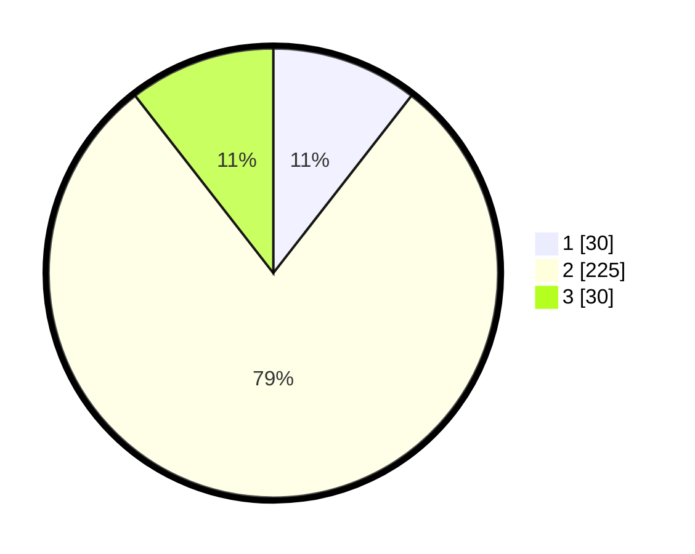

# Hasil

## Grafik

## Tabel

| No. | Nama Paslon    | Suara | Suara (raw) | Persentase |
|:--- |:-------------- | -----:| -----------:| ----------:|
| 1   | ANIES MUHAIMIN | 30    | [30][p-1]   | 10,53      |
| 2   | PRABOWO GIBRAN | 225   | [225][p-2]  | 78,95      |
| 3   | GANJAR MAHFUD  | 30    | [30][p-3]   | 10,53      |

[p-1]: https://github.com/gigit-pemilu/pemilu-2024-94-papua-tengah/blob/main/pilpres/hitung-suara/sub/94-papua-tengah/sub/01-nabire/sub/01-nabire/sub/1001-wonorejo/sub/020-tps/sub/paslon-1.txt
[p-2]: https://github.com/gigit-pemilu/pemilu-2024-94-papua-tengah/blob/main/pilpres/hitung-suara/sub/94-papua-tengah/sub/01-nabire/sub/01-nabire/sub/1001-wonorejo/sub/020-tps/sub/paslon-2.txt
[p-3]: https://github.com/gigit-pemilu/pemilu-2024-94-papua-tengah/blob/main/pilpres/hitung-suara/sub/94-papua-tengah/sub/01-nabire/sub/01-nabire/sub/1001-wonorejo/sub/020-tps/sub/paslon-3.txt

## Foto C Plano

https://sirekap-obj-formc.kpu.go.id/3c84/pemilu/ppwp/94/01/01/10/01/9401011001020-20240216-032807--69f0879b-2552-40c7-b95a-b6bcbc767a46.jpg

https://sirekap-obj-formc.kpu.go.id/3c84/pemilu/ppwp/94/01/01/10/01/9401011001020-20240216-032808--50b14a52-fdb3-4369-8608-2ece1c689418.jpg

https://sirekap-obj-formc.kpu.go.id/3c84/pemilu/ppwp/94/01/01/10/01/9401011001020-20240216-032808--e500ec66-ffb1-454d-92d3-b7cbe57cc5f5.jpg

## Metadata

| Key        | Value               |
| ---------- | ------------------- |
| Time Stamp | 2024-02-16 09:30:28 |

## DATA PEMILIH TETAP

Jumlah pemilih dalam DPT: **294**.
 * L: **146**.
 * P: **148**.

## DATA PENGGUNA HAK PILIH

Jumlah pengguna hak pilih dalam DPT: **294**.
 * L: **146**.
 * P: **148**.

Jumlah pengguna hak pilih dalam DPTb: **0**.
 * L: **0**.
 * P: **0**.

Jumlah pengguna hak pilih dalam DPK: **0**.
 * L: **0**.
 * P: **0**.

Jumlah pengguna hak pilih: **294**.
 * L: **0**.
 * P: **0**.

## JUMLAH SUARA SAH DAN TIDAK SAH

JUMLAH SELURUH SUARA SAH: **285**.

JUMLAH SUARA TIDAK SAH: **15**.

JUMLAH SELURUH SUARA SAH DAN SUARA TIDAK SAH: **300**.

