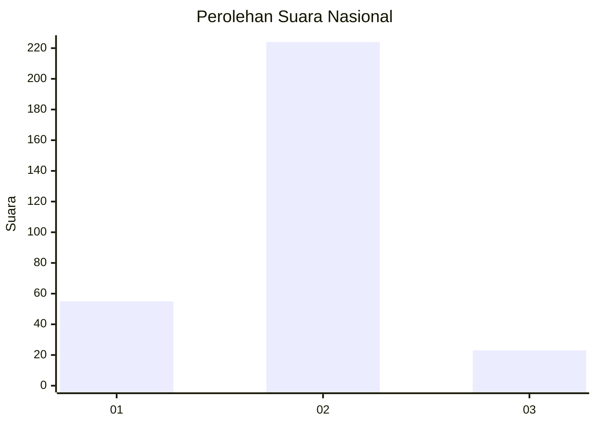
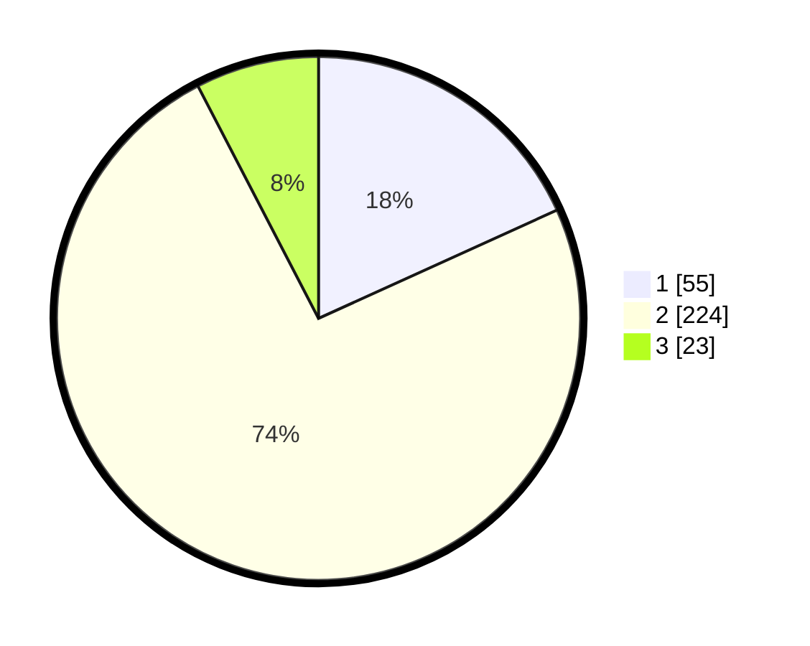

# Hasil

## Grafik

## Tabel

| No. | Nama Paslon    | Suara | Suara (raw) | Persentase |
|:--- |:-------------- | -----:| -----------:| ----------:|
| 1   | ANIES MUHAIMIN | 55    | [55][p-1]   | 18,21      |
| 2   | PRABOWO GIBRAN | 224   | [224][p-2]  | 74,17      |
| 3   | GANJAR MAHFUD  | 23    | [23][p-3]   | 7,62       |

[p-1]: https://github.com/gigit-pemilu/pemilu-2024/blob/main/pilpres/hitung-suara/sub/94-papua-tengah/sub/01-nabire/sub/01-nabire/sub/1001-wonorejo/sub/021-tps/sub/paslon-1.txt
[p-2]: https://github.com/gigit-pemilu/pemilu-2024/blob/main/pilpres/hitung-suara/sub/94-papua-tengah/sub/01-nabire/sub/01-nabire/sub/1001-wonorejo/sub/021-tps/sub/paslon-2.txt
[p-3]: https://github.com/gigit-pemilu/pemilu-2024/blob/main/pilpres/hitung-suara/sub/94-papua-tengah/sub/01-nabire/sub/01-nabire/sub/1001-wonorejo/sub/021-tps/sub/paslon-3.txt

## Foto C Plano

https://sirekap-obj-formc.kpu.go.id/66d9/pemilu/ppwp/94/01/01/10/01/9401011001021-20240214-234517--50e17b9d-c2ea-4381-b377-772d70426449.jpg

https://sirekap-obj-formc.kpu.go.id/66d9/pemilu/ppwp/94/01/01/10/01/9401011001021-20240214-234555--5c0572eb-75a2-401d-821f-e1660da2b7ff.jpg

https://sirekap-obj-formc.kpu.go.id/66d9/pemilu/ppwp/94/01/01/10/01/9401011001021-20240214-234651--6147f1dc-2d97-49a7-be4e-b2a63d40f2a8.jpg

## Metadata

| Key        | Value               |
| ---------- | ------------------- |
| Time Stamp | 2024-02-15 19:30:26 |

