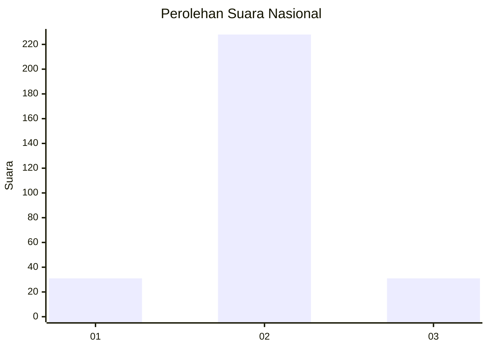
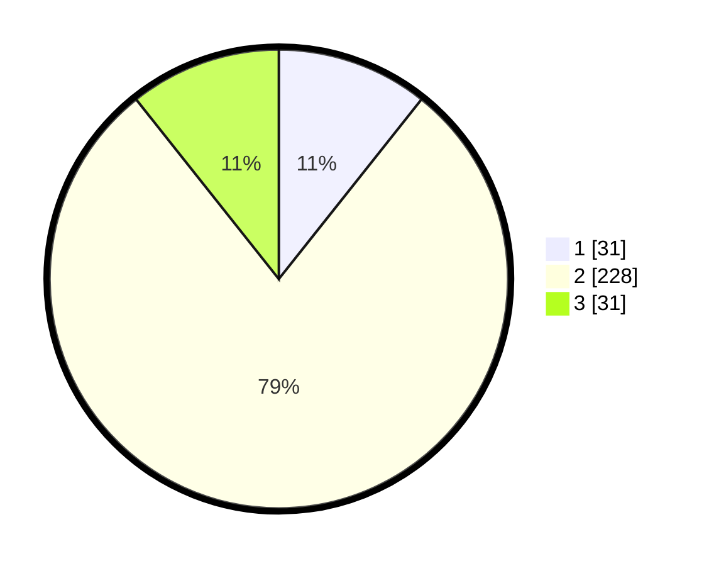

# Hasil

## Grafik

## Tabel

| No. | Nama Paslon    | Suara | Suara (raw) | Persentase |
|:--- |:-------------- | -----:| -----------:| ----------:|
| 1   | ANIES MUHAIMIN | 31    | [31][p-1]   | 10,69      |
| 2   | PRABOWO GIBRAN | 228   | [228][p-2]  | 78,62      |
| 3   | GANJAR MAHFUD  | 31    | [31][p-3]   | 10,69      |

[p-1]: https://github.com/gigit-pemilu/pemilu-2024/blob/main/pilpres/hitung-suara/sub/94-papua-tengah/sub/01-nabire/sub/01-nabire/sub/1002-kali-bobo/sub/001-tps/sub/paslon-1.txt
[p-2]: https://github.com/gigit-pemilu/pemilu-2024/blob/main/pilpres/hitung-suara/sub/94-papua-tengah/sub/01-nabire/sub/01-nabire/sub/1002-kali-bobo/sub/001-tps/sub/paslon-2.txt
[p-3]: https://github.com/gigit-pemilu/pemilu-2024/blob/main/pilpres/hitung-suara/sub/94-papua-tengah/sub/01-nabire/sub/01-nabire/sub/1002-kali-bobo/sub/001-tps/sub/paslon-3.txt

## Foto C Plano

https://sirekap-obj-formc.kpu.go.id/fd3f/pemilu/ppwp/94/01/01/10/02/9401011002001-20240216-132339--ae1e20b0-544a-4dd4-bd3d-88730016f2c8.jpg

https://sirekap-obj-formc.kpu.go.id/fd3f/pemilu/ppwp/94/01/01/10/02/9401011002001-20240216-132340--9601cb82-ac33-41d8-a4b3-8d0fc743f297.jpg

https://sirekap-obj-formc.kpu.go.id/fd3f/pemilu/ppwp/94/01/01/10/02/9401011002001-20240216-132339--8d9abe18-e9c6-4cf7-a1aa-e8d3fe728159.jpg

## Metadata

| Key        | Value               |
| ---------- | ------------------- |
| Time Stamp | 2024-02-16 23:30:00 |

## DATA PEMILIH TETAP

Jumlah pemilih dalam DPT: **298**.
 * L: **151**.
 * P: **147**.

## DATA PENGGUNA HAK PILIH

Jumlah pengguna hak pilih dalam DPT: **274**.
 * L: **140**.
 * P: **134**.

Jumlah pengguna hak pilih dalam DPTb: **24**.
 * L: **15**.
 * P: **9**.

Jumlah pengguna hak pilih dalam DPK: **0**.
 * L: **0**.
 * P: **0**.

Jumlah pengguna hak pilih: **298**.
 * L: **155**.
 * P: **143**.

## JUMLAH SUARA SAH DAN TIDAK SAH

JUMLAH SELURUH SUARA SAH: **290**.

JUMLAH SUARA TIDAK SAH: **8**.

JUMLAH SELURUH SUARA SAH DAN SUARA TIDAK SAH: **298**.

