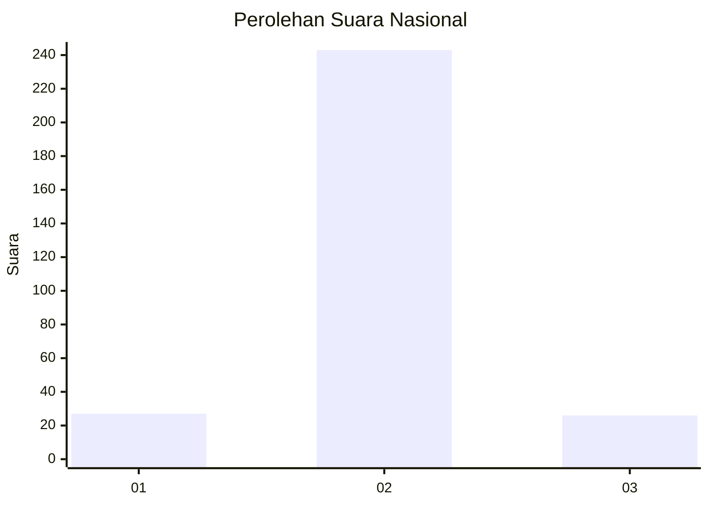
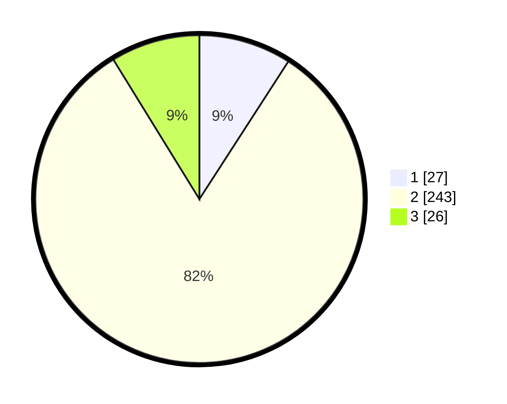

# Hasil

## Grafik

## Tabel

| No. | Nama Paslon    | Suara | Suara (raw) | Persentase |
|:--- |:-------------- | -----:| -----------:| ----------:|
| 1   | ANIES MUHAIMIN | 27    | [27][p-1]   | 9,12       |
| 2   | PRABOWO GIBRAN | 243   | [243][p-2]  | 82,09      |
| 3   | GANJAR MAHFUD  | 26    | [26][p-3]   | 8,78       |

[p-1]: https://github.com/gigit-pemilu/pemilu-2024/blob/main/pilpres/hitung-suara/sub/94-papua-tengah/sub/01-nabire/sub/01-nabire/sub/1002-kali-bobo/sub/002-tps/sub/paslon-1.txt
[p-2]: https://github.com/gigit-pemilu/pemilu-2024/blob/main/pilpres/hitung-suara/sub/94-papua-tengah/sub/01-nabire/sub/01-nabire/sub/1002-kali-bobo/sub/002-tps/sub/paslon-2.txt
[p-3]: https://github.com/gigit-pemilu/pemilu-2024/blob/main/pilpres/hitung-suara/sub/94-papua-tengah/sub/01-nabire/sub/01-nabire/sub/1002-kali-bobo/sub/002-tps/sub/paslon-3.txt

## Foto C Plano

https://sirekap-obj-formc.kpu.go.id/8ad5/pemilu/ppwp/94/01/01/10/02/9401011002002-20240216-190407--c35a64df-1f2c-419b-a079-0a630be26a1b.jpg

https://sirekap-obj-formc.kpu.go.id/8ad5/pemilu/ppwp/94/01/01/10/02/9401011002002-20240216-190409--0a01f56d-5352-452b-ade5-e51c82935689.jpg

https://sirekap-obj-formc.kpu.go.id/8ad5/pemilu/ppwp/94/01/01/10/02/9401011002002-20240216-190407--977ea74f-8da5-49c3-b6c3-85fd2bdc13a1.jpg

## Metadata

| Key        | Value               |
| ---------- | ------------------- |
| Time Stamp | 2024-02-16 23:30:00 |

## DATA PEMILIH TETAP

Jumlah pemilih dalam DPT: **298**.
 * L: **161**.
 * P: **137**.

## DATA PENGGUNA HAK PILIH

Jumlah pengguna hak pilih dalam DPT: **298**.
 * L: **161**.
 * P: **137**.

Jumlah pengguna hak pilih dalam DPTb: **0**.
 * L: **0**.
 * P: **0**.

Jumlah pengguna hak pilih dalam DPK: **0**.
 * L: **0**.
 * P: **0**.

Jumlah pengguna hak pilih: **298**.
 * L: **161**.
 * P: **137**.

## JUMLAH SUARA SAH DAN TIDAK SAH

JUMLAH SELURUH SUARA SAH: **296**.

JUMLAH SUARA TIDAK SAH: **2**.

JUMLAH SELURUH SUARA SAH DAN SUARA TIDAK SAH: **298**.

