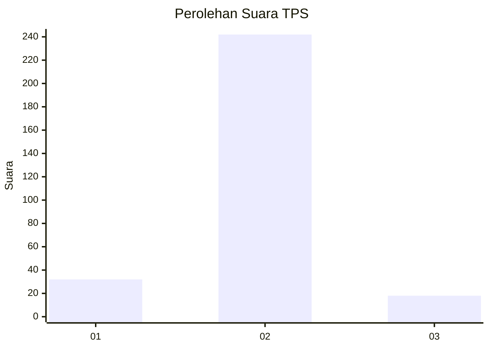
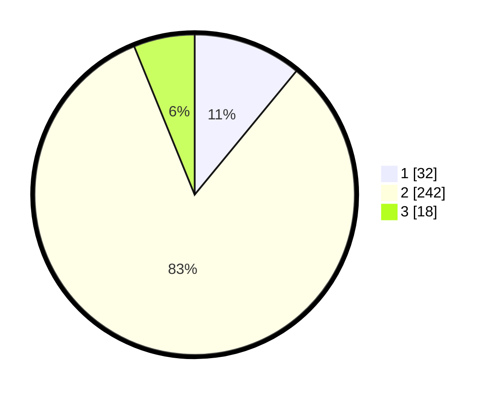

# Hasil

## Grafik

## Tabel

| No. | Nama Paslon    | Suara | Suara (raw) | Persentase |
|:--- |:-------------- | -----:| -----------:| ----------:|
| 1   | ANIES MUHAIMIN | 32    | [32][p-1]   | 10,96      |
| 2   | PRABOWO GIBRAN | 242   | [242][p-2]  | 82,88      |
| 3   | GANJAR MAHFUD  | 18    | [18][p-3]   | 6,16       |

[p-1]: https://github.com/gigit-pemilu/pemilu-2024-94-papua-tengah/blob/main/pilpres/hitung-suara/sub/94-papua-tengah/sub/01-nabire/sub/01-nabire/sub/1002-kali-bobo/sub/003-tps/sub/paslon-1.txt
[p-2]: https://github.com/gigit-pemilu/pemilu-2024-94-papua-tengah/blob/main/pilpres/hitung-suara/sub/94-papua-tengah/sub/01-nabire/sub/01-nabire/sub/1002-kali-bobo/sub/003-tps/sub/paslon-2.txt
[p-3]: https://github.com/gigit-pemilu/pemilu-2024-94-papua-tengah/blob/main/pilpres/hitung-suara/sub/94-papua-tengah/sub/01-nabire/sub/01-nabire/sub/1002-kali-bobo/sub/003-tps/sub/paslon-3.txt

## Foto C Plano

https://sirekap-obj-formc.kpu.go.id/52e0/pemilu/ppwp/94/01/01/10/02/9401011002003-20240216-160214--682d1d4b-b4a9-4673-a5c7-9a3f931ab559.jpg

https://sirekap-obj-formc.kpu.go.id/52e0/pemilu/ppwp/94/01/01/10/02/9401011002003-20240216-160216--8edc91da-01dc-4516-a2eb-850c40d3b562.jpg

https://sirekap-obj-formc.kpu.go.id/52e0/pemilu/ppwp/94/01/01/10/02/9401011002003-20240216-160215--52345060-bae0-4b9f-9b88-c3c9e9025fee.jpg

## Metadata

| Key        | Value               |
| ---------- | ------------------- |
| Time Stamp | 2024-02-16 23:30:00 |

## DATA PEMILIH TETAP

Jumlah pemilih dalam DPT: **0**.
 * L: **0**.
 * P: **0**.

## DATA PENGGUNA HAK PILIH

Jumlah pengguna hak pilih dalam DPT: **0**.
 * L: **0**.
 * P: **0**.

Jumlah pengguna hak pilih dalam DPTb: **0**.
 * L: **0**.
 * P: **0**.

Jumlah pengguna hak pilih dalam DPK: **0**.
 * L: **0**.
 * P: **0**.

Jumlah pengguna hak pilih: **0**.
 * L: **0**.
 * P: **0**.

## JUMLAH SUARA SAH DAN TIDAK SAH

JUMLAH SELURUH SUARA SAH: **294**.

JUMLAH SUARA TIDAK SAH: **4**.

JUMLAH SELURUH SUARA SAH DAN SUARA TIDAK SAH: **298**.

