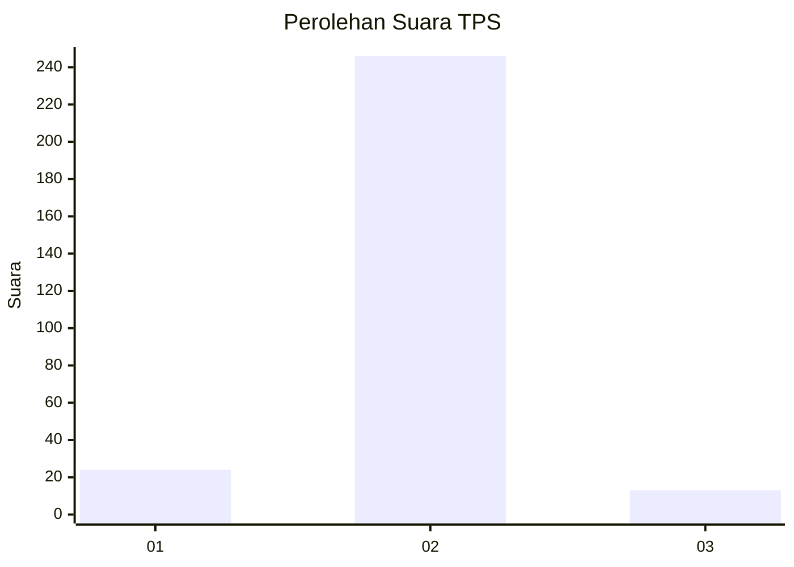
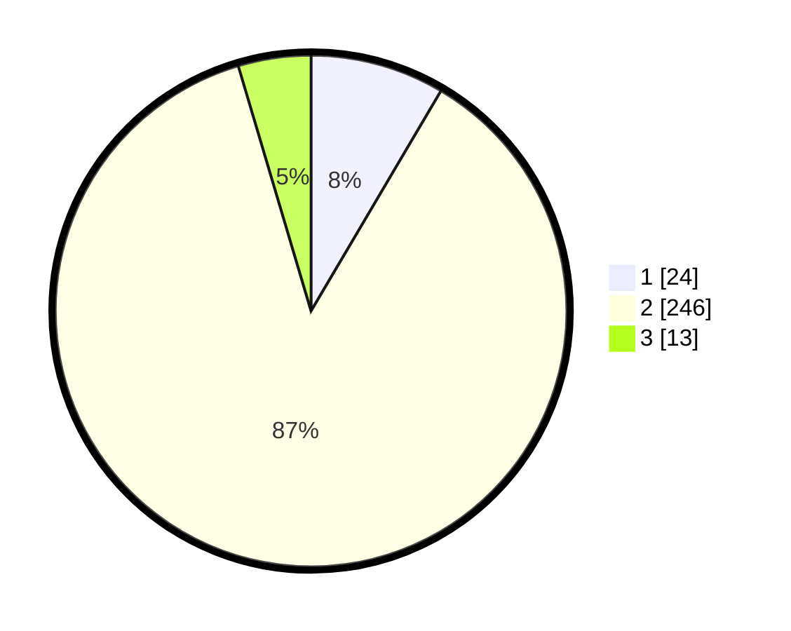

# Hasil

## Grafik

## Tabel

| No. | Nama Paslon    | Suara | Suara (raw) | Persentase |
|:--- |:-------------- | -----:| -----------:| ----------:|
| 1   | ANIES MUHAIMIN | 24    | [24][p-1]   | 8,48       |
| 2   | PRABOWO GIBRAN | 246   | [246][p-2]  | 86,93      |
| 3   | GANJAR MAHFUD  | 13    | [13][p-3]   | 4,59       |

[p-1]: https://github.com/gigit-pemilu/pemilu-2024-94-papua-tengah/blob/main/pilpres/hitung-suara/sub/94-papua-tengah/sub/01-nabire/sub/01-nabire/sub/1002-kali-bobo/sub/010-tps/sub/paslon-1.txt
[p-2]: https://github.com/gigit-pemilu/pemilu-2024-94-papua-tengah/blob/main/pilpres/hitung-suara/sub/94-papua-tengah/sub/01-nabire/sub/01-nabire/sub/1002-kali-bobo/sub/010-tps/sub/paslon-2.txt
[p-3]: https://github.com/gigit-pemilu/pemilu-2024-94-papua-tengah/blob/main/pilpres/hitung-suara/sub/94-papua-tengah/sub/01-nabire/sub/01-nabire/sub/1002-kali-bobo/sub/010-tps/sub/paslon-3.txt

## Foto C Plano

https://sirekap-obj-formc.kpu.go.id/05f8/pemilu/ppwp/94/01/01/10/02/9401011002010-20240216-123554--176e38f7-072c-4083-acde-667059b473c7.jpg

https://sirekap-obj-formc.kpu.go.id/05f8/pemilu/ppwp/94/01/01/10/02/9401011002010-20240216-123557--7ea8d612-f234-4580-983c-7a9d238a0609.jpg

https://sirekap-obj-formc.kpu.go.id/05f8/pemilu/ppwp/94/01/01/10/02/9401011002010-20240216-123556--97d97492-1124-4b31-934b-f4a18123b294.jpg

## Metadata

| Key        | Value               |
| ---------- | ------------------- |
| Time Stamp | 2024-02-16 23:30:00 |

## DATA PEMILIH TETAP

Jumlah pemilih dalam DPT: **293**.
 * L: **151**.
 * P: **142**.

## DATA PENGGUNA HAK PILIH

Jumlah pengguna hak pilih dalam DPT: **282**.
 * L: **134**.
 * P: **148**.

Jumlah pengguna hak pilih dalam DPTb: **1**.
 * L: **0**.
 * P: **1**.

Jumlah pengguna hak pilih dalam DPK: **0**.
 * L: **0**.
 * P: **0**.

Jumlah pengguna hak pilih: **283**.
 * L: **134**.
 * P: **149**.

## JUMLAH SUARA SAH DAN TIDAK SAH

JUMLAH SELURUH SUARA SAH: **283**.

JUMLAH SUARA TIDAK SAH: **3**.

JUMLAH SELURUH SUARA SAH DAN SUARA TIDAK SAH: **286**.

