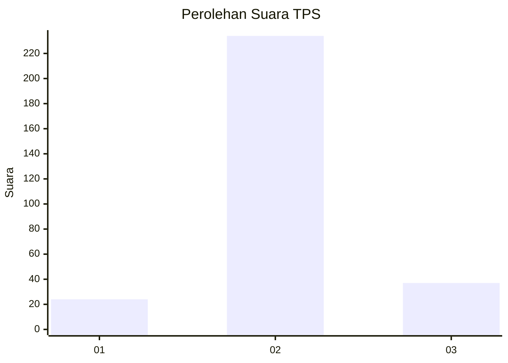
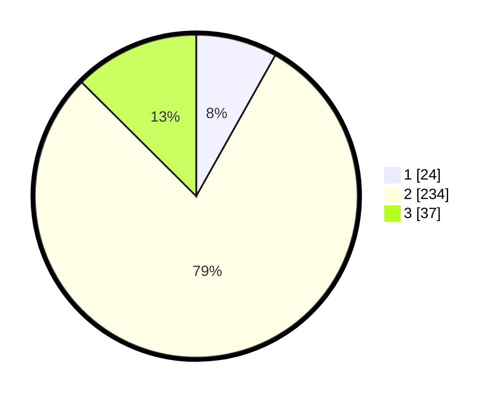

# Hasil

## Grafik

## Tabel

| No. | Nama Paslon    | Suara | Suara (raw) | Persentase |
|:--- |:-------------- | -----:| -----------:| ----------:|
| 1   | ANIES MUHAIMIN | 24    | [24][p-1]   | 8,14       |
| 2   | PRABOWO GIBRAN | 234   | [234][p-2]  | 79,32      |
| 3   | GANJAR MAHFUD  | 37    | [37][p-3]   | 12,54      |

[p-1]: https://github.com/gigit-pemilu/pemilu-2024-94-papua-tengah/blob/main/pilpres/hitung-suara/sub/94-papua-tengah/sub/01-nabire/sub/01-nabire/sub/1002-kali-bobo/sub/011-tps/sub/paslon-1.txt
[p-2]: https://github.com/gigit-pemilu/pemilu-2024-94-papua-tengah/blob/main/pilpres/hitung-suara/sub/94-papua-tengah/sub/01-nabire/sub/01-nabire/sub/1002-kali-bobo/sub/011-tps/sub/paslon-2.txt
[p-3]: https://github.com/gigit-pemilu/pemilu-2024-94-papua-tengah/blob/main/pilpres/hitung-suara/sub/94-papua-tengah/sub/01-nabire/sub/01-nabire/sub/1002-kali-bobo/sub/011-tps/sub/paslon-3.txt

## Foto C Plano

https://sirekap-obj-formc.kpu.go.id/0c46/pemilu/ppwp/94/01/01/10/02/9401011002011-20240214-155242--e8a0e844-241b-4188-b9aa-28f5a4515119.jpg

https://sirekap-obj-formc.kpu.go.id/0c46/pemilu/ppwp/94/01/01/10/02/9401011002011-20240214-155444--0fbe0a92-746d-4402-870e-a93f6a58e4fd.jpg

## Metadata

| Key        | Value               |
| ---------- | ------------------- |
| Time Stamp | 2024-02-15 19:30:26 |

