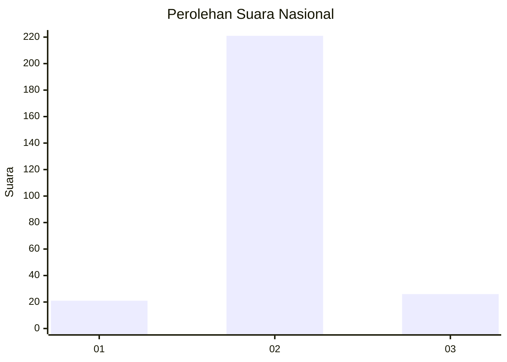
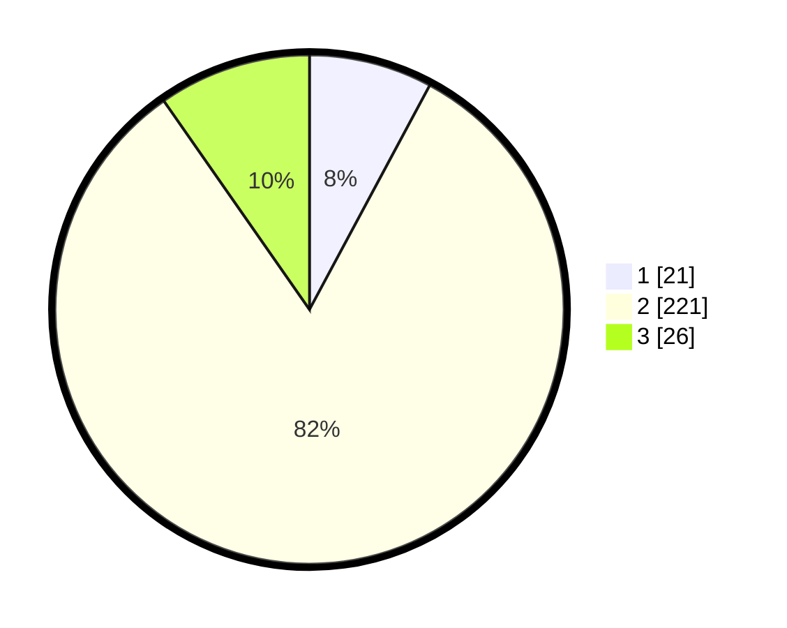

# Hasil

## Grafik

## Tabel

| No. | Nama Paslon    | Suara | Suara (raw) | Persentase |
|:--- |:-------------- | -----:| -----------:| ----------:|
| 1   | ANIES MUHAIMIN | 21    | [21][p-1]   | 7,84       |
| 2   | PRABOWO GIBRAN | 221   | [221][p-2]  | 82,46      |
| 3   | GANJAR MAHFUD  | 26    | [26][p-3]   | 9,70       |

[p-1]: https://github.com/gigit-pemilu/pemilu-2024/blob/main/pilpres/hitung-suara/sub/94-papua-tengah/sub/01-nabire/sub/01-nabire/sub/1002-kali-bobo/sub/012-tps/sub/paslon-1.txt
[p-2]: https://github.com/gigit-pemilu/pemilu-2024/blob/main/pilpres/hitung-suara/sub/94-papua-tengah/sub/01-nabire/sub/01-nabire/sub/1002-kali-bobo/sub/012-tps/sub/paslon-2.txt
[p-3]: https://github.com/gigit-pemilu/pemilu-2024/blob/main/pilpres/hitung-suara/sub/94-papua-tengah/sub/01-nabire/sub/01-nabire/sub/1002-kali-bobo/sub/012-tps/sub/paslon-3.txt

## Foto C Plano

https://sirekap-obj-formc.kpu.go.id/9a43/pemilu/ppwp/94/01/01/10/02/9401011002012-20240216-140024--e6bc4a39-1b38-4c00-80eb-f753a88e7854.jpg

https://sirekap-obj-formc.kpu.go.id/9a43/pemilu/ppwp/94/01/01/10/02/9401011002012-20240216-140026--f80b881c-2630-4081-940c-e3fb83f0be26.jpg

https://sirekap-obj-formc.kpu.go.id/9a43/pemilu/ppwp/94/01/01/10/02/9401011002012-20240216-140025--6ceeace9-0e9e-4922-bdbc-22a5490c4fe9.jpg

## Metadata

| Key        | Value               |
| ---------- | ------------------- |
| Time Stamp | 2024-02-16 23:30:00 |

## DATA PEMILIH TETAP

Jumlah pemilih dalam DPT: **274**.
 * L: **147**.
 * P: **127**.

## DATA PENGGUNA HAK PILIH

Jumlah pengguna hak pilih dalam DPT: **214**.
 * L: **118**.
 * P: **96**.

Jumlah pengguna hak pilih dalam DPTb: **54**.
 * L: **27**.
 * P: **27**.

Jumlah pengguna hak pilih dalam DPK: **0**.
 * L: **0**.
 * P: **0**.

Jumlah pengguna hak pilih: **268**.
 * L: **145**.
 * P: **123**.

## JUMLAH SUARA SAH DAN TIDAK SAH

JUMLAH SELURUH SUARA SAH: **268**.

JUMLAH SUARA TIDAK SAH: **7**.

JUMLAH SELURUH SUARA SAH DAN SUARA TIDAK SAH: **275**.

