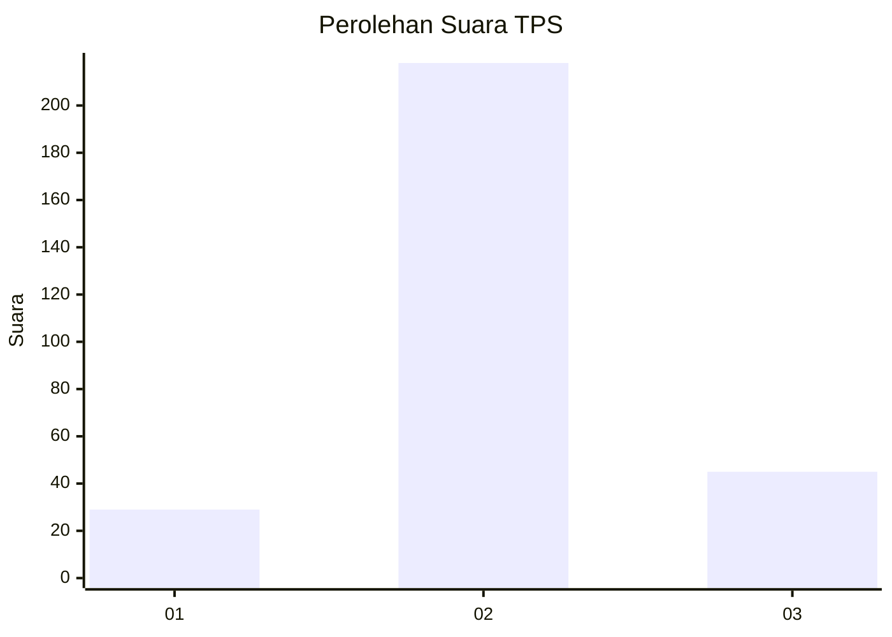
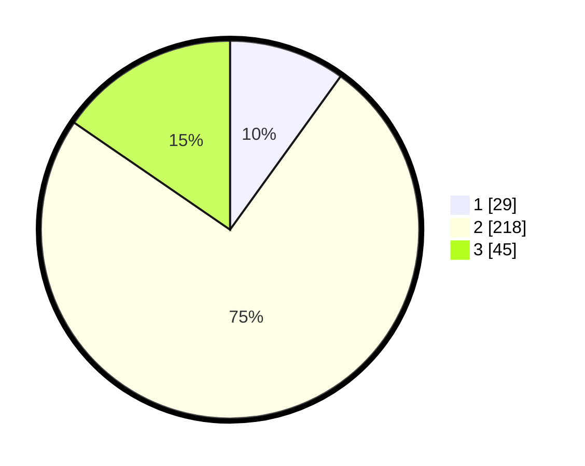

# Hasil

## Grafik

## Tabel

| No. | Nama Paslon    | Suara | Suara (raw) | Persentase |
|:--- |:-------------- | -----:| -----------:| ----------:|
| 1   | ANIES MUHAIMIN | 29    | [29][p-1]   | 9,93       |
| 2   | PRABOWO GIBRAN | 218   | [218][p-2]  | 74,66      |
| 3   | GANJAR MAHFUD  | 45    | [45][p-3]   | 15,41      |

[p-1]: https://github.com/gigit-pemilu/pemilu-2024-94-papua-tengah/blob/main/pilpres/hitung-suara/sub/94-papua-tengah/sub/01-nabire/sub/01-nabire/sub/1002-kali-bobo/sub/013-tps/sub/paslon-1.txt
[p-2]: https://github.com/gigit-pemilu/pemilu-2024-94-papua-tengah/blob/main/pilpres/hitung-suara/sub/94-papua-tengah/sub/01-nabire/sub/01-nabire/sub/1002-kali-bobo/sub/013-tps/sub/paslon-2.txt
[p-3]: https://github.com/gigit-pemilu/pemilu-2024-94-papua-tengah/blob/main/pilpres/hitung-suara/sub/94-papua-tengah/sub/01-nabire/sub/01-nabire/sub/1002-kali-bobo/sub/013-tps/sub/paslon-3.txt

## Foto C Plano

https://sirekap-obj-formc.kpu.go.id/8089/pemilu/ppwp/94/01/01/10/02/9401011002013-20240216-064932--9cd7397f-6e1a-43c9-b6d9-8de0f5130749.jpg

https://sirekap-obj-formc.kpu.go.id/8089/pemilu/ppwp/94/01/01/10/02/9401011002013-20240216-064935--1ff65a5c-9589-419f-8b0a-7e214674ae27.jpg

https://sirekap-obj-formc.kpu.go.id/8089/pemilu/ppwp/94/01/01/10/02/9401011002013-20240216-064933--8a031715-bd8c-4213-90f9-4196cb002a98.jpg

## Metadata

| Key        | Value               |
| ---------- | ------------------- |
| Time Stamp | 2024-02-16 09:30:28 |

## DATA PEMILIH TETAP

Jumlah pemilih dalam DPT: **299**.
 * L: **167**.
 * P: **132**.

## DATA PENGGUNA HAK PILIH

Jumlah pengguna hak pilih dalam DPT: **273**.
 * L: **160**.
 * P: **113**.

Jumlah pengguna hak pilih dalam DPTb: **0**.
 * L: **0**.
 * P: **0**.

Jumlah pengguna hak pilih dalam DPK: **0**.
 * L: **14**.
 * P: **12**.

Jumlah pengguna hak pilih: **299**.
 * L: **174**.
 * P: **125**.

## JUMLAH SUARA SAH DAN TIDAK SAH

JUMLAH SELURUH SUARA SAH: **292**.

JUMLAH SUARA TIDAK SAH: **7**.

JUMLAH SELURUH SUARA SAH DAN SUARA TIDAK SAH: **299**.

