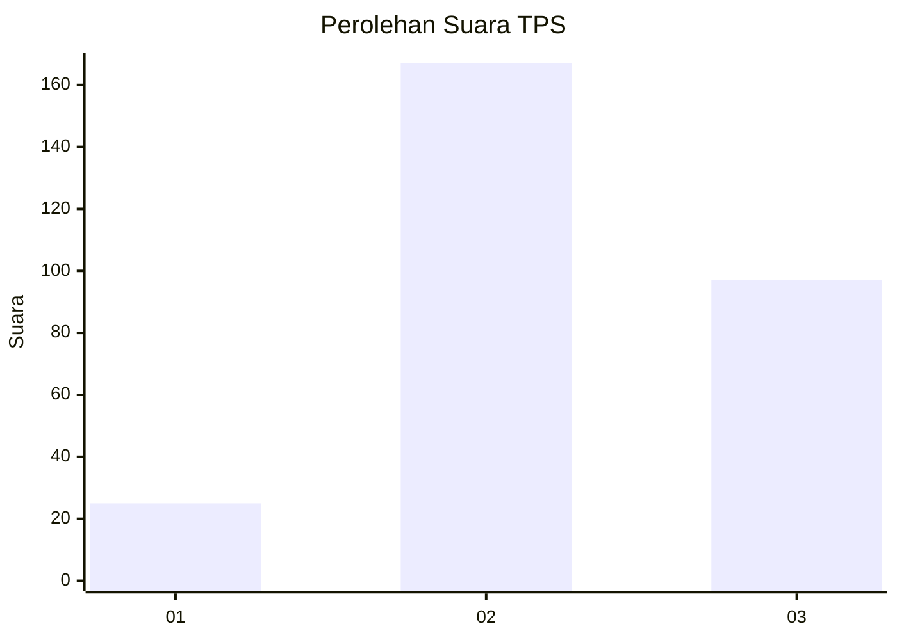
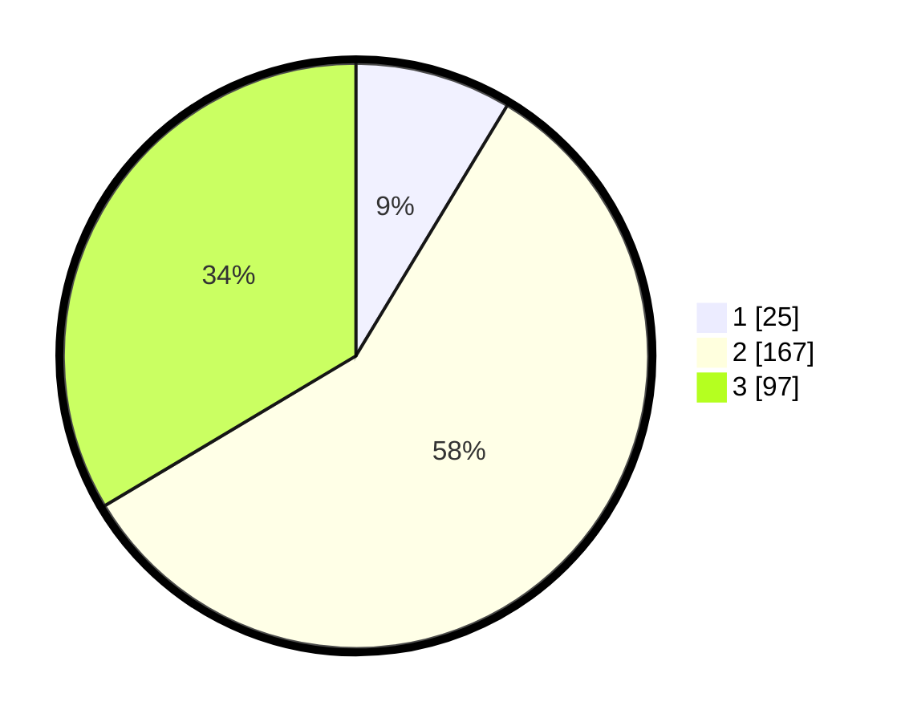

# Hasil

## Grafik

## Tabel

| No. | Nama Paslon    | Suara | Suara (raw) | Persentase |
|:--- |:-------------- | -----:| -----------:| ----------:|
| 1   | ANIES MUHAIMIN | 25    | [25][p-1]   | 8,65       |
| 2   | PRABOWO GIBRAN | 167   | [167][p-2]  | 57,79      |
| 3   | GANJAR MAHFUD  | 97    | [97][p-3]   | 33,56      |

[p-1]: https://github.com/gigit-pemilu/pemilu-2024-94-papua-tengah/blob/main/pilpres/hitung-suara/sub/94-papua-tengah/sub/01-nabire/sub/01-nabire/sub/1002-kali-bobo/sub/027-tps/sub/paslon-1.txt
[p-2]: https://github.com/gigit-pemilu/pemilu-2024-94-papua-tengah/blob/main/pilpres/hitung-suara/sub/94-papua-tengah/sub/01-nabire/sub/01-nabire/sub/1002-kali-bobo/sub/027-tps/sub/paslon-2.txt
[p-3]: https://github.com/gigit-pemilu/pemilu-2024-94-papua-tengah/blob/main/pilpres/hitung-suara/sub/94-papua-tengah/sub/01-nabire/sub/01-nabire/sub/1002-kali-bobo/sub/027-tps/sub/paslon-3.txt

## Foto C Plano

https://sirekap-obj-formc.kpu.go.id/ebea/pemilu/ppwp/94/01/01/10/02/9401011002027-20240215-083727--2ca0373f-f9dd-436b-828e-123d3c8f731d.jpg

https://sirekap-obj-formc.kpu.go.id/ebea/pemilu/ppwp/94/01/01/10/02/9401011002027-20240215-083840--07637282-1464-49ae-973e-d633fe3cd2a2.jpg

https://sirekap-obj-formc.kpu.go.id/ebea/pemilu/ppwp/94/01/01/10/02/9401011002027-20240215-084115--33c7240b-4a7c-4fdf-af55-1978b1b296ca.jpg

## Metadata

| Key        | Value               |
| ---------- | ------------------- |
| Time Stamp | 2024-02-15 19:30:26 |

