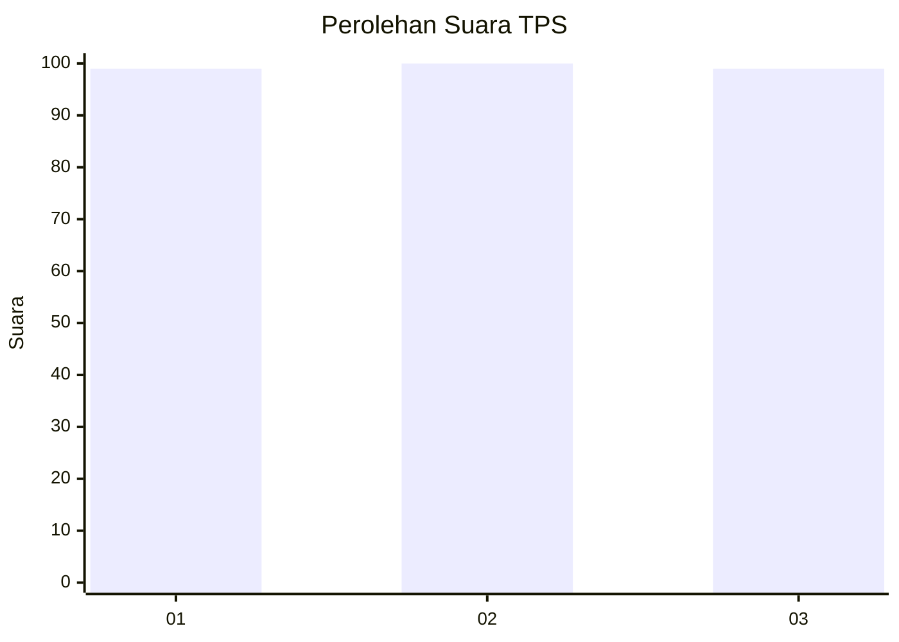
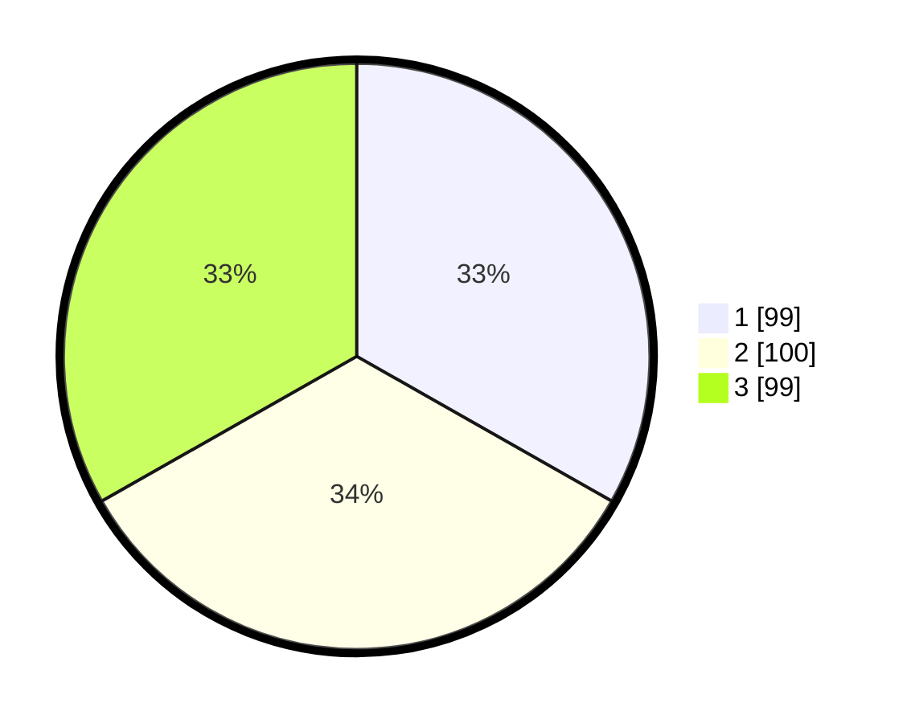

# Hasil

## Grafik

## Tabel

| No. | Nama Paslon    | Suara | Suara (raw) | Persentase |
|:--- |:-------------- | -----:| -----------:| ----------:|
| 1   | ANIES MUHAIMIN | 99    | [99][p-1]   | 33,22      |
| 2   | PRABOWO GIBRAN | 100   | [100][p-2]  | 33,56      |
| 3   | GANJAR MAHFUD  | 99    | [99][p-3]   | 33,22      |

[p-1]: https://github.com/gigit-pemilu/pemilu-2024-94-papua-tengah/blob/main/pilpres/hitung-suara/sub/94-papua-tengah/sub/01-nabire/sub/01-nabire/sub/1002-kali-bobo/sub/032-tps/sub/paslon-1.txt
[p-2]: https://github.com/gigit-pemilu/pemilu-2024-94-papua-tengah/blob/main/pilpres/hitung-suara/sub/94-papua-tengah/sub/01-nabire/sub/01-nabire/sub/1002-kali-bobo/sub/032-tps/sub/paslon-2.txt
[p-3]: https://github.com/gigit-pemilu/pemilu-2024-94-papua-tengah/blob/main/pilpres/hitung-suara/sub/94-papua-tengah/sub/01-nabire/sub/01-nabire/sub/1002-kali-bobo/sub/032-tps/sub/paslon-3.txt

## Foto C Plano

https://sirekap-obj-formc.kpu.go.id/589c/pemilu/ppwp/94/01/01/10/02/9401011002032-20240215-071657--61feeb68-1956-417a-bef3-34a505caf22f.jpg

https://sirekap-obj-formc.kpu.go.id/589c/pemilu/ppwp/94/01/01/10/02/9401011002032-20240215-071134--1be79e29-7df0-4cc5-ac32-f192407de84a.jpg

https://sirekap-obj-formc.kpu.go.id/589c/pemilu/ppwp/94/01/01/10/02/9401011002032-20240215-071231--29ce9639-5c79-421a-8698-b90fa6127ca3.jpg

## Metadata

| Key        | Value               |
| ---------- | ------------------- |
| Time Stamp | 2024-02-15 20:30:46 |

