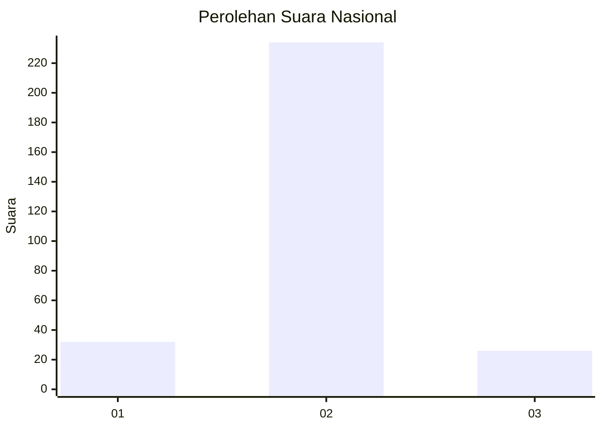
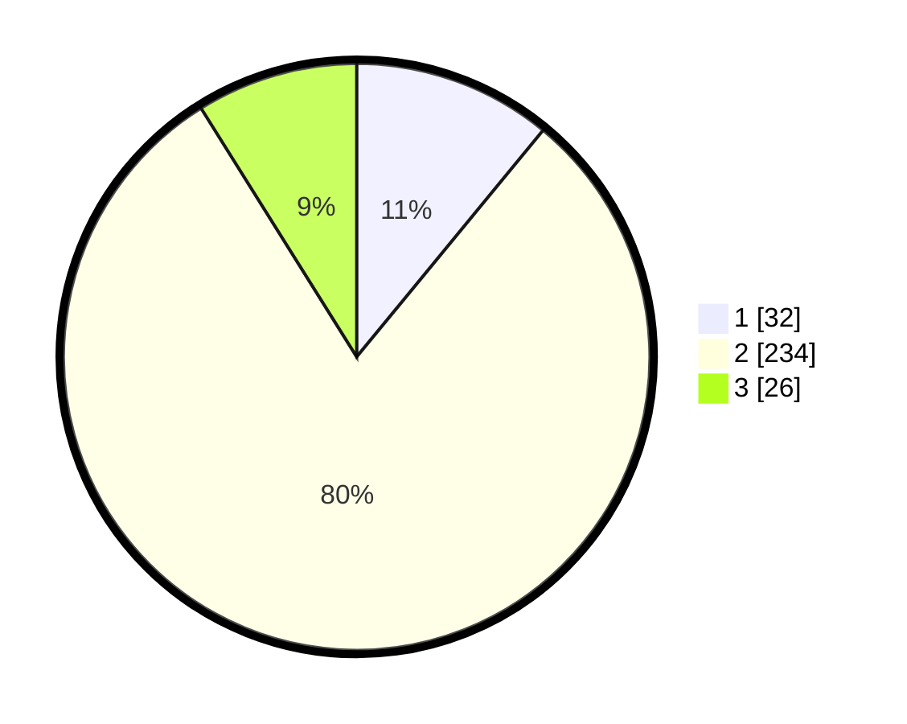

# Hasil

## Grafik

## Tabel

| No. | Nama Paslon    | Suara | Suara (raw) | Persentase |
|:--- |:-------------- | -----:| -----------:| ----------:|
| 1   | ANIES MUHAIMIN | 32    | [32][p-1]   | 10,96      |
| 2   | PRABOWO GIBRAN | 234   | [234][p-2]  | 80,14      |
| 3   | GANJAR MAHFUD  | 26    | [26][p-3]   | 8,90       |

[p-1]: https://github.com/gigit-pemilu/pemilu-2024/blob/main/pilpres/hitung-suara/sub/94-papua-tengah/sub/01-nabire/sub/01-nabire/sub/1004-girimulyo/sub/005-tps/sub/paslon-1.txt
[p-2]: https://github.com/gigit-pemilu/pemilu-2024/blob/main/pilpres/hitung-suara/sub/94-papua-tengah/sub/01-nabire/sub/01-nabire/sub/1004-girimulyo/sub/005-tps/sub/paslon-2.txt
[p-3]: https://github.com/gigit-pemilu/pemilu-2024/blob/main/pilpres/hitung-suara/sub/94-papua-tengah/sub/01-nabire/sub/01-nabire/sub/1004-girimulyo/sub/005-tps/sub/paslon-3.txt

## Foto C Plano

https://sirekap-obj-formc.kpu.go.id/766f/pemilu/ppwp/94/01/01/10/04/9401011004005-20240214-124342--9cb5ff57-9d85-4fb2-854a-5bd4820edc8d.jpg

https://sirekap-obj-formc.kpu.go.id/766f/pemilu/ppwp/94/01/01/10/04/9401011004005-20240214-124631--5a2ee6bc-f9da-4b54-b805-05aadeb019e5.jpg

https://sirekap-obj-formc.kpu.go.id/766f/pemilu/ppwp/94/01/01/10/04/9401011004005-20240214-124829--e97806be-b90a-4308-851e-66be9f38c7c0.jpg

## Metadata

| Key        | Value               |
| ---------- | ------------------- |
| Time Stamp | 2024-02-14 21:46:01 |

## DATA PEMILIH TETAP

Jumlah pemilih dalam DPT: **293**.
 * L: **144**.
 * P: **149**.

## DATA PENGGUNA HAK PILIH

Jumlah pengguna hak pilih dalam DPT: **293**.
 * L: **144**.
 * P: **149**.

Jumlah pengguna hak pilih dalam DPTb: **7**.
 * L: **4**.
 * P: **3**.

Jumlah pengguna hak pilih dalam DPK: **0**.
 * L: **0**.
 * P: **0**.

Jumlah pengguna hak pilih: **300**.
 * L: **148**.
 * P: **152**.

## JUMLAH SUARA SAH DAN TIDAK SAH

JUMLAH SELURUH SUARA SAH: **300**.

JUMLAH SUARA TIDAK SAH: **8**.

JUMLAH SELURUH SUARA SAH DAN SUARA TIDAK SAH: **300**.

