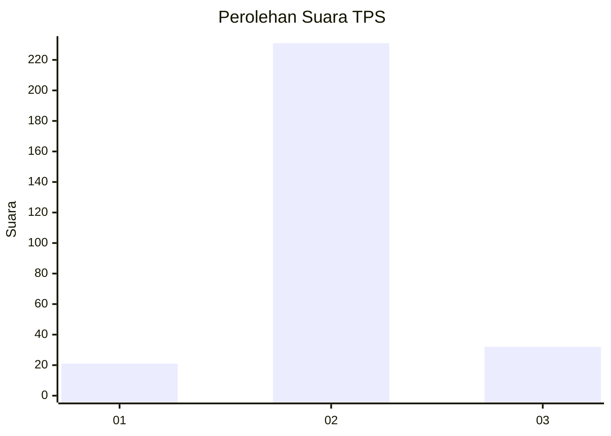
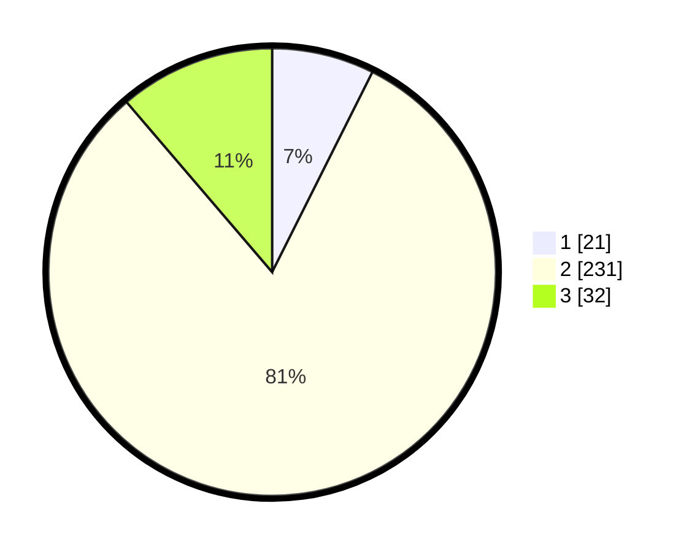

# Hasil

## Grafik

## Tabel

| No. | Nama Paslon    | Suara | Suara (raw) | Persentase |
|:--- |:-------------- | -----:| -----------:| ----------:|
| 1   | ANIES MUHAIMIN | 21    | [21][p-1]   | 7,39       |
| 2   | PRABOWO GIBRAN | 231   | [231][p-2]  | 81,34      |
| 3   | GANJAR MAHFUD  | 32    | [32][p-3]   | 11,27      |

[p-1]: https://github.com/gigit-pemilu/pemilu-2024-94-papua-tengah/blob/main/pilpres/hitung-suara/sub/94-papua-tengah/sub/01-nabire/sub/01-nabire/sub/1004-girimulyo/sub/007-tps/sub/paslon-1.txt
[p-2]: https://github.com/gigit-pemilu/pemilu-2024-94-papua-tengah/blob/main/pilpres/hitung-suara/sub/94-papua-tengah/sub/01-nabire/sub/01-nabire/sub/1004-girimulyo/sub/007-tps/sub/paslon-2.txt
[p-3]: https://github.com/gigit-pemilu/pemilu-2024-94-papua-tengah/blob/main/pilpres/hitung-suara/sub/94-papua-tengah/sub/01-nabire/sub/01-nabire/sub/1004-girimulyo/sub/007-tps/sub/paslon-3.txt

## Foto C Plano

https://sirekap-obj-formc.kpu.go.id/67f9/pemilu/ppwp/94/01/01/10/04/9401011004007-20240214-193736--8435c7d6-23f8-4418-8989-32b97577b551.jpg

https://sirekap-obj-formc.kpu.go.id/67f9/pemilu/ppwp/94/01/01/10/04/9401011004007-20240214-193428--6fad2c34-3279-4e32-93c8-6e477347ccc8.jpg

https://sirekap-obj-formc.kpu.go.id/67f9/pemilu/ppwp/94/01/01/10/04/9401011004007-20240214-193954--5d119b80-f03a-4687-9cd1-e0828b4a3125.jpg

## Metadata

| Key        | Value               |
| ---------- | ------------------- |
| Time Stamp | 2024-02-15 19:30:26 |

