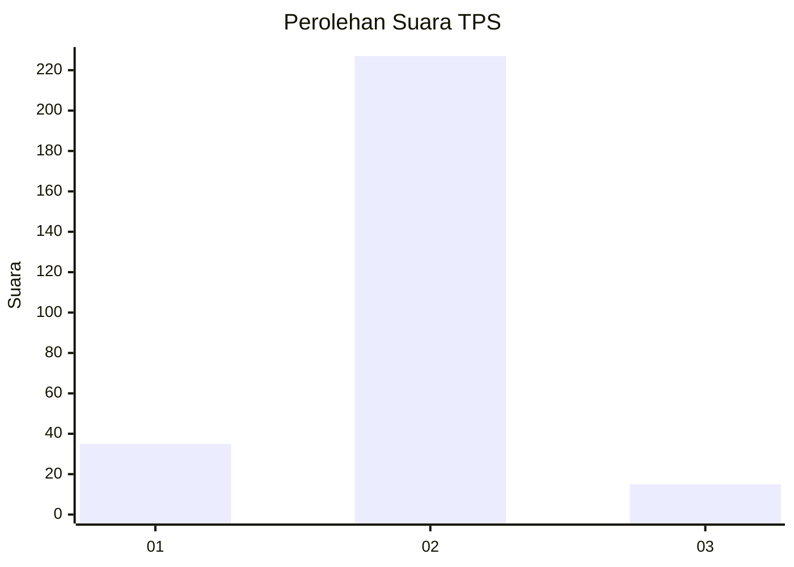
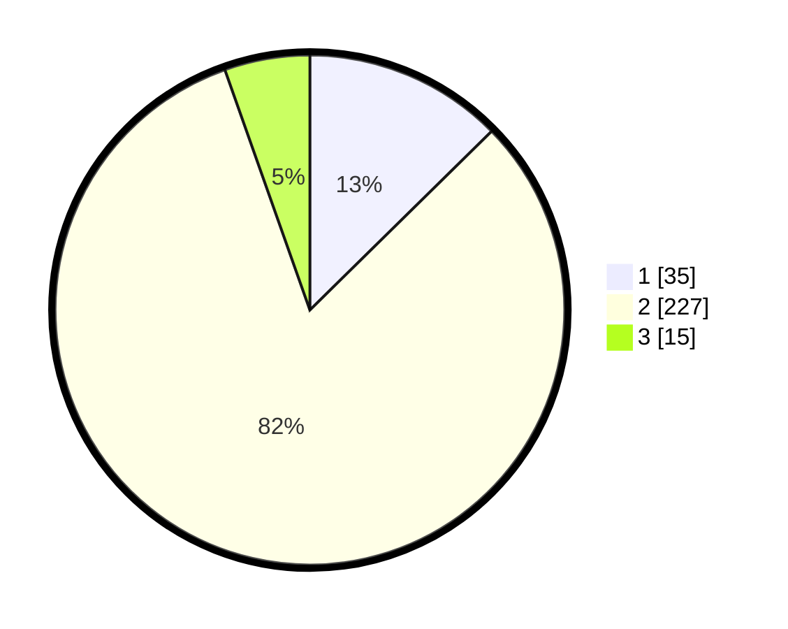

# Hasil

## Grafik

## Tabel

| No. | Nama Paslon    | Suara | Suara (raw) | Persentase |
|:--- |:-------------- | -----:| -----------:| ----------:|
| 1   | ANIES MUHAIMIN | 35    | [35][p-1]   | 12,64      |
| 2   | PRABOWO GIBRAN | 227   | [227][p-2]  | 81,95      |
| 3   | GANJAR MAHFUD  | 15    | [15][p-3]   | 5,42       |

[p-1]: https://github.com/gigit-pemilu/pemilu-2024-94-papua-tengah/blob/main/pilpres/hitung-suara/sub/94-papua-tengah/sub/01-nabire/sub/01-nabire/sub/1004-girimulyo/sub/014-tps/sub/paslon-1.txt
[p-2]: https://github.com/gigit-pemilu/pemilu-2024-94-papua-tengah/blob/main/pilpres/hitung-suara/sub/94-papua-tengah/sub/01-nabire/sub/01-nabire/sub/1004-girimulyo/sub/014-tps/sub/paslon-2.txt
[p-3]: https://github.com/gigit-pemilu/pemilu-2024-94-papua-tengah/blob/main/pilpres/hitung-suara/sub/94-papua-tengah/sub/01-nabire/sub/01-nabire/sub/1004-girimulyo/sub/014-tps/sub/paslon-3.txt

## Foto C Plano

https://sirekap-obj-formc.kpu.go.id/49d7/pemilu/ppwp/94/01/01/10/04/9401011004014-20240215-073415--50089b4f-981e-46c1-ba8e-abf435cb6c09.jpg

https://sirekap-obj-formc.kpu.go.id/49d7/pemilu/ppwp/94/01/01/10/04/9401011004014-20240215-073450--c6614c1e-99ba-4799-a018-3e961e505e0c.jpg

https://sirekap-obj-formc.kpu.go.id/49d7/pemilu/ppwp/94/01/01/10/04/9401011004014-20240215-073522--2bc30ef2-0297-4481-9c1c-40901a0ff8b3.jpg

## Metadata

| Key        | Value               |
| ---------- | ------------------- |
| Time Stamp | 2024-02-15 19:30:26 |

