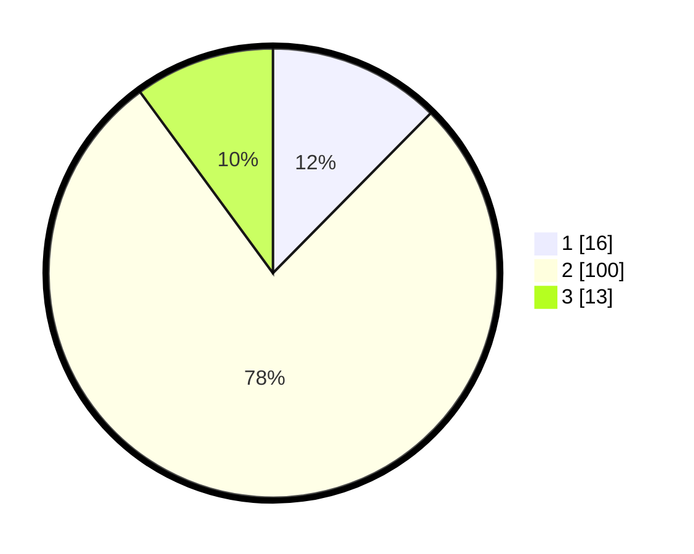

# Hasil

## Grafik

## Tabel

| No. | Nama Paslon    | Suara | Suara (raw) | Persentase |
|:--- |:-------------- | -----:| -----------:| ----------:|
| 1   | ANIES MUHAIMIN | 16    | [16][p-1]   | 12,40      |
| 2   | PRABOWO GIBRAN | 100   | [100][p-2]  | 77,52      |
| 3   | GANJAR MAHFUD  | 13    | [13][p-3]   | 10,08      |

[p-1]: https://github.com/gigit-pemilu/pemilu-2024-94-papua-tengah/blob/main/pilpres/hitung-suara/sub/94-papua-tengah/sub/01-nabire/sub/01-nabire/sub/1004-girimulyo/sub/016-tps/sub/paslon-1.txt
[p-2]: https://github.com/gigit-pemilu/pemilu-2024-94-papua-tengah/blob/main/pilpres/hitung-suara/sub/94-papua-tengah/sub/01-nabire/sub/01-nabire/sub/1004-girimulyo/sub/016-tps/sub/paslon-2.txt
[p-3]: https://github.com/gigit-pemilu/pemilu-2024-94-papua-tengah/blob/main/pilpres/hitung-suara/sub/94-papua-tengah/sub/01-nabire/sub/01-nabire/sub/1004-girimulyo/sub/016-tps/sub/paslon-3.txt

## Foto C Plano

https://sirekap-obj-formc.kpu.go.id/934f/pemilu/ppwp/94/01/01/10/04/9401011004016-20240216-083735--5118a5d4-6bc8-45b5-8ea1-706718df3469.jpg

https://sirekap-obj-formc.kpu.go.id/934f/pemilu/ppwp/94/01/01/10/04/9401011004016-20240214-132846--e25b0b1f-e051-48ec-a296-eacbcba8072e.jpg

https://sirekap-obj-formc.kpu.go.id/934f/pemilu/ppwp/94/01/01/10/04/9401011004016-20240214-131445--7fc5113f-236d-40a2-8181-658e12869056.jpg

## Metadata

| Key        | Value               |
| ---------- | ------------------- |
| Time Stamp | 2024-02-16 09:00:28 |

