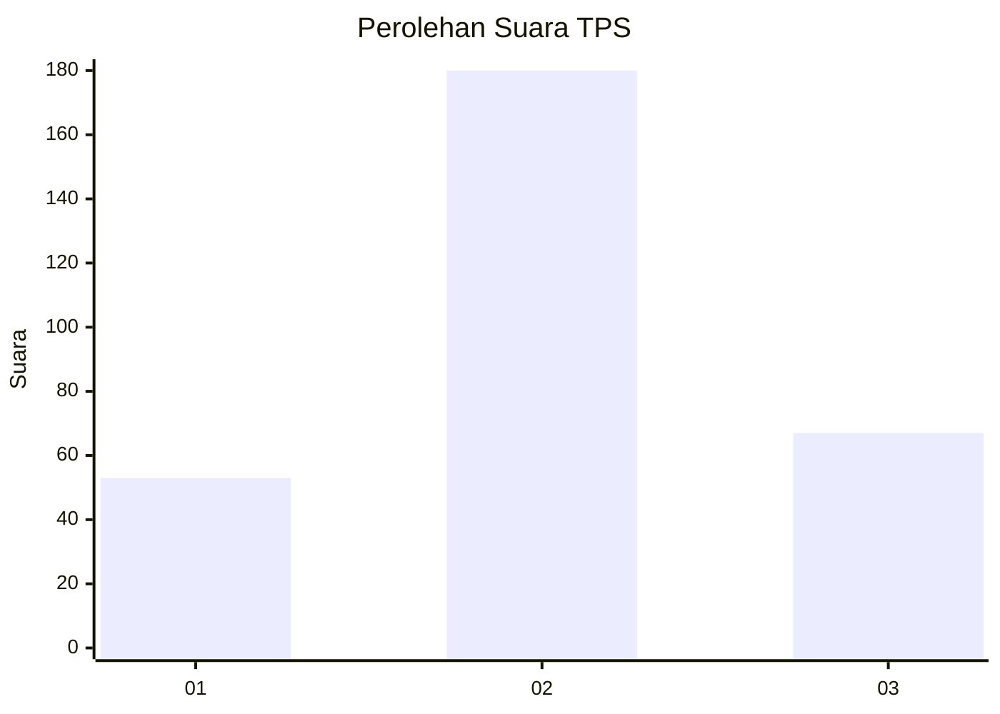
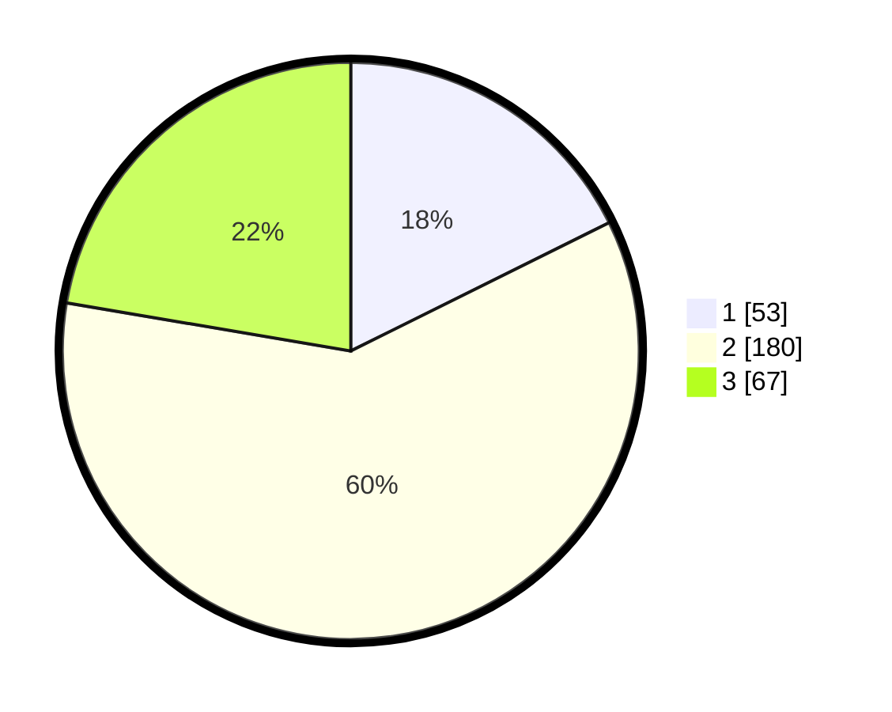

# Hasil

## Grafik

## Tabel

| No. | Nama Paslon    | Suara | Suara (raw) | Persentase |
|:--- |:-------------- | -----:| -----------:| ----------:|
| 1   | ANIES MUHAIMIN | 53    | [53][p-1]   | 17,67      |
| 2   | PRABOWO GIBRAN | 180   | [180][p-2]  | 60,00      |
| 3   | GANJAR MAHFUD  | 67    | [67][p-3]   | 22,33      |

[p-1]: https://github.com/gigit-pemilu/pemilu-2024-94-papua-tengah/blob/main/pilpres/hitung-suara/sub/94-papua-tengah/sub/01-nabire/sub/01-nabire/sub/1005-karang-tumaritis/sub/004-tps/sub/paslon-1.txt
[p-2]: https://github.com/gigit-pemilu/pemilu-2024-94-papua-tengah/blob/main/pilpres/hitung-suara/sub/94-papua-tengah/sub/01-nabire/sub/01-nabire/sub/1005-karang-tumaritis/sub/004-tps/sub/paslon-2.txt
[p-3]: https://github.com/gigit-pemilu/pemilu-2024-94-papua-tengah/blob/main/pilpres/hitung-suara/sub/94-papua-tengah/sub/01-nabire/sub/01-nabire/sub/1005-karang-tumaritis/sub/004-tps/sub/paslon-3.txt

## Foto C Plano

https://sirekap-obj-formc.kpu.go.id/84fd/pemilu/ppwp/94/01/01/10/05/9401011005004-20240215-085343--f9137fa7-4e1a-408b-bbd6-4677e487d6c6.jpg

https://sirekap-obj-formc.kpu.go.id/84fd/pemilu/ppwp/94/01/01/10/05/9401011005004-20240215-090152--1da5878d-7656-401e-bd77-745b29fd2344.jpg

## Metadata

| Key        | Value               |
| ---------- | ------------------- |
| Time Stamp | 2024-02-15 20:00:44 |

