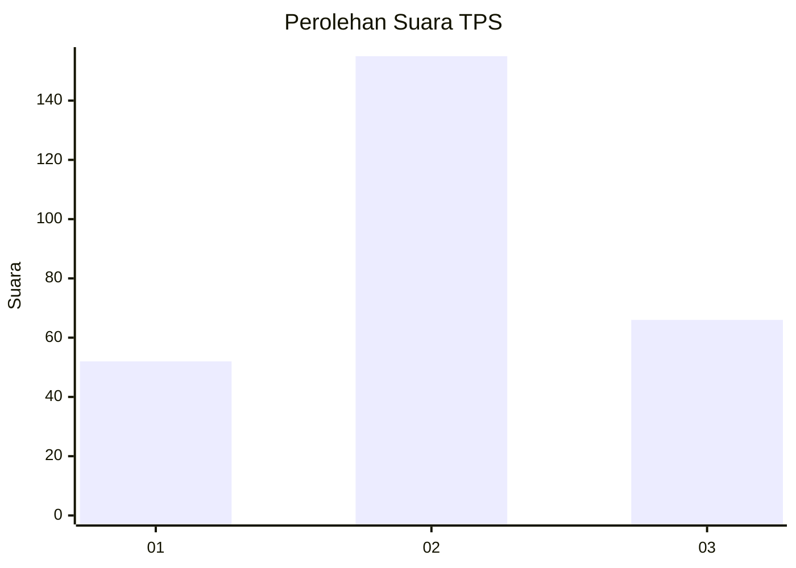
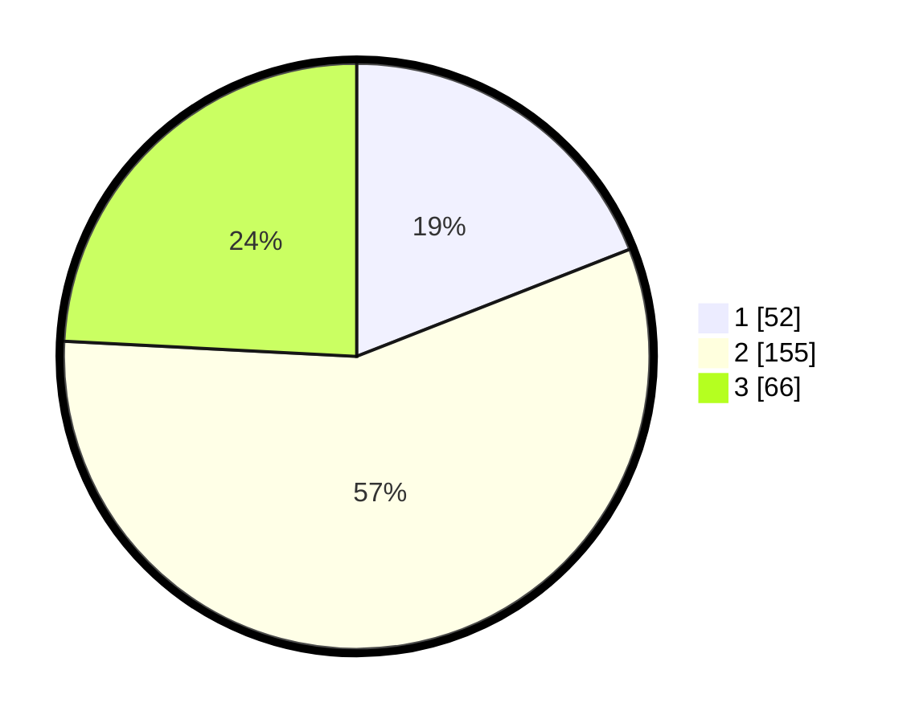

# Hasil

## Grafik

## Tabel

| No. | Nama Paslon    | Suara | Suara (raw) | Persentase |
|:--- |:-------------- | -----:| -----------:| ----------:|
| 1   | ANIES MUHAIMIN | 52    | [52][p-1]   | 19,05      |
| 2   | PRABOWO GIBRAN | 155   | [155][p-2]  | 56,78      |
| 3   | GANJAR MAHFUD  | 66    | [66][p-3]   | 24,18      |

[p-1]: https://github.com/gigit-pemilu/pemilu-2024-94-papua-tengah/blob/main/pilpres/hitung-suara/sub/94-papua-tengah/sub/01-nabire/sub/01-nabire/sub/1005-karang-tumaritis/sub/005-tps/sub/paslon-1.txt
[p-2]: https://github.com/gigit-pemilu/pemilu-2024-94-papua-tengah/blob/main/pilpres/hitung-suara/sub/94-papua-tengah/sub/01-nabire/sub/01-nabire/sub/1005-karang-tumaritis/sub/005-tps/sub/paslon-2.txt
[p-3]: https://github.com/gigit-pemilu/pemilu-2024-94-papua-tengah/blob/main/pilpres/hitung-suara/sub/94-papua-tengah/sub/01-nabire/sub/01-nabire/sub/1005-karang-tumaritis/sub/005-tps/sub/paslon-3.txt

## Foto C Plano

https://sirekap-obj-formc.kpu.go.id/6cf7/pemilu/ppwp/94/01/01/10/05/9401011005005-20240215-112503--0f0dbf3d-5b74-46d7-a889-ebd5beb36312.jpg

https://sirekap-obj-formc.kpu.go.id/6cf7/pemilu/ppwp/94/01/01/10/05/9401011005005-20240215-112612--ffce01b2-6931-404a-b595-ffbefd2e875e.jpg

https://sirekap-obj-formc.kpu.go.id/6cf7/pemilu/ppwp/94/01/01/10/05/9401011005005-20240215-112702--1142730d-7858-4166-a0d4-bb98281dd68c.jpg

## Metadata

| Key        | Value               |
| ---------- | ------------------- |
| Time Stamp | 2024-02-15 19:30:26 |

