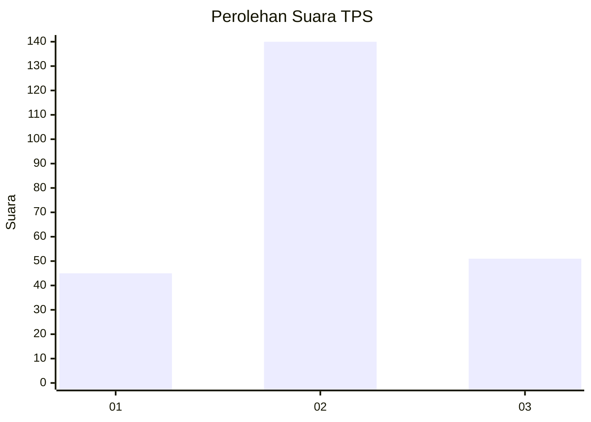
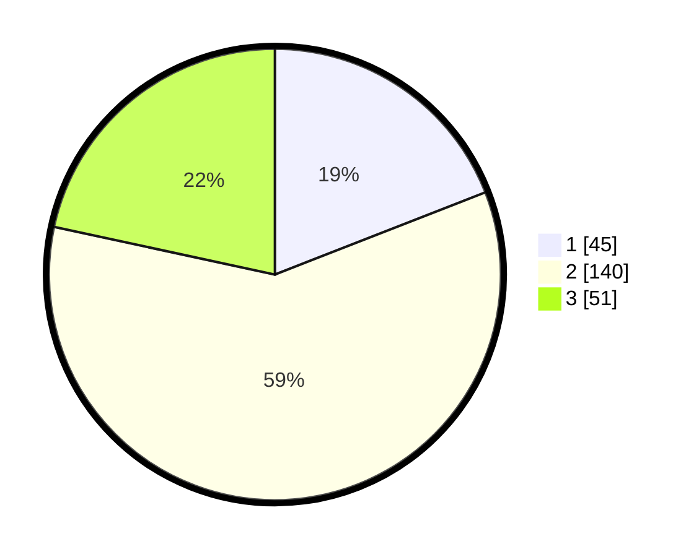

# Hasil

## Grafik

## Tabel

| No. | Nama Paslon    | Suara | Suara (raw) | Persentase |
|:--- |:-------------- | -----:| -----------:| ----------:|
| 1   | ANIES MUHAIMIN | 45    | [45][p-1]   | 19,07      |
| 2   | PRABOWO GIBRAN | 140   | [140][p-2]  | 59,32      |
| 3   | GANJAR MAHFUD  | 51    | [51][p-3]   | 21,61      |

[p-1]: https://github.com/gigit-pemilu/pemilu-2024-94-papua-tengah/blob/main/pilpres/hitung-suara/sub/94-papua-tengah/sub/01-nabire/sub/01-nabire/sub/1005-karang-tumaritis/sub/013-tps/sub/paslon-1.txt
[p-2]: https://github.com/gigit-pemilu/pemilu-2024-94-papua-tengah/blob/main/pilpres/hitung-suara/sub/94-papua-tengah/sub/01-nabire/sub/01-nabire/sub/1005-karang-tumaritis/sub/013-tps/sub/paslon-2.txt
[p-3]: https://github.com/gigit-pemilu/pemilu-2024-94-papua-tengah/blob/main/pilpres/hitung-suara/sub/94-papua-tengah/sub/01-nabire/sub/01-nabire/sub/1005-karang-tumaritis/sub/013-tps/sub/paslon-3.txt

## Foto C Plano

https://sirekap-obj-formc.kpu.go.id/05ec/pemilu/ppwp/94/01/01/10/05/9401011005013-20240215-135215--afabfcdc-e9d3-4400-aec6-ec8f09b0e2d8.jpg

https://sirekap-obj-formc.kpu.go.id/05ec/pemilu/ppwp/94/01/01/10/05/9401011005013-20240215-135328--692804b4-4036-4b32-890e-44f06f9c9b3c.jpg

https://sirekap-obj-formc.kpu.go.id/05ec/pemilu/ppwp/94/01/01/10/05/9401011005013-20240215-135431--289cc661-465b-44aa-9bf5-28470b72a23b.jpg

## Metadata

| Key        | Value               |
| ---------- | ------------------- |
| Time Stamp | 2024-02-15 19:30:26 |

