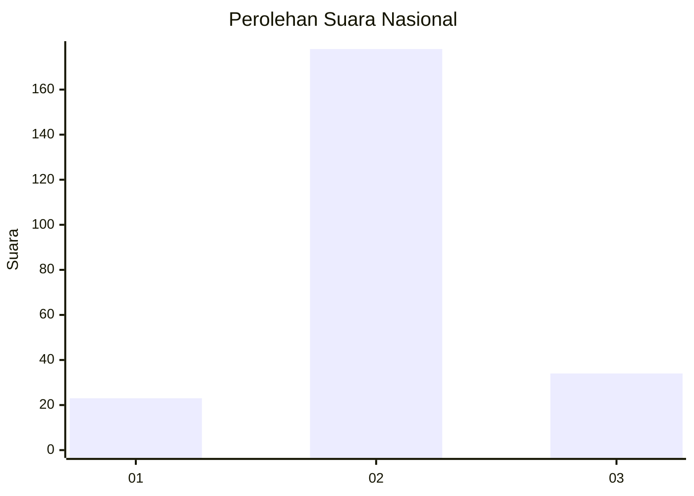

# Hasil

## Grafik

## Tabel

| No. | Nama Paslon    | Suara | Suara (raw) | Persentase |
|:--- |:-------------- | -----:| -----------:| ----------:|
| 1   | ANIES MUHAIMIN | 23    | [23][p-1]   | 9,79       |
| 2   | PRABOWO GIBRAN | 178   | [178][p-2]  | 75,74      |
| 3   | GANJAR MAHFUD  | 34    | [34][p-3]   | 14,47      |

[p-1]: https://github.com/gigit-pemilu/pemilu-2024/blob/main/pilpres/hitung-suara/sub/94-papua-tengah/sub/01-nabire/sub/01-nabire/sub/1005-karang-tumaritis/sub/019-tps/sub/paslon-1.txt
[p-2]: https://github.com/gigit-pemilu/pemilu-2024/blob/main/pilpres/hitung-suara/sub/94-papua-tengah/sub/01-nabire/sub/01-nabire/sub/1005-karang-tumaritis/sub/019-tps/sub/paslon-2.txt
[p-3]: https://github.com/gigit-pemilu/pemilu-2024/blob/main/pilpres/hitung-suara/sub/94-papua-tengah/sub/01-nabire/sub/01-nabire/sub/1005-karang-tumaritis/sub/019-tps/sub/paslon-3.txt

## Foto C Plano

https://sirekap-obj-formc.kpu.go.id/4247/pemilu/ppwp/94/01/01/10/05/9401011005019-20240215-124659--0d893b01-b46a-4640-96c1-9db9fccfa168.jpg

https://sirekap-obj-formc.kpu.go.id/4247/pemilu/ppwp/94/01/01/10/05/9401011005019-20240215-123605--e51aa419-84c4-4893-bc39-8833ae41d583.jpg

https://sirekap-obj-formc.kpu.go.id/4247/pemilu/ppwp/94/01/01/10/05/9401011005019-20240215-123947--23ee09d5-5971-4b0f-802c-41eedd894193.jpg

## Metadata

| Key        | Value               |
| ---------- | ------------------- |
| Time Stamp | 2024-02-15 20:00:44 |

