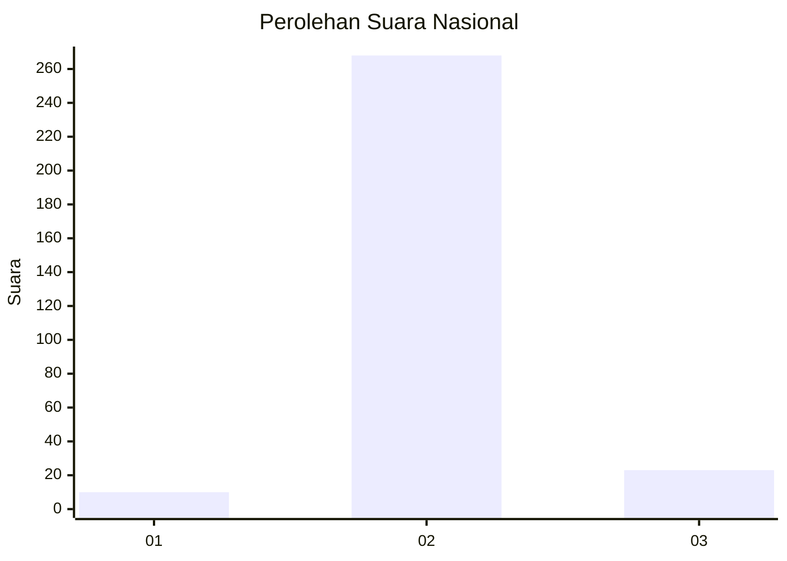
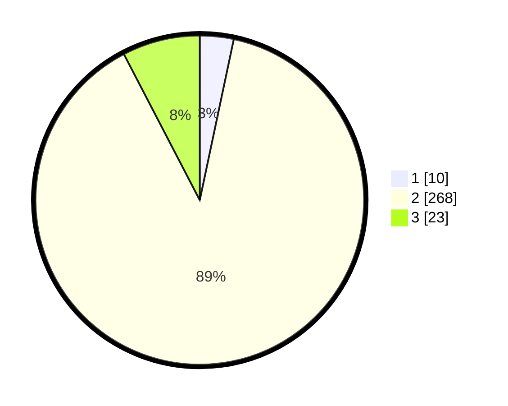

# Hasil

## Grafik

## Tabel

| No. | Nama Paslon    | Suara | Suara (raw) | Persentase |
|:--- |:-------------- | -----:| -----------:| ----------:|
| 1   | ANIES MUHAIMIN | 10    | [10][p-1]   | 3,32       |
| 2   | PRABOWO GIBRAN | 268   | [268][p-2]  | 89,04      |
| 3   | GANJAR MAHFUD  | 23    | [23][p-3]   | 7,64       |

[p-1]: https://github.com/gigit-pemilu/pemilu-2024/blob/main/pilpres/hitung-suara/sub/94-papua-tengah/sub/01-nabire/sub/01-nabire/sub/1006-oyehe/sub/001-tps/sub/paslon-1.txt
[p-2]: https://github.com/gigit-pemilu/pemilu-2024/blob/main/pilpres/hitung-suara/sub/94-papua-tengah/sub/01-nabire/sub/01-nabire/sub/1006-oyehe/sub/001-tps/sub/paslon-2.txt
[p-3]: https://github.com/gigit-pemilu/pemilu-2024/blob/main/pilpres/hitung-suara/sub/94-papua-tengah/sub/01-nabire/sub/01-nabire/sub/1006-oyehe/sub/001-tps/sub/paslon-3.txt

## Foto C Plano

https://sirekap-obj-formc.kpu.go.id/0ec4/pemilu/ppwp/94/01/01/10/06/9401011006001-20240219-041835--a6c9f4e9-f40e-4a93-b00a-2d4158abbfd0.jpg

https://sirekap-obj-formc.kpu.go.id/0ec4/pemilu/ppwp/94/01/01/10/06/9401011006001-20240219-041837--3f674791-e329-4ce6-88d8-70788a0efb02.jpg

https://sirekap-obj-formc.kpu.go.id/0ec4/pemilu/ppwp/94/01/01/10/06/9401011006001-20240219-041836--342b7db5-df58-4a5c-b1da-70a5af481647.jpg

## Metadata

| Key        | Value               |
| ---------- | ------------------- |
| Time Stamp | 2024-02-24 22:31:28 |

## DATA PEMILIH TETAP

Jumlah pemilih dalam DPT: **299**.
 * L: **149**.
 * P: **150**.

## DATA PENGGUNA HAK PILIH

Jumlah pengguna hak pilih dalam DPT: **299**.
 * L: **149**.
 * P: **150**.

Jumlah pengguna hak pilih dalam DPTb: **3**.
 * L: **2**.
 * P: **1**.

Jumlah pengguna hak pilih dalam DPK: **0**.
 * L: **0**.
 * P: **0**.

Jumlah pengguna hak pilih: **302**.
 * L: **151**.
 * P: **151**.

## JUMLAH SUARA SAH DAN TIDAK SAH

JUMLAH SELURUH SUARA SAH: **301**.

JUMLAH SUARA TIDAK SAH: **1**.

JUMLAH SELURUH SUARA SAH DAN SUARA TIDAK SAH: **302**.

