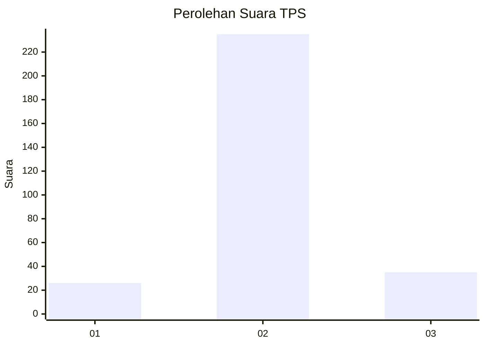
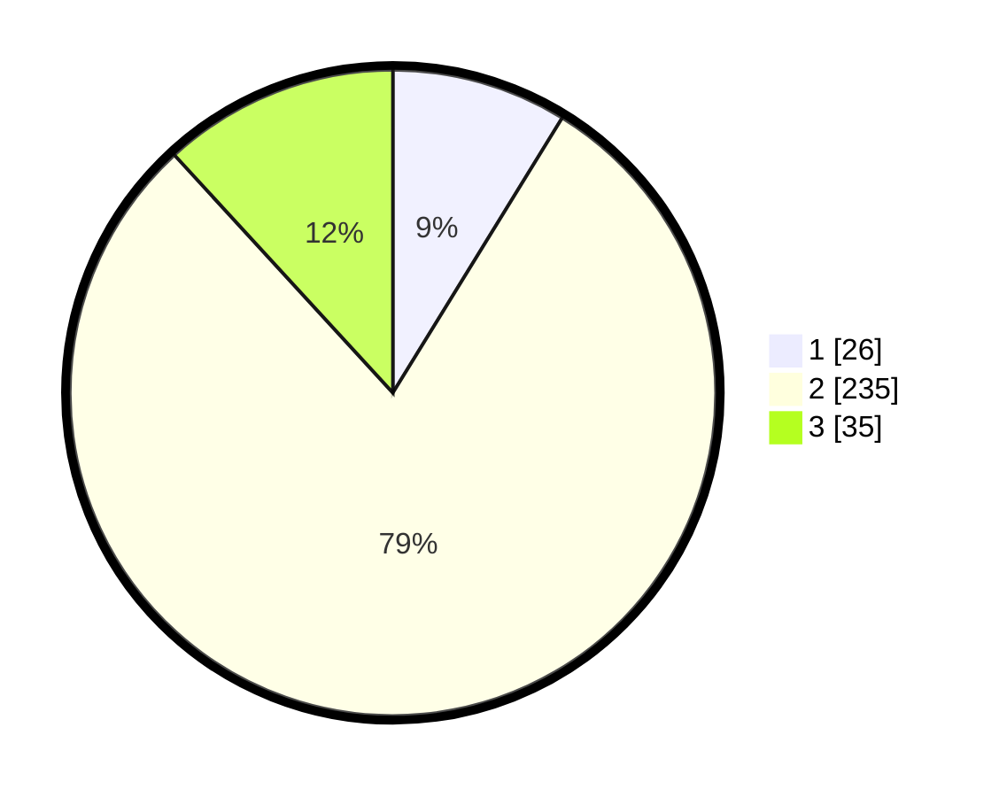

# Hasil

## Grafik

## Tabel

| No. | Nama Paslon    | Suara | Suara (raw) | Persentase |
|:--- |:-------------- | -----:| -----------:| ----------:|
| 1   | ANIES MUHAIMIN | 26    | [26][p-1]   | 8,78       |
| 2   | PRABOWO GIBRAN | 235   | [235][p-2]  | 79,39      |
| 3   | GANJAR MAHFUD  | 35    | [35][p-3]   | 11,82      |

[p-1]: https://github.com/gigit-pemilu/pemilu-2024-94-papua-tengah/blob/main/pilpres/hitung-suara/sub/94-papua-tengah/sub/01-nabire/sub/01-nabire/sub/1006-oyehe/sub/005-tps/sub/paslon-1.txt
[p-2]: https://github.com/gigit-pemilu/pemilu-2024-94-papua-tengah/blob/main/pilpres/hitung-suara/sub/94-papua-tengah/sub/01-nabire/sub/01-nabire/sub/1006-oyehe/sub/005-tps/sub/paslon-2.txt
[p-3]: https://github.com/gigit-pemilu/pemilu-2024-94-papua-tengah/blob/main/pilpres/hitung-suara/sub/94-papua-tengah/sub/01-nabire/sub/01-nabire/sub/1006-oyehe/sub/005-tps/sub/paslon-3.txt

## Foto C Plano

https://sirekap-obj-formc.kpu.go.id/cecb/pemilu/ppwp/94/01/01/10/06/9401011006005-20240215-122849--59510388-4fcd-4f60-93c8-9ee31d9456da.jpg

https://sirekap-obj-formc.kpu.go.id/cecb/pemilu/ppwp/94/01/01/10/06/9401011006005-20240215-123037--20aed049-5151-411f-bb4b-6119307db763.jpg

https://sirekap-obj-formc.kpu.go.id/cecb/pemilu/ppwp/94/01/01/10/06/9401011006005-20240215-123207--9f443115-b5e0-44aa-ba28-6d28b47439ca.jpg

## Metadata

| Key        | Value               |
| ---------- | ------------------- |
| Time Stamp | 2024-02-24 22:31:28 |

## DATA PEMILIH TETAP

Jumlah pemilih dalam DPT: **299**.
 * L: **76**.
 * P: **223**.

## DATA PENGGUNA HAK PILIH

Jumlah pengguna hak pilih dalam DPT: **299**.
 * L: **76**.
 * P: **223**.

Jumlah pengguna hak pilih dalam DPTb: **0**.
 * L: **0**.
 * P: **0**.

Jumlah pengguna hak pilih dalam DPK: **0**.
 * L: **0**.
 * P: **0**.

Jumlah pengguna hak pilih: **299**.
 * L: **76**.
 * P: **223**.

## JUMLAH SUARA SAH DAN TIDAK SAH

JUMLAH SELURUH SUARA SAH: **296**.

JUMLAH SUARA TIDAK SAH: **2**.

JUMLAH SELURUH SUARA SAH DAN SUARA TIDAK SAH: **298**.

