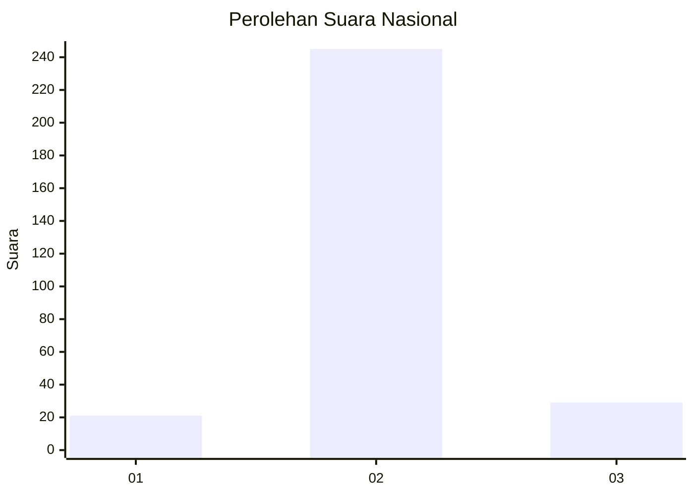
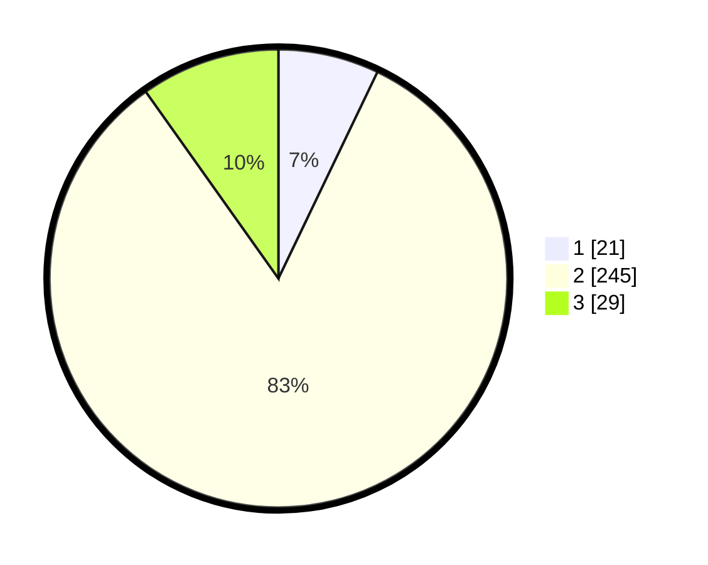

# Hasil

## Grafik

## Tabel

| No. | Nama Paslon    | Suara | Suara (raw) | Persentase |
|:--- |:-------------- | -----:| -----------:| ----------:|
| 1   | ANIES MUHAIMIN | 21    | [21][p-1]   | 7,12       |
| 2   | PRABOWO GIBRAN | 245   | [245][p-2]  | 83,05      |
| 3   | GANJAR MAHFUD  | 29    | [29][p-3]   | 9,83       |

[p-1]: https://github.com/gigit-pemilu/pemilu-2024/blob/main/pilpres/hitung-suara/sub/94-papua-tengah/sub/01-nabire/sub/01-nabire/sub/1006-oyehe/sub/008-tps/sub/paslon-1.txt
[p-2]: https://github.com/gigit-pemilu/pemilu-2024/blob/main/pilpres/hitung-suara/sub/94-papua-tengah/sub/01-nabire/sub/01-nabire/sub/1006-oyehe/sub/008-tps/sub/paslon-2.txt
[p-3]: https://github.com/gigit-pemilu/pemilu-2024/blob/main/pilpres/hitung-suara/sub/94-papua-tengah/sub/01-nabire/sub/01-nabire/sub/1006-oyehe/sub/008-tps/sub/paslon-3.txt

## Foto C Plano

https://sirekap-obj-formc.kpu.go.id/7c44/pemilu/ppwp/94/01/01/10/06/9401011006008-20240216-141207--5735f5f6-50ab-4f10-96a3-255bfc9b0681.jpg

https://sirekap-obj-formc.kpu.go.id/7c44/pemilu/ppwp/94/01/01/10/06/9401011006008-20240216-141208--85f4ed10-4d7b-4be9-b1db-412fb5079c44.jpg

https://sirekap-obj-formc.kpu.go.id/7c44/pemilu/ppwp/94/01/01/10/06/9401011006008-20240216-083925--89e52fc1-437e-4cdf-b3c2-98d0531b9c98.jpg

## Metadata

| Key        | Value               |
| ---------- | ------------------- |
| Time Stamp | 2024-02-17 01:00:00 |

## DATA PEMILIH TETAP

Jumlah pemilih dalam DPT: **299**.
 * L: **153**.
 * P: **146**.

## DATA PENGGUNA HAK PILIH

Jumlah pengguna hak pilih dalam DPT: **299**.
 * L: **153**.
 * P: **146**.

Jumlah pengguna hak pilih dalam DPTb: **8**.
 * L: **3**.
 * P: **5**.

Jumlah pengguna hak pilih dalam DPK: **0**.
 * L: **0**.
 * P: **0**.

Jumlah pengguna hak pilih: **307**.
 * L: **156**.
 * P: **151**.

## JUMLAH SUARA SAH DAN TIDAK SAH

JUMLAH SELURUH SUARA SAH: **295**.

JUMLAH SUARA TIDAK SAH: **12**.

JUMLAH SELURUH SUARA SAH DAN SUARA TIDAK SAH: **307**.

