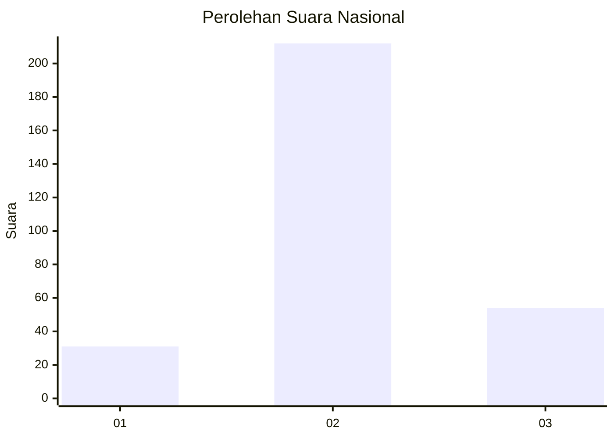
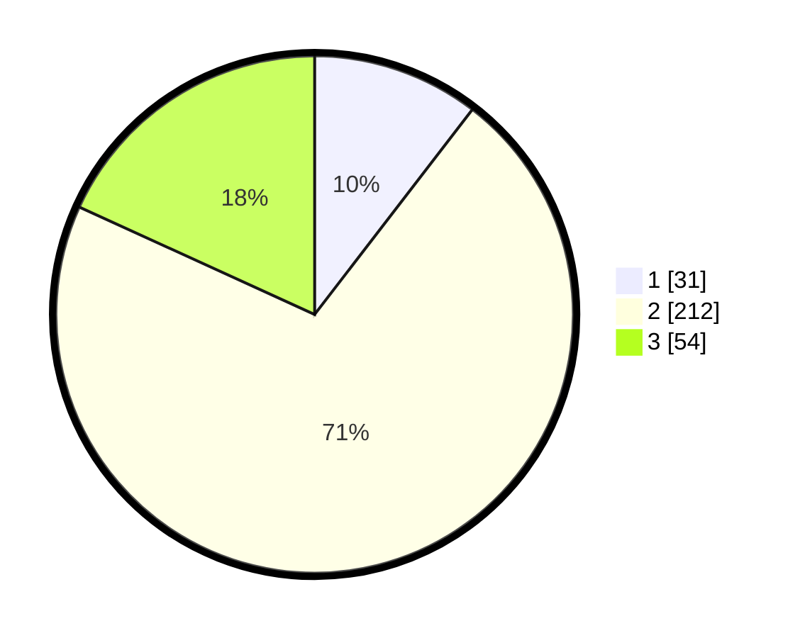

# Hasil

## Grafik

## Tabel

| No. | Nama Paslon    | Suara | Suara (raw) | Persentase |
|:--- |:-------------- | -----:| -----------:| ----------:|
| 1   | ANIES MUHAIMIN | 31    | [31][p-1]   | 10,44      |
| 2   | PRABOWO GIBRAN | 212   | [212][p-2]  | 71,38      |
| 3   | GANJAR MAHFUD  | 54    | [54][p-3]   | 18,18      |

[p-1]: https://github.com/gigit-pemilu/pemilu-2024/blob/main/pilpres/hitung-suara/sub/94-papua-tengah/sub/01-nabire/sub/01-nabire/sub/1007-karang-mulia/sub/003-tps/sub/paslon-1.txt
[p-2]: https://github.com/gigit-pemilu/pemilu-2024/blob/main/pilpres/hitung-suara/sub/94-papua-tengah/sub/01-nabire/sub/01-nabire/sub/1007-karang-mulia/sub/003-tps/sub/paslon-2.txt
[p-3]: https://github.com/gigit-pemilu/pemilu-2024/blob/main/pilpres/hitung-suara/sub/94-papua-tengah/sub/01-nabire/sub/01-nabire/sub/1007-karang-mulia/sub/003-tps/sub/paslon-3.txt

## Foto C Plano

https://sirekap-obj-formc.kpu.go.id/d44f/pemilu/ppwp/94/01/01/10/07/9401011007003-20240215-020531--7dbaab2f-95f9-48e4-8a94-6c5214f7e348.jpg

https://sirekap-obj-formc.kpu.go.id/d44f/pemilu/ppwp/94/01/01/10/07/9401011007003-20240215-020235--96622f30-7d85-4d39-98e1-be40f92097f2.jpg

https://sirekap-obj-formc.kpu.go.id/d44f/pemilu/ppwp/94/01/01/10/07/9401011007003-20240215-020525--14dc6a11-8df3-4ae8-8c8b-d6da8567b240.jpg

## Metadata

| Key        | Value               |
| ---------- | ------------------- |
| Time Stamp | 2024-02-15 21:01:18 |

