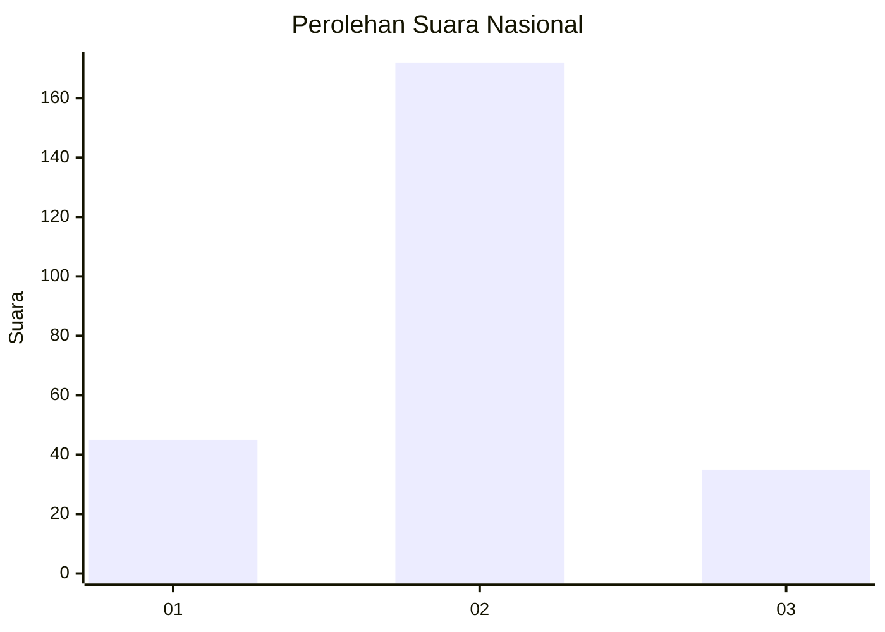
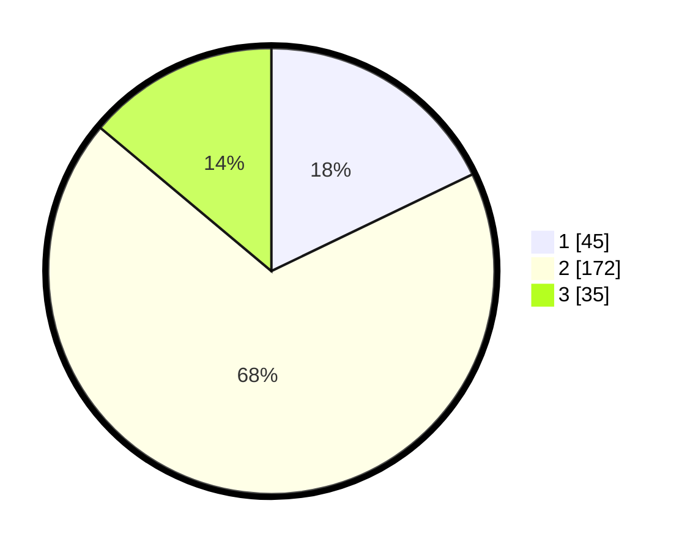

# Hasil

## Grafik

## Tabel

| No. | Nama Paslon    | Suara | Suara (raw) | Persentase |
|:--- |:-------------- | -----:| -----------:| ----------:|
| 1   | ANIES MUHAIMIN | 45    | [45][p-1]   | 17,86      |
| 2   | PRABOWO GIBRAN | 172   | [172][p-2]  | 68,25      |
| 3   | GANJAR MAHFUD  | 35    | [35][p-3]   | 13,89      |

[p-1]: https://github.com/gigit-pemilu/pemilu-2024/blob/main/pilpres/hitung-suara/sub/94-papua-tengah/sub/01-nabire/sub/01-nabire/sub/1007-karang-mulia/sub/015-tps/sub/paslon-1.txt
[p-2]: https://github.com/gigit-pemilu/pemilu-2024/blob/main/pilpres/hitung-suara/sub/94-papua-tengah/sub/01-nabire/sub/01-nabire/sub/1007-karang-mulia/sub/015-tps/sub/paslon-2.txt
[p-3]: https://github.com/gigit-pemilu/pemilu-2024/blob/main/pilpres/hitung-suara/sub/94-papua-tengah/sub/01-nabire/sub/01-nabire/sub/1007-karang-mulia/sub/015-tps/sub/paslon-3.txt

## Foto C Plano

https://sirekap-obj-formc.kpu.go.id/c72e/pemilu/ppwp/94/01/01/10/07/9401011007015-20240215-032411--2a8cecb4-4490-4c95-b56e-780564e80a8b.jpg

https://sirekap-obj-formc.kpu.go.id/c72e/pemilu/ppwp/94/01/01/10/07/9401011007015-20240215-032558--7ed7b578-2342-407c-907d-3ae93b9c6e61.jpg

https://sirekap-obj-formc.kpu.go.id/c72e/pemilu/ppwp/94/01/01/10/07/9401011007015-20240215-032818--6dfc44b3-fe9e-48b2-b977-cc7ad3dc03ef.jpg

## Metadata

| Key        | Value               |
| ---------- | ------------------- |
| Time Stamp | 2024-02-15 20:00:44 |

