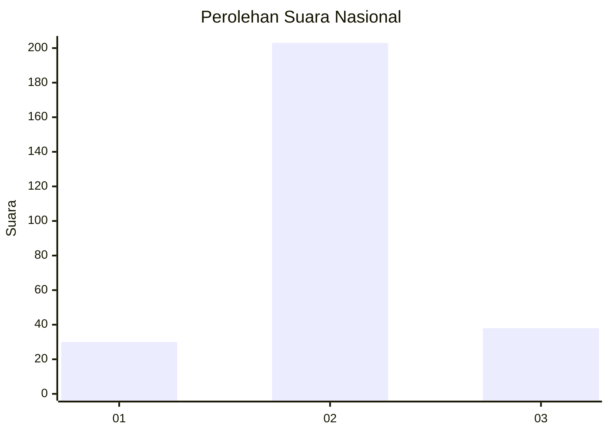
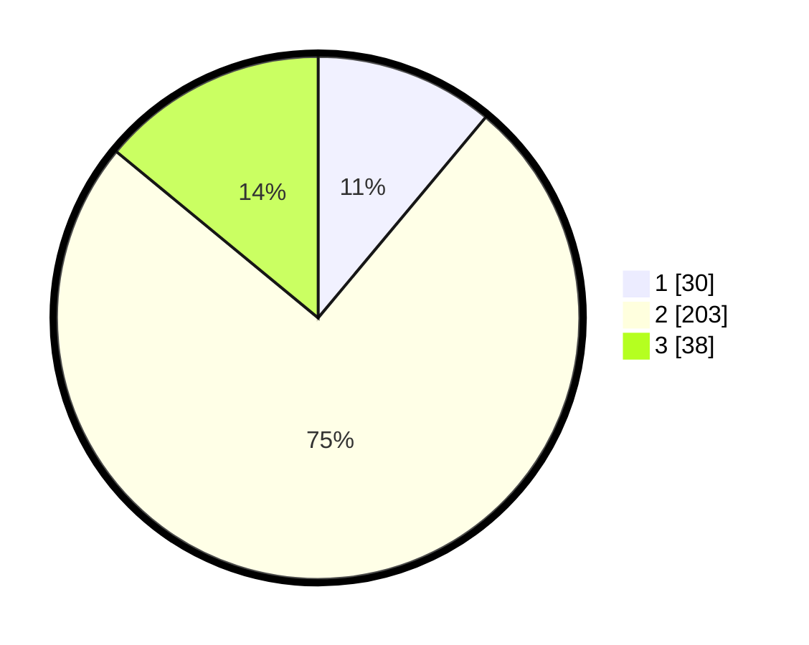

# Hasil

## Grafik

## Tabel

| No. | Nama Paslon    | Suara | Suara (raw) | Persentase |
|:--- |:-------------- | -----:| -----------:| ----------:|
| 1   | ANIES MUHAIMIN | 30    | [30][p-1]   | 11,07      |
| 2   | PRABOWO GIBRAN | 203   | [203][p-2]  | 74,91      |
| 3   | GANJAR MAHFUD  | 38    | [38][p-3]   | 14,02      |

[p-1]: https://github.com/gigit-pemilu/pemilu-2024/blob/main/pilpres/hitung-suara/sub/94-papua-tengah/sub/01-nabire/sub/01-nabire/sub/1007-karang-mulia/sub/016-tps/sub/paslon-1.txt
[p-2]: https://github.com/gigit-pemilu/pemilu-2024/blob/main/pilpres/hitung-suara/sub/94-papua-tengah/sub/01-nabire/sub/01-nabire/sub/1007-karang-mulia/sub/016-tps/sub/paslon-2.txt
[p-3]: https://github.com/gigit-pemilu/pemilu-2024/blob/main/pilpres/hitung-suara/sub/94-papua-tengah/sub/01-nabire/sub/01-nabire/sub/1007-karang-mulia/sub/016-tps/sub/paslon-3.txt

## Foto C Plano

https://sirekap-obj-formc.kpu.go.id/f93d/pemilu/ppwp/94/01/01/10/07/9401011007016-20240215-105007--80c85ae1-87df-4b1b-a290-b6462a61a299.jpg

https://sirekap-obj-formc.kpu.go.id/f93d/pemilu/ppwp/94/01/01/10/07/9401011007016-20240214-155708--7637cc48-f5c0-472b-8c13-bf47fafe53a2.jpg

https://sirekap-obj-formc.kpu.go.id/f93d/pemilu/ppwp/94/01/01/10/07/9401011007016-20240215-105146--9037985c-2b86-4dd6-87ae-a8cc08c1cbe8.jpg

## Metadata

| Key        | Value               |
| ---------- | ------------------- |
| Time Stamp | 2024-02-15 15:00:29 |

