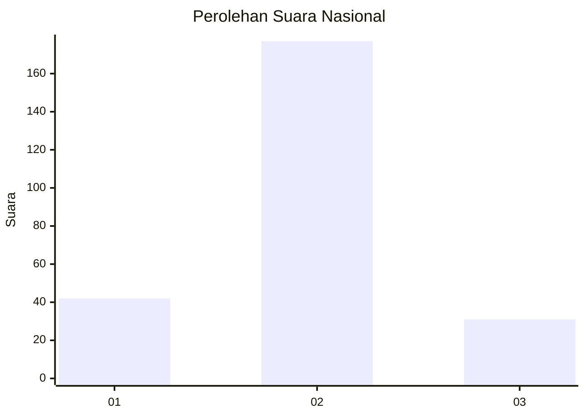
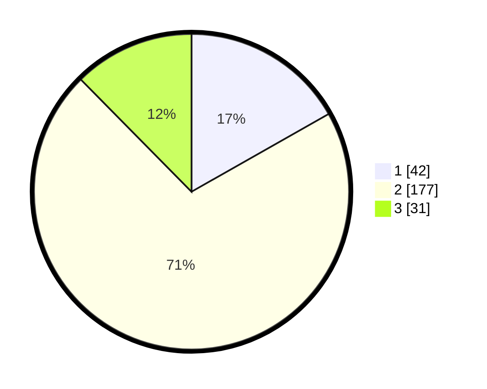

# Hasil

## Grafik

## Tabel

| No. | Nama Paslon    | Suara | Suara (raw) | Persentase |
|:--- |:-------------- | -----:| -----------:| ----------:|
| 1   | ANIES MUHAIMIN | 42    | [42][p-1]   | 16,80      |
| 2   | PRABOWO GIBRAN | 177   | [177][p-2]  | 70,80      |
| 3   | GANJAR MAHFUD  | 31    | [31][p-3]   | 12,40      |

[p-1]: https://github.com/gigit-pemilu/pemilu-2024/blob/main/pilpres/hitung-suara/sub/94-papua-tengah/sub/01-nabire/sub/01-nabire/sub/1007-karang-mulia/sub/021-tps/sub/paslon-1.txt
[p-2]: https://github.com/gigit-pemilu/pemilu-2024/blob/main/pilpres/hitung-suara/sub/94-papua-tengah/sub/01-nabire/sub/01-nabire/sub/1007-karang-mulia/sub/021-tps/sub/paslon-2.txt
[p-3]: https://github.com/gigit-pemilu/pemilu-2024/blob/main/pilpres/hitung-suara/sub/94-papua-tengah/sub/01-nabire/sub/01-nabire/sub/1007-karang-mulia/sub/021-tps/sub/paslon-3.txt

## Foto C Plano

https://sirekap-obj-formc.kpu.go.id/e8b9/pemilu/ppwp/94/01/01/10/07/9401011007021-20240215-113104--da632aa1-0adf-484a-9c14-207775d0ea70.jpg

https://sirekap-obj-formc.kpu.go.id/e8b9/pemilu/ppwp/94/01/01/10/07/9401011007021-20240215-113238--84be6a4e-697f-4424-bcb4-d2f9fe80f405.jpg

https://sirekap-obj-formc.kpu.go.id/e8b9/pemilu/ppwp/94/01/01/10/07/9401011007021-20240215-112426--24dbdee1-edb9-4826-ac34-5962a70e4751.jpg

## Metadata

| Key        | Value               |
| ---------- | ------------------- |
| Time Stamp | 2024-02-17 01:00:00 |

