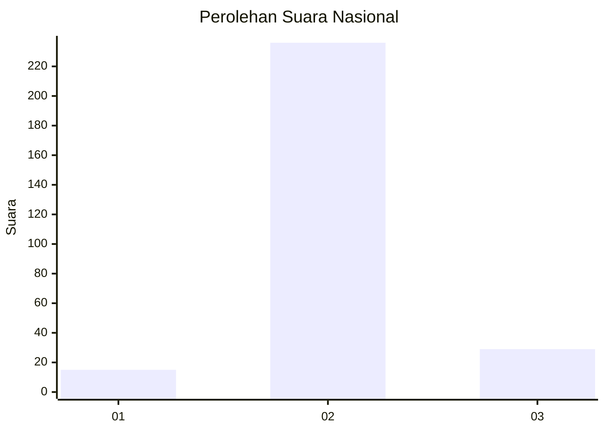
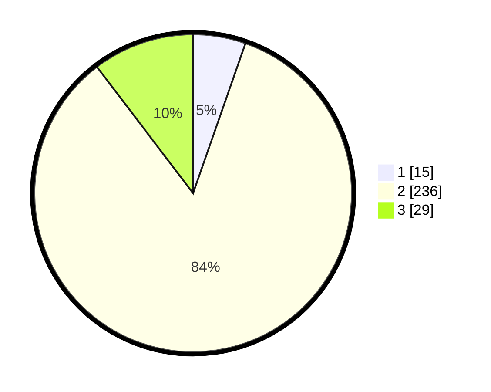

# Hasil

## Grafik

## Tabel

| No. | Nama Paslon    | Suara | Suara (raw) | Persentase |
|:--- |:-------------- | -----:| -----------:| ----------:|
| 1   | ANIES MUHAIMIN | 15    | [15][p-1]   | 5,36       |
| 2   | PRABOWO GIBRAN | 236   | [236][p-2]  | 84,29      |
| 3   | GANJAR MAHFUD  | 29    | [29][p-3]   | 10,36      |

[p-1]: https://github.com/gigit-pemilu/pemilu-2024/blob/main/pilpres/hitung-suara/sub/94-papua-tengah/sub/01-nabire/sub/01-nabire/sub/1008-nabarua/sub/007-tps/sub/paslon-1.txt
[p-2]: https://github.com/gigit-pemilu/pemilu-2024/blob/main/pilpres/hitung-suara/sub/94-papua-tengah/sub/01-nabire/sub/01-nabire/sub/1008-nabarua/sub/007-tps/sub/paslon-2.txt
[p-3]: https://github.com/gigit-pemilu/pemilu-2024/blob/main/pilpres/hitung-suara/sub/94-papua-tengah/sub/01-nabire/sub/01-nabire/sub/1008-nabarua/sub/007-tps/sub/paslon-3.txt

## Foto C Plano

https://sirekap-obj-formc.kpu.go.id/0e01/pemilu/ppwp/94/01/01/10/08/9401011008007-20240216-120450--d8ee6d6c-608b-4180-9fd4-8dac57d8dd75.jpg

https://sirekap-obj-formc.kpu.go.id/0e01/pemilu/ppwp/94/01/01/10/08/9401011008007-20240216-120452--835a851e-69ed-4b09-a5a6-3453dd490707.jpg

https://sirekap-obj-formc.kpu.go.id/0e01/pemilu/ppwp/94/01/01/10/08/9401011008007-20240216-120451--9d06ce38-cee3-4934-8629-e039d4075418.jpg

## Metadata

| Key        | Value               |
| ---------- | ------------------- |
| Time Stamp | 2024-02-17 01:00:00 |

## DATA PEMILIH TETAP

Jumlah pemilih dalam DPT: **300**.
 * L: **147**.
 * P: **157**.

## DATA PENGGUNA HAK PILIH

Jumlah pengguna hak pilih dalam DPT: **281**.
 * L: **141**.
 * P: **140**.

Jumlah pengguna hak pilih dalam DPTb: **19**.
 * L: **6**.
 * P: **13**.

Jumlah pengguna hak pilih dalam DPK: **0**.
 * L: **0**.
 * P: **0**.

Jumlah pengguna hak pilih: **300**.
 * L: **147**.
 * P: **153**.

## JUMLAH SUARA SAH DAN TIDAK SAH

JUMLAH SELURUH SUARA SAH: **280**.

JUMLAH SUARA TIDAK SAH: **26**.

JUMLAH SELURUH SUARA SAH DAN SUARA TIDAK SAH: **306**.

