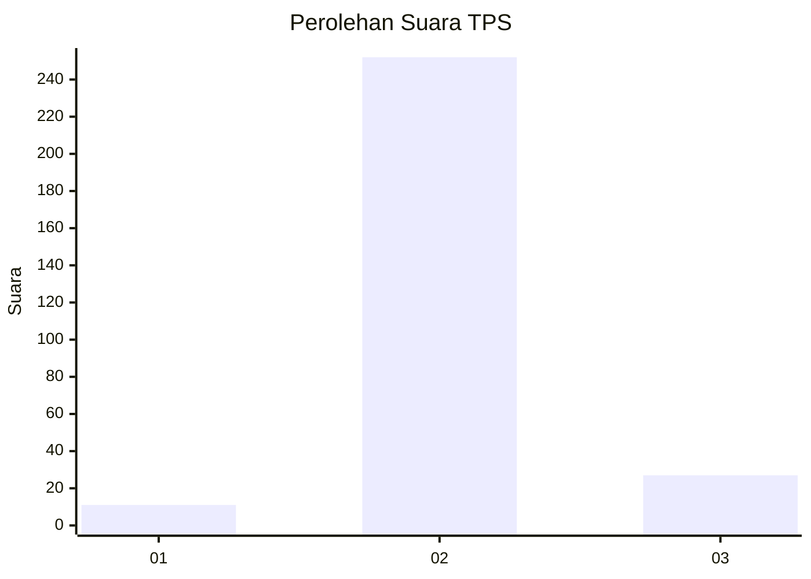
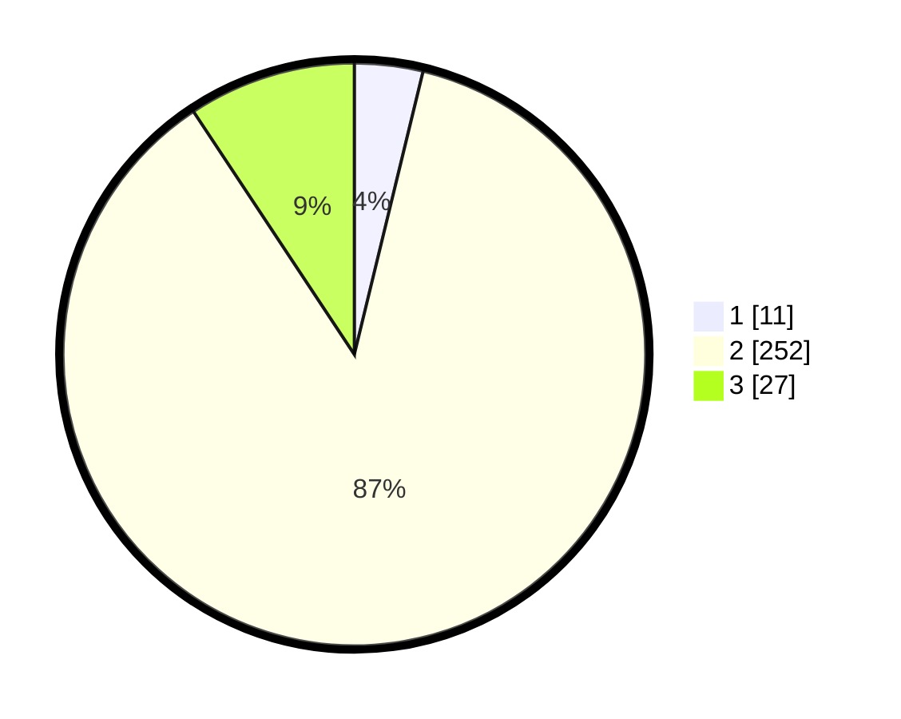

# Hasil

## Grafik

## Tabel

| No. | Nama Paslon    | Suara | Suara (raw) | Persentase |
|:--- |:-------------- | -----:| -----------:| ----------:|
| 1   | ANIES MUHAIMIN | 11    | [11][p-1]   | 3,79       |
| 2   | PRABOWO GIBRAN | 252   | [252][p-2]  | 86,90      |
| 3   | GANJAR MAHFUD  | 27    | [27][p-3]   | 9,31       |

[p-1]: https://github.com/gigit-pemilu/pemilu-2024-94-papua-tengah/blob/main/pilpres/hitung-suara/sub/94-papua-tengah/sub/01-nabire/sub/01-nabire/sub/1008-nabarua/sub/008-tps/sub/paslon-1.txt
[p-2]: https://github.com/gigit-pemilu/pemilu-2024-94-papua-tengah/blob/main/pilpres/hitung-suara/sub/94-papua-tengah/sub/01-nabire/sub/01-nabire/sub/1008-nabarua/sub/008-tps/sub/paslon-2.txt
[p-3]: https://github.com/gigit-pemilu/pemilu-2024-94-papua-tengah/blob/main/pilpres/hitung-suara/sub/94-papua-tengah/sub/01-nabire/sub/01-nabire/sub/1008-nabarua/sub/008-tps/sub/paslon-3.txt

## Foto C Plano

https://sirekap-obj-formc.kpu.go.id/650f/pemilu/ppwp/94/01/01/10/08/9401011008008-20240215-000627--e1e17e35-bca6-4146-9e6d-e7f28586e604.jpg

https://sirekap-obj-formc.kpu.go.id/650f/pemilu/ppwp/94/01/01/10/08/9401011008008-20240215-001150--399a5ad9-cd9c-49c5-baa1-b367ee2de42e.jpg

https://sirekap-obj-formc.kpu.go.id/650f/pemilu/ppwp/94/01/01/10/08/9401011008008-20240215-004001--f8b778ec-1e2e-4def-9889-410671f3eed6.jpg

## Metadata

| Key        | Value               |
| ---------- | ------------------- |
| Time Stamp | 2024-02-15 19:30:26 |

