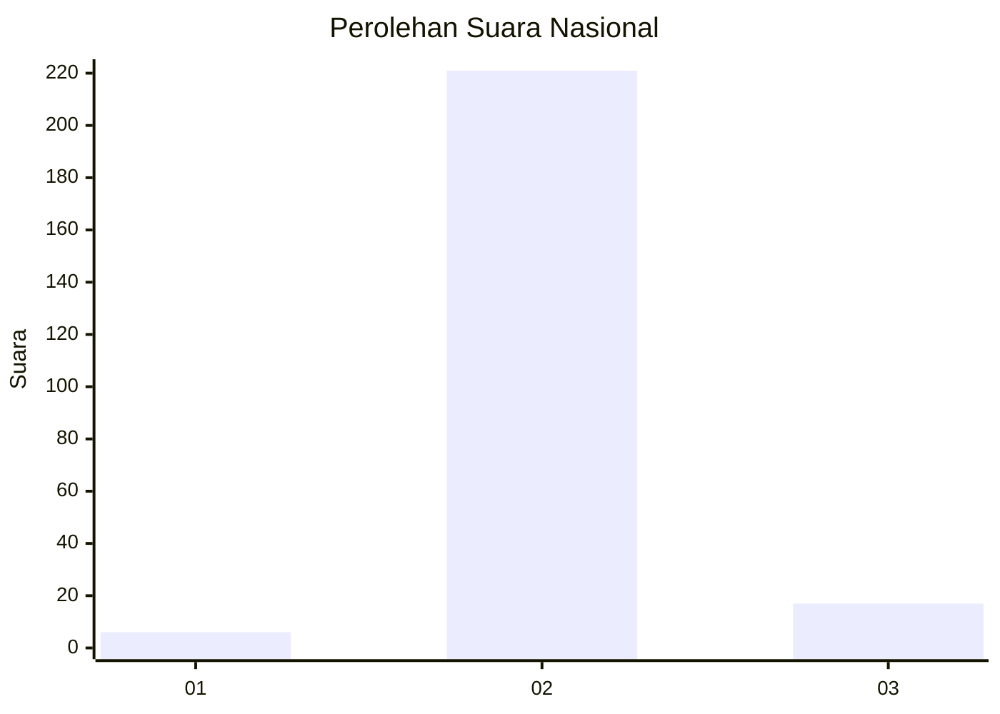
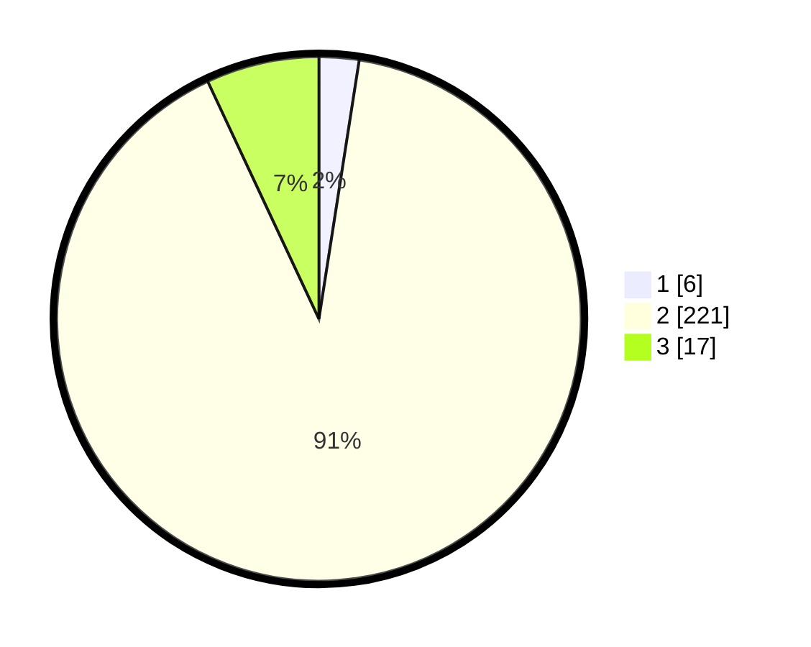

# Hasil

## Grafik

## Tabel

| No. | Nama Paslon    | Suara | Suara (raw) | Persentase |
|:--- |:-------------- | -----:| -----------:| ----------:|
| 1   | ANIES MUHAIMIN | 6     | [6][p-1]    | 2,46       |
| 2   | PRABOWO GIBRAN | 221   | [221][p-2]  | 90,57      |
| 3   | GANJAR MAHFUD  | 17    | [17][p-3]   | 6,97       |

[p-1]: https://github.com/gigit-pemilu/pemilu-2024/blob/main/pilpres/hitung-suara/sub/94-papua-tengah/sub/01-nabire/sub/01-nabire/sub/1008-nabarua/sub/014-tps/sub/paslon-1.txt
[p-2]: https://github.com/gigit-pemilu/pemilu-2024/blob/main/pilpres/hitung-suara/sub/94-papua-tengah/sub/01-nabire/sub/01-nabire/sub/1008-nabarua/sub/014-tps/sub/paslon-2.txt
[p-3]: https://github.com/gigit-pemilu/pemilu-2024/blob/main/pilpres/hitung-suara/sub/94-papua-tengah/sub/01-nabire/sub/01-nabire/sub/1008-nabarua/sub/014-tps/sub/paslon-3.txt

## Foto C Plano

https://sirekap-obj-formc.kpu.go.id/4646/pemilu/ppwp/94/01/01/10/08/9401011008014-20240216-093155--527b32db-57ae-4d8f-a7e1-a0c26dbaa2e7.jpg

https://sirekap-obj-formc.kpu.go.id/4646/pemilu/ppwp/94/01/01/10/08/9401011008014-20240216-123010--f652baef-271a-49ba-8d51-6c98b5f98f85.jpg

https://sirekap-obj-formc.kpu.go.id/4646/pemilu/ppwp/94/01/01/10/08/9401011008014-20240216-123009--f3b46d05-7fea-4135-8170-b4cdc16e5910.jpg

## Metadata

| Key        | Value               |
| ---------- | ------------------- |
| Time Stamp | 2024-02-17 01:00:00 |

## DATA PEMILIH TETAP

Jumlah pemilih dalam DPT: **247**.
 * L: **133**.
 * P: **114**.

## DATA PENGGUNA HAK PILIH

Jumlah pengguna hak pilih dalam DPT: **211**.
 * L: **110**.
 * P: **101**.

Jumlah pengguna hak pilih dalam DPTb: **4**.
 * L: **3**.
 * P: **1**.

Jumlah pengguna hak pilih dalam DPK: **31**.
 * L: **15**.
 * P: **16**.

Jumlah pengguna hak pilih: **246**.
 * L: **128**.
 * P: **118**.

## JUMLAH SUARA SAH DAN TIDAK SAH

JUMLAH SELURUH SUARA SAH: **244**.

JUMLAH SUARA TIDAK SAH: **2**.

JUMLAH SELURUH SUARA SAH DAN SUARA TIDAK SAH: **246**.

