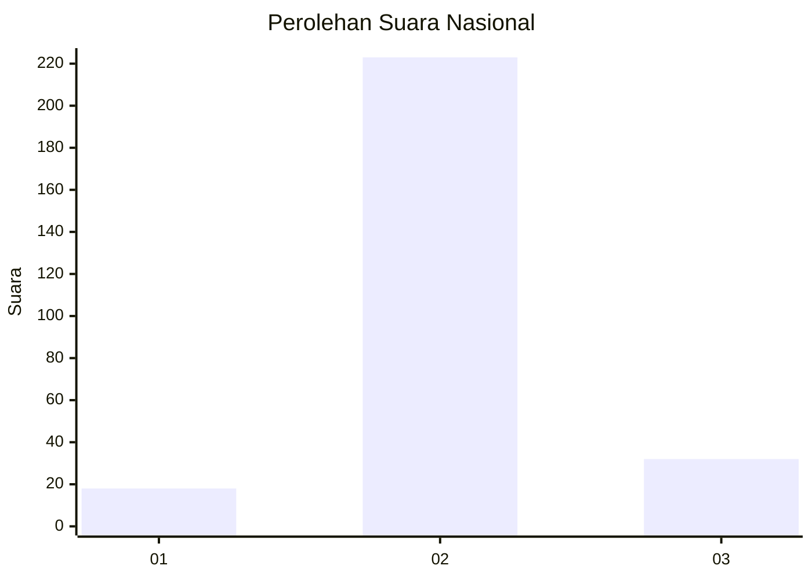
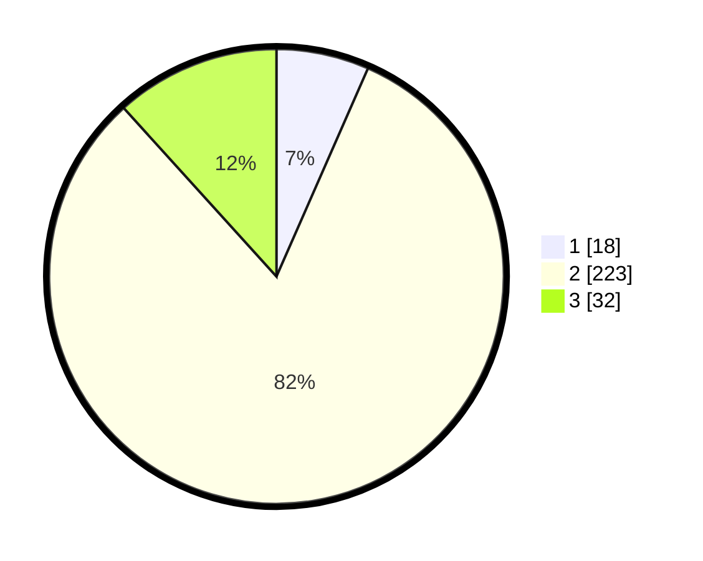

# Hasil

## Grafik

## Tabel

| No. | Nama Paslon    | Suara | Suara (raw) | Persentase |
|:--- |:-------------- | -----:| -----------:| ----------:|
| 1   | ANIES MUHAIMIN | 18    | [18][p-1]   | 6,59       |
| 2   | PRABOWO GIBRAN | 223   | [223][p-2]  | 81,68      |
| 3   | GANJAR MAHFUD  | 32    | [32][p-3]   | 11,72      |

[p-1]: https://github.com/gigit-pemilu/pemilu-2024/blob/main/pilpres/hitung-suara/sub/94-papua-tengah/sub/01-nabire/sub/01-nabire/sub/1008-nabarua/sub/016-tps/sub/paslon-1.txt
[p-2]: https://github.com/gigit-pemilu/pemilu-2024/blob/main/pilpres/hitung-suara/sub/94-papua-tengah/sub/01-nabire/sub/01-nabire/sub/1008-nabarua/sub/016-tps/sub/paslon-2.txt
[p-3]: https://github.com/gigit-pemilu/pemilu-2024/blob/main/pilpres/hitung-suara/sub/94-papua-tengah/sub/01-nabire/sub/01-nabire/sub/1008-nabarua/sub/016-tps/sub/paslon-3.txt

## Foto C Plano

https://sirekap-obj-formc.kpu.go.id/e938/pemilu/ppwp/94/01/01/10/08/9401011008016-20240215-213629--f7d67476-f732-471e-bcde-a7c3288b1b6f.jpg

https://sirekap-obj-formc.kpu.go.id/e938/pemilu/ppwp/94/01/01/10/08/9401011008016-20240215-213630--feeb0d71-7b36-456b-85dc-7760f74e37ae.jpg

https://sirekap-obj-formc.kpu.go.id/e938/pemilu/ppwp/94/01/01/10/08/9401011008016-20240215-213629--f947cb79-a090-434e-9b3f-4d28e1472caa.jpg

## Metadata

| Key        | Value               |
| ---------- | ------------------- |
| Time Stamp | 2024-02-15 22:00:27 |

## DATA PEMILIH TETAP

Jumlah pemilih dalam DPT: **284**.
 * L: **142**.
 * P: **142**.

## DATA PENGGUNA HAK PILIH

Jumlah pengguna hak pilih dalam DPT: **267**.
 * L: **134**.
 * P: **133**.

Jumlah pengguna hak pilih dalam DPTb: **1**.
 * L: **1**.
 * P: **0**.

Jumlah pengguna hak pilih dalam DPK: **16**.
 * L: **8**.
 * P: **8**.

Jumlah pengguna hak pilih: **284**.
 * L: **143**.
 * P: **141**.

## JUMLAH SUARA SAH DAN TIDAK SAH

JUMLAH SELURUH SUARA SAH: **273**.

JUMLAH SUARA TIDAK SAH: **11**.

JUMLAH SELURUH SUARA SAH DAN SUARA TIDAK SAH: **284**.

