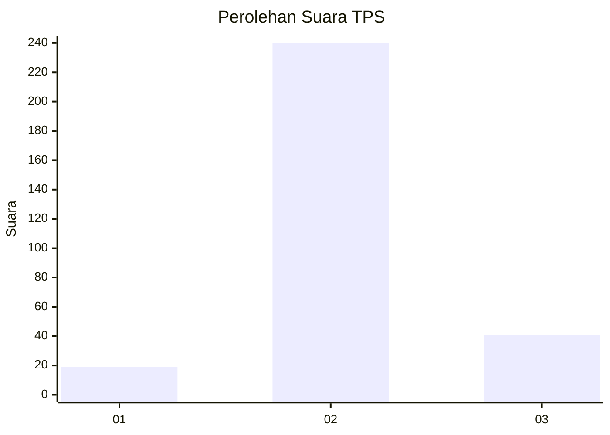
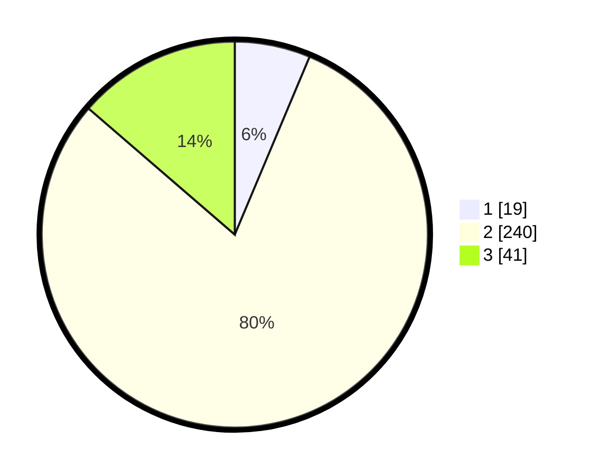

# Hasil

## Grafik

## Tabel

| No. | Nama Paslon    | Suara | Suara (raw) | Persentase |
|:--- |:-------------- | -----:| -----------:| ----------:|
| 1   | ANIES MUHAIMIN | 19    | [19][p-1]   | 6,33       |
| 2   | PRABOWO GIBRAN | 240   | [240][p-2]  | 80,00      |
| 3   | GANJAR MAHFUD  | 41    | [41][p-3]   | 13,67      |

[p-1]: https://github.com/gigit-pemilu/pemilu-2024-94-papua-tengah/blob/main/pilpres/hitung-suara/sub/94-papua-tengah/sub/01-nabire/sub/01-nabire/sub/1008-nabarua/sub/024-tps/sub/paslon-1.txt
[p-2]: https://github.com/gigit-pemilu/pemilu-2024-94-papua-tengah/blob/main/pilpres/hitung-suara/sub/94-papua-tengah/sub/01-nabire/sub/01-nabire/sub/1008-nabarua/sub/024-tps/sub/paslon-2.txt
[p-3]: https://github.com/gigit-pemilu/pemilu-2024-94-papua-tengah/blob/main/pilpres/hitung-suara/sub/94-papua-tengah/sub/01-nabire/sub/01-nabire/sub/1008-nabarua/sub/024-tps/sub/paslon-3.txt

## Foto C Plano

https://sirekap-obj-formc.kpu.go.id/a404/pemilu/ppwp/94/01/01/10/08/9401011008024-20240216-131405--7c112554-bf57-4b43-8a9f-393f10c70209.jpg

https://sirekap-obj-formc.kpu.go.id/a404/pemilu/ppwp/94/01/01/10/08/9401011008024-20240216-131407--f55f600d-9d53-4247-ad5b-25715fd2abfe.jpg

https://sirekap-obj-formc.kpu.go.id/a404/pemilu/ppwp/94/01/01/10/08/9401011008024-20240216-131406--0cbc6f61-fd8f-4e17-b71c-4f5e303d1603.jpg

## Metadata

| Key        | Value               |
| ---------- | ------------------- |
| Time Stamp | 2024-02-17 01:00:00 |

## DATA PEMILIH TETAP

Jumlah pemilih dalam DPT: **295**.
 * L: **162**.
 * P: **133**.

## DATA PENGGUNA HAK PILIH

Jumlah pengguna hak pilih dalam DPT: **273**.
 * L: **145**.
 * P: **128**.

Jumlah pengguna hak pilih dalam DPTb: **0**.
 * L: **0**.
 * P: **0**.

Jumlah pengguna hak pilih dalam DPK: **31**.
 * L: **15**.
 * P: **16**.

Jumlah pengguna hak pilih: **304**.
 * L: **160**.
 * P: **144**.

## JUMLAH SUARA SAH DAN TIDAK SAH

JUMLAH SELURUH SUARA SAH: **300**.

JUMLAH SUARA TIDAK SAH: **4**.

JUMLAH SELURUH SUARA SAH DAN SUARA TIDAK SAH: **304**.

