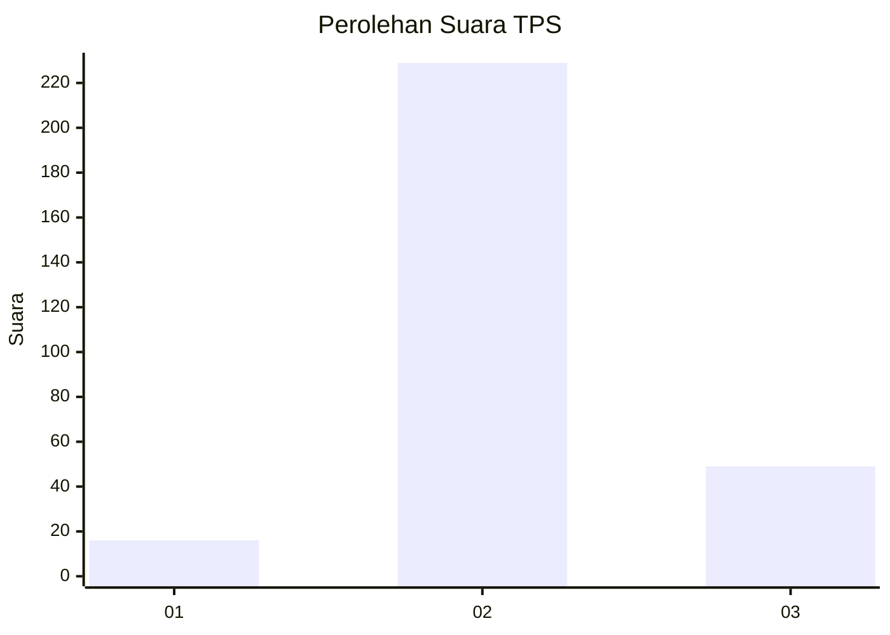
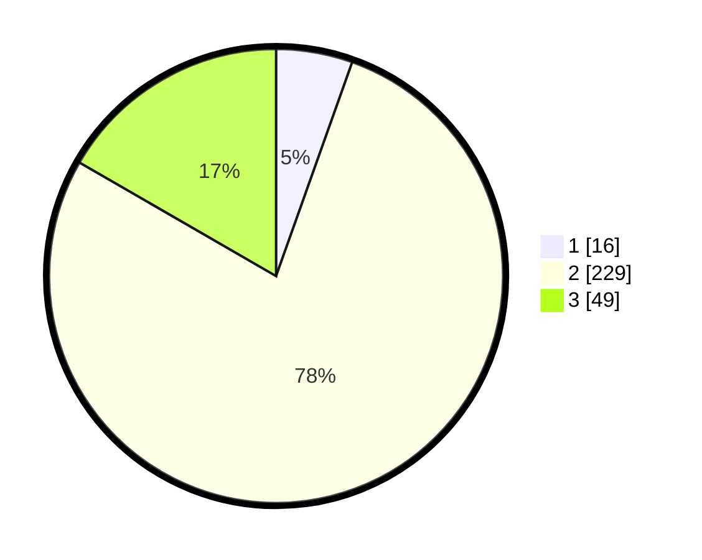

# Hasil

## Grafik

## Tabel

| No. | Nama Paslon    | Suara | Suara (raw) | Persentase |
|:--- |:-------------- | -----:| -----------:| ----------:|
| 1   | ANIES MUHAIMIN | 16    | [16][p-1]   | 5,44       |
| 2   | PRABOWO GIBRAN | 229   | [229][p-2]  | 77,89      |
| 3   | GANJAR MAHFUD  | 49    | [49][p-3]   | 16,67      |

[p-1]: https://github.com/gigit-pemilu/pemilu-2024-94-papua-tengah/blob/main/pilpres/hitung-suara/sub/94-papua-tengah/sub/01-nabire/sub/01-nabire/sub/1008-nabarua/sub/026-tps/sub/paslon-1.txt
[p-2]: https://github.com/gigit-pemilu/pemilu-2024-94-papua-tengah/blob/main/pilpres/hitung-suara/sub/94-papua-tengah/sub/01-nabire/sub/01-nabire/sub/1008-nabarua/sub/026-tps/sub/paslon-2.txt
[p-3]: https://github.com/gigit-pemilu/pemilu-2024-94-papua-tengah/blob/main/pilpres/hitung-suara/sub/94-papua-tengah/sub/01-nabire/sub/01-nabire/sub/1008-nabarua/sub/026-tps/sub/paslon-3.txt

## Foto C Plano

https://sirekap-obj-formc.kpu.go.id/47ce/pemilu/ppwp/94/01/01/10/08/9401011008026-20240215-053902--6ba56785-e67d-4a68-8f4e-9ef8e098130f.jpg

https://sirekap-obj-formc.kpu.go.id/47ce/pemilu/ppwp/94/01/01/10/08/9401011008026-20240214-234516--523a093c-e700-456d-b56e-737d8baefc36.jpg

https://sirekap-obj-formc.kpu.go.id/47ce/pemilu/ppwp/94/01/01/10/08/9401011008026-20240215-054130--6908461f-ddc8-4eee-8a14-a5db775576e9.jpg

## Metadata

| Key        | Value               |
| ---------- | ------------------- |
| Time Stamp | 2024-02-15 19:30:26 |

