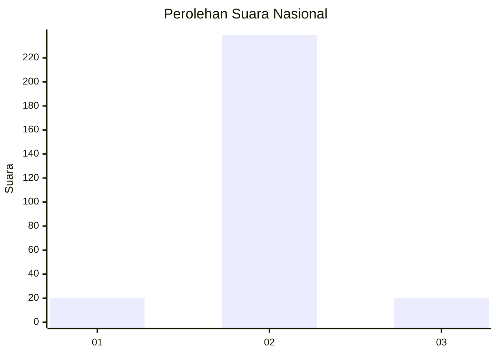
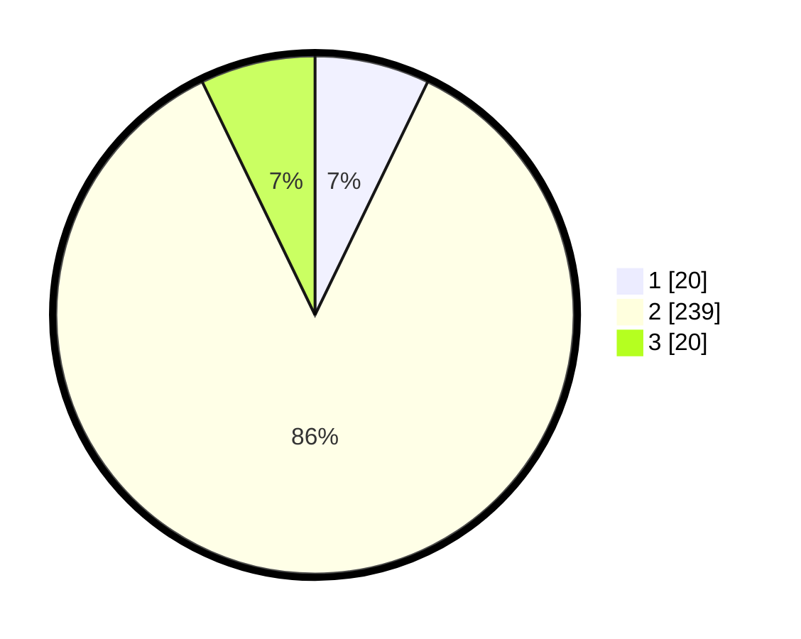

# Hasil

## Grafik

## Tabel

| No. | Nama Paslon    | Suara | Suara (raw) | Persentase |
|:--- |:-------------- | -----:| -----------:| ----------:|
| 1   | ANIES MUHAIMIN | 20    | [20][p-1]   | 7,17       |
| 2   | PRABOWO GIBRAN | 239   | [239][p-2]  | 85,66      |
| 3   | GANJAR MAHFUD  | 20    | [20][p-3]   | 7,17       |

[p-1]: https://github.com/gigit-pemilu/pemilu-2024/blob/main/pilpres/hitung-suara/sub/94-papua-tengah/sub/01-nabire/sub/01-nabire/sub/1008-nabarua/sub/029-tps/sub/paslon-1.txt
[p-2]: https://github.com/gigit-pemilu/pemilu-2024/blob/main/pilpres/hitung-suara/sub/94-papua-tengah/sub/01-nabire/sub/01-nabire/sub/1008-nabarua/sub/029-tps/sub/paslon-2.txt
[p-3]: https://github.com/gigit-pemilu/pemilu-2024/blob/main/pilpres/hitung-suara/sub/94-papua-tengah/sub/01-nabire/sub/01-nabire/sub/1008-nabarua/sub/029-tps/sub/paslon-3.txt

## Foto C Plano

https://sirekap-obj-formc.kpu.go.id/4fee/pemilu/ppwp/94/01/01/10/08/9401011008029-20240215-113925--2d00e0fc-55a4-4a21-935f-52a47f40c832.jpg

https://sirekap-obj-formc.kpu.go.id/4fee/pemilu/ppwp/94/01/01/10/08/9401011008029-20240215-113949--1e365c86-5b7d-4277-8621-4665407cc3df.jpg

https://sirekap-obj-formc.kpu.go.id/4fee/pemilu/ppwp/94/01/01/10/08/9401011008029-20240215-113935--e4a09ec1-6139-495d-a5a4-560d1ef84255.jpg

## Metadata

| Key        | Value               |
| ---------- | ------------------- |
| Time Stamp | 2024-02-15 19:30:26 |

## DATA PEMILIH TETAP

Jumlah pemilih dalam DPT: **282**.
 * L: **152**.
 * P: **130**.

## DATA PENGGUNA HAK PILIH

Jumlah pengguna hak pilih dalam DPT: **271**.
 * L: **145**.
 * P: **126**.

Jumlah pengguna hak pilih dalam DPTb: **0**.
 * L: **0**.
 * P: **0**.

Jumlah pengguna hak pilih dalam DPK: **11**.
 * L: **7**.
 * P: **4**.

Jumlah pengguna hak pilih: **282**.
 * L: **152**.
 * P: **130**.

## JUMLAH SUARA SAH DAN TIDAK SAH

JUMLAH SELURUH SUARA SAH: **279**.

JUMLAH SUARA TIDAK SAH: **3**.

JUMLAH SELURUH SUARA SAH DAN SUARA TIDAK SAH: **282**.

