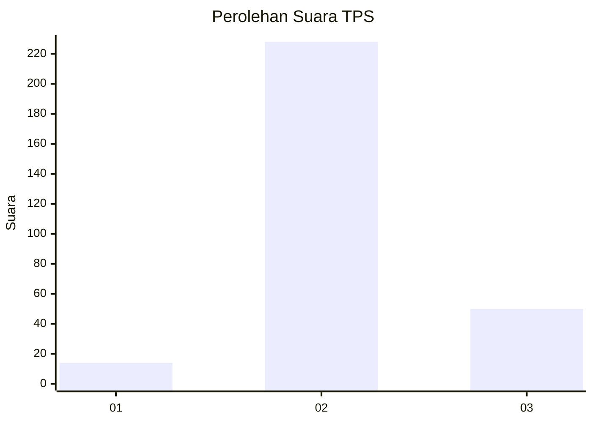

# Hasil

## Grafik

## Tabel

| No. | Nama Paslon    | Suara | Suara (raw) | Persentase |
|:--- |:-------------- | -----:| -----------:| ----------:|
| 1   | ANIES MUHAIMIN | 14    | [14][p-1]   | 4,79       |
| 2   | PRABOWO GIBRAN | 228   | [228][p-2]  | 78,08      |
| 3   | GANJAR MAHFUD  | 50    | [50][p-3]   | 17,12      |

[p-1]: https://github.com/gigit-pemilu/pemilu-2024-94-papua-tengah/blob/main/pilpres/hitung-suara/sub/94-papua-tengah/sub/01-nabire/sub/01-nabire/sub/1009-siriwini/sub/023-tps/sub/paslon-1.txt
[p-2]: https://github.com/gigit-pemilu/pemilu-2024-94-papua-tengah/blob/main/pilpres/hitung-suara/sub/94-papua-tengah/sub/01-nabire/sub/01-nabire/sub/1009-siriwini/sub/023-tps/sub/paslon-2.txt
[p-3]: https://github.com/gigit-pemilu/pemilu-2024-94-papua-tengah/blob/main/pilpres/hitung-suara/sub/94-papua-tengah/sub/01-nabire/sub/01-nabire/sub/1009-siriwini/sub/023-tps/sub/paslon-3.txt

## Foto C Plano

https://sirekap-obj-formc.kpu.go.id/2cc5/pemilu/ppwp/94/01/01/10/09/9401011009023-20240219-074422--1337e434-b9cf-429e-a2e0-fe6add2e8d1a.jpg

https://sirekap-obj-formc.kpu.go.id/2cc5/pemilu/ppwp/94/01/01/10/09/9401011009023-20240219-074424--6fa793bb-b690-4003-921f-44086f4d19fd.jpg

https://sirekap-obj-formc.kpu.go.id/2cc5/pemilu/ppwp/94/01/01/10/09/9401011009023-20240219-074423--89cae897-0a90-4ae4-9ad9-de5266525b97.jpg

## Metadata

| Key        | Value               |
| ---------- | ------------------- |
| Time Stamp | 2024-02-24 22:31:28 |

## DATA PEMILIH TETAP

Jumlah pemilih dalam DPT: **297**.
 * L: **137**.
 * P: **160**.

## DATA PENGGUNA HAK PILIH

Jumlah pengguna hak pilih dalam DPT: **297**.
 * L: **137**.
 * P: **160**.

Jumlah pengguna hak pilih dalam DPTb: **6**.
 * L: **3**.
 * P: **3**.

Jumlah pengguna hak pilih dalam DPK: **0**.
 * L: **0**.
 * P: **0**.

Jumlah pengguna hak pilih: **303**.
 * L: **140**.
 * P: **163**.

## JUMLAH SUARA SAH DAN TIDAK SAH

JUMLAH SELURUH SUARA SAH: **292**.

JUMLAH SUARA TIDAK SAH: **11**.

JUMLAH SELURUH SUARA SAH DAN SUARA TIDAK SAH: **303**.

