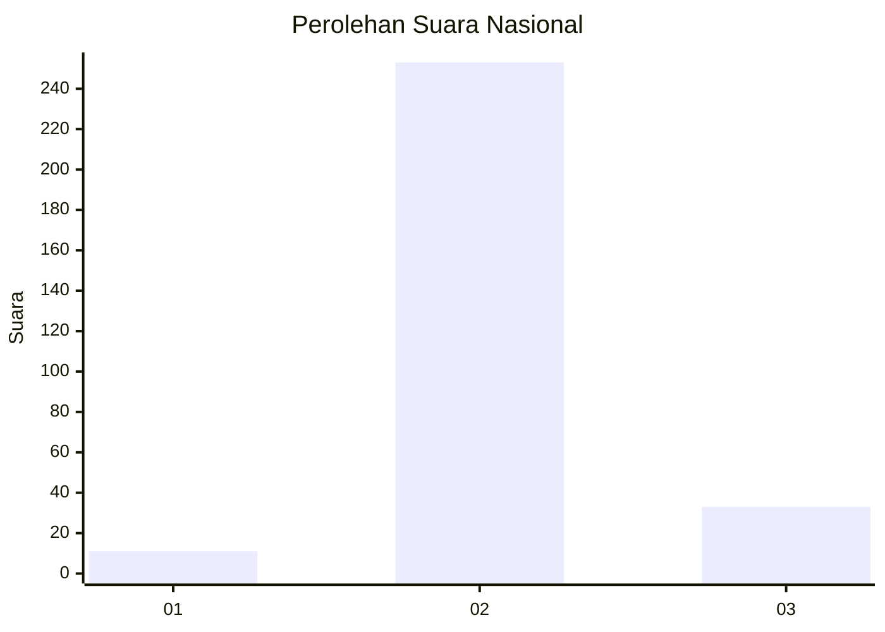
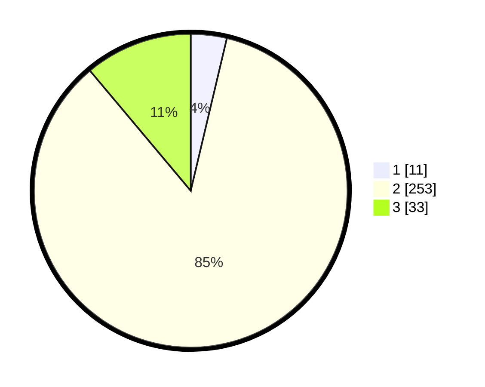

# Hasil

## Grafik

## Tabel

| No. | Nama Paslon    | Suara | Suara (raw) | Persentase |
|:--- |:-------------- | -----:| -----------:| ----------:|
| 1   | ANIES MUHAIMIN | 11    | [11][p-1]   | 3,70       |
| 2   | PRABOWO GIBRAN | 253   | [253][p-2]  | 85,19      |
| 3   | GANJAR MAHFUD  | 33    | [33][p-3]   | 11,11      |

[p-1]: https://github.com/gigit-pemilu/pemilu-2024/blob/main/pilpres/hitung-suara/sub/94-papua-tengah/sub/01-nabire/sub/01-nabire/sub/1009-siriwini/sub/025-tps/sub/paslon-1.txt
[p-2]: https://github.com/gigit-pemilu/pemilu-2024/blob/main/pilpres/hitung-suara/sub/94-papua-tengah/sub/01-nabire/sub/01-nabire/sub/1009-siriwini/sub/025-tps/sub/paslon-2.txt
[p-3]: https://github.com/gigit-pemilu/pemilu-2024/blob/main/pilpres/hitung-suara/sub/94-papua-tengah/sub/01-nabire/sub/01-nabire/sub/1009-siriwini/sub/025-tps/sub/paslon-3.txt

## Foto C Plano

https://sirekap-obj-formc.kpu.go.id/a8d3/pemilu/ppwp/94/01/01/10/09/9401011009025-20240215-053718--5219b7bb-459a-4357-9f12-32b4540d7558.jpg

https://sirekap-obj-formc.kpu.go.id/a8d3/pemilu/ppwp/94/01/01/10/09/9401011009025-20240215-053842--05f94a53-0c1f-4411-97ce-c4adaeea918a.jpg

https://sirekap-obj-formc.kpu.go.id/a8d3/pemilu/ppwp/94/01/01/10/09/9401011009025-20240215-054003--f11b3ecd-9c22-45d2-9169-6d101111ee05.jpg

## Metadata

| Key        | Value               |
| ---------- | ------------------- |
| Time Stamp | 2024-02-15 20:00:44 |

