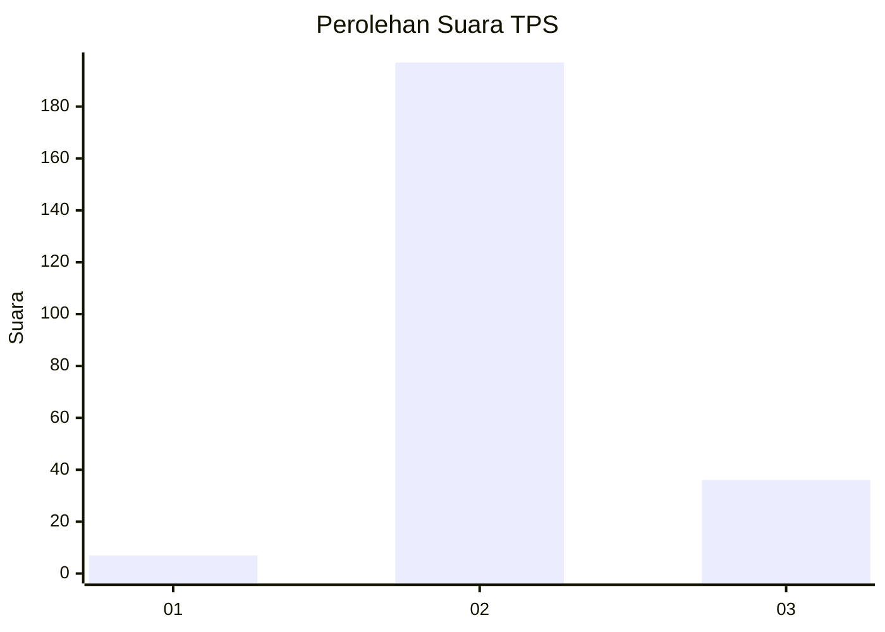
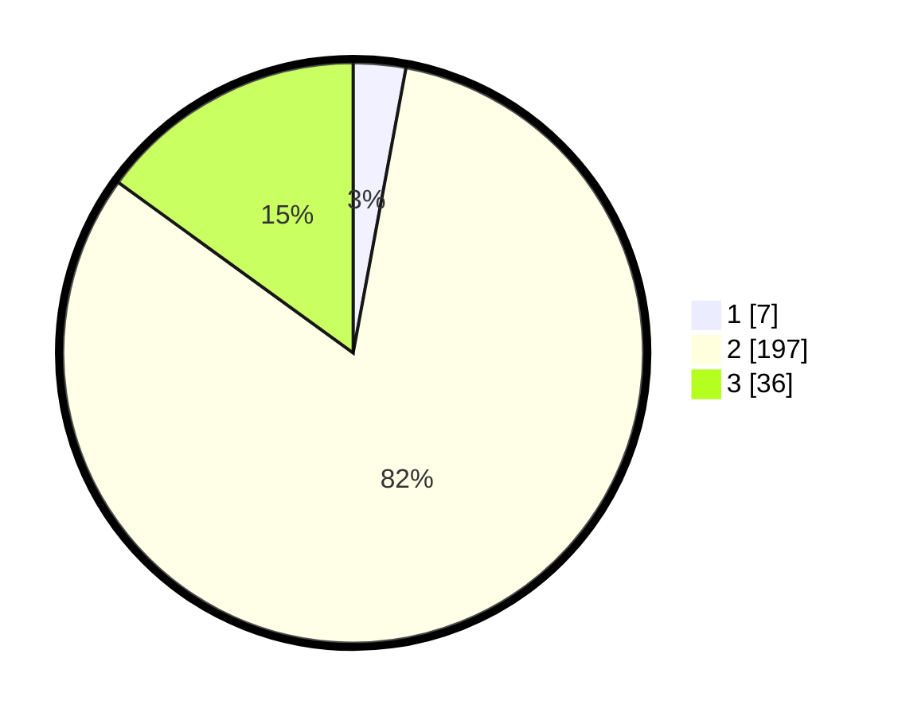

# Hasil

## Grafik

## Tabel

| No. | Nama Paslon    | Suara | Suara (raw) | Persentase |
|:--- |:-------------- | -----:| -----------:| ----------:|
| 1   | ANIES MUHAIMIN | 7     | [7][p-1]    | 2,92       |
| 2   | PRABOWO GIBRAN | 197   | [197][p-2]  | 82,08      |
| 3   | GANJAR MAHFUD  | 36    | [36][p-3]   | 15,00      |

[p-1]: https://github.com/gigit-pemilu/pemilu-2024-94-papua-tengah/blob/main/pilpres/hitung-suara/sub/94-papua-tengah/sub/01-nabire/sub/01-nabire/sub/1009-siriwini/sub/028-tps/sub/paslon-1.txt
[p-2]: https://github.com/gigit-pemilu/pemilu-2024-94-papua-tengah/blob/main/pilpres/hitung-suara/sub/94-papua-tengah/sub/01-nabire/sub/01-nabire/sub/1009-siriwini/sub/028-tps/sub/paslon-2.txt
[p-3]: https://github.com/gigit-pemilu/pemilu-2024-94-papua-tengah/blob/main/pilpres/hitung-suara/sub/94-papua-tengah/sub/01-nabire/sub/01-nabire/sub/1009-siriwini/sub/028-tps/sub/paslon-3.txt

## Foto C Plano

https://sirekap-obj-formc.kpu.go.id/d83a/pemilu/ppwp/94/01/01/10/09/9401011009028-20240214-220605--7d77cf3e-637b-479a-9916-a16bb673021a.jpg

https://sirekap-obj-formc.kpu.go.id/d83a/pemilu/ppwp/94/01/01/10/09/9401011009028-20240214-220649--ae53e6a8-5bea-451f-9386-04f57fe4b1be.jpg

https://sirekap-obj-formc.kpu.go.id/d83a/pemilu/ppwp/94/01/01/10/09/9401011009028-20240214-220728--9677e816-f69b-4ce9-93cb-c421ab1f8d40.jpg

## Metadata

| Key        | Value               |
| ---------- | ------------------- |
| Time Stamp | 2024-02-15 20:30:46 |

