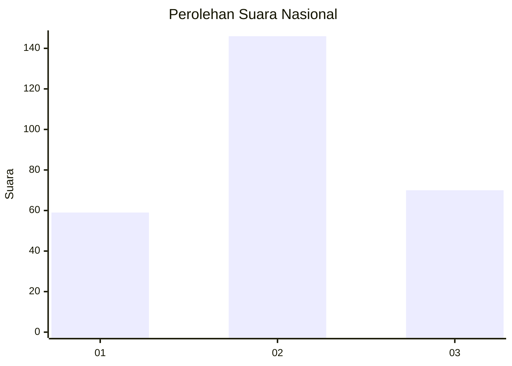
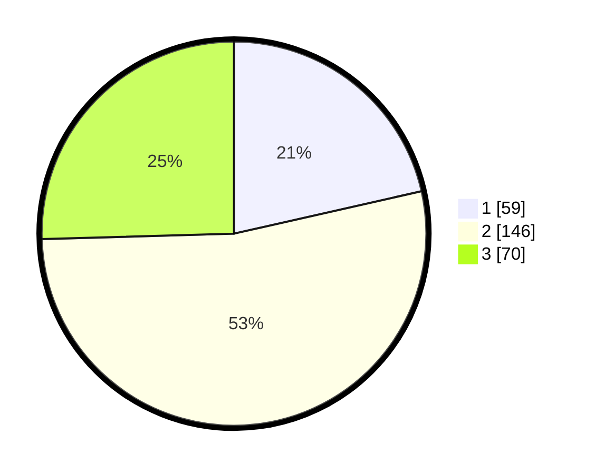

# Hasil

## Grafik

## Tabel

| No. | Nama Paslon    | Suara | Suara (raw) | Persentase |
|:--- |:-------------- | -----:| -----------:| ----------:|
| 1   | ANIES MUHAIMIN | 59    | [59][p-1]   | 21,45      |
| 2   | PRABOWO GIBRAN | 146   | [146][p-2]  | 53,09      |
| 3   | GANJAR MAHFUD  | 70    | [70][p-3]   | 25,45      |

[p-1]: https://github.com/gigit-pemilu/pemilu-2024/blob/main/pilpres/hitung-suara/sub/94-papua-tengah/sub/01-nabire/sub/01-nabire/sub/1009-siriwini/sub/032-tps/sub/paslon-1.txt
[p-2]: https://github.com/gigit-pemilu/pemilu-2024/blob/main/pilpres/hitung-suara/sub/94-papua-tengah/sub/01-nabire/sub/01-nabire/sub/1009-siriwini/sub/032-tps/sub/paslon-2.txt
[p-3]: https://github.com/gigit-pemilu/pemilu-2024/blob/main/pilpres/hitung-suara/sub/94-papua-tengah/sub/01-nabire/sub/01-nabire/sub/1009-siriwini/sub/032-tps/sub/paslon-3.txt

## Foto C Plano

https://sirekap-obj-formc.kpu.go.id/e620/pemilu/ppwp/94/01/01/10/09/9401011009032-20240215-062517--627035a1-6401-4945-80a6-5107d555caab.jpg

https://sirekap-obj-formc.kpu.go.id/e620/pemilu/ppwp/94/01/01/10/09/9401011009032-20240215-062709--69da3195-34fa-43cb-bfc7-4f423af3e909.jpg

https://sirekap-obj-formc.kpu.go.id/e620/pemilu/ppwp/94/01/01/10/09/9401011009032-20240215-185117--ddf6200b-e96f-402d-bcc8-67fba4be74a5.jpg

## Metadata

| Key        | Value               |
| ---------- | ------------------- |
| Time Stamp | 2024-02-15 22:00:27 |

