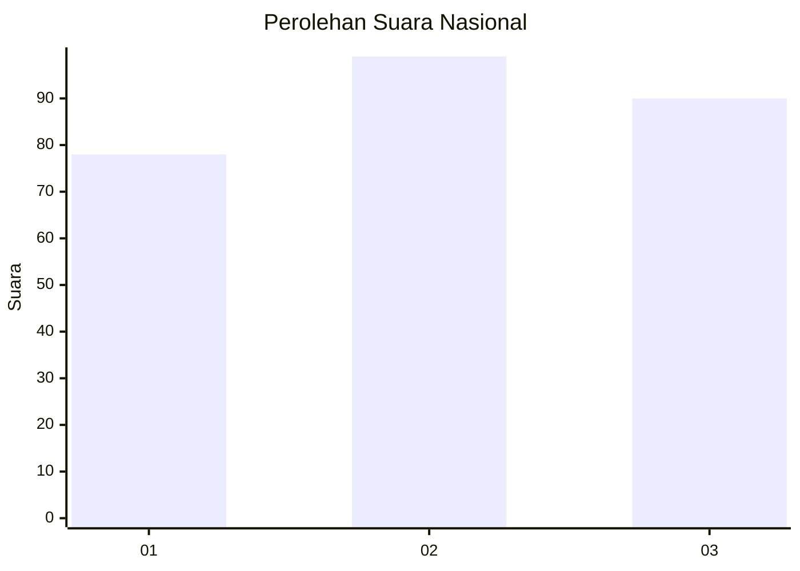
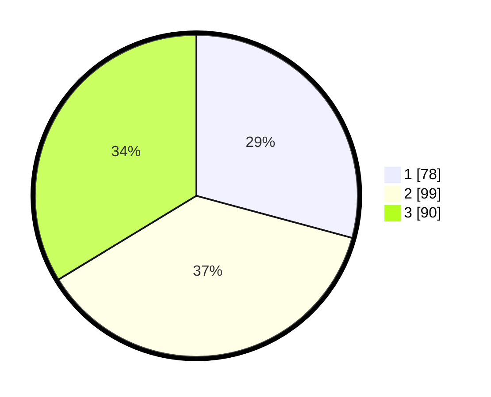

# Hasil

## Grafik

## Tabel

| No. | Nama Paslon    | Suara | Suara (raw) | Persentase |
|:--- |:-------------- | -----:| -----------:| ----------:|
| 1   | ANIES MUHAIMIN | 78    | [78][p-1]   | 29,21      |
| 2   | PRABOWO GIBRAN | 99    | [99][p-2]   | 37,08      |
| 3   | GANJAR MAHFUD  | 90    | [90][p-3]   | 33,71      |

[p-1]: https://github.com/gigit-pemilu/pemilu-2024/blob/main/pilpres/hitung-suara/sub/94-papua-tengah/sub/01-nabire/sub/01-nabire/sub/1009-siriwini/sub/034-tps/sub/paslon-1.txt
[p-2]: https://github.com/gigit-pemilu/pemilu-2024/blob/main/pilpres/hitung-suara/sub/94-papua-tengah/sub/01-nabire/sub/01-nabire/sub/1009-siriwini/sub/034-tps/sub/paslon-2.txt
[p-3]: https://github.com/gigit-pemilu/pemilu-2024/blob/main/pilpres/hitung-suara/sub/94-papua-tengah/sub/01-nabire/sub/01-nabire/sub/1009-siriwini/sub/034-tps/sub/paslon-3.txt

## Foto C Plano

https://sirekap-obj-formc.kpu.go.id/63bb/pemilu/ppwp/94/01/01/10/09/9401011009034-20240215-064246--21d8a4b9-7b26-48d7-a5c1-cfcd4e151479.jpg

https://sirekap-obj-formc.kpu.go.id/63bb/pemilu/ppwp/94/01/01/10/09/9401011009034-20240215-000346--f7e4e7cd-ed05-4aac-8223-14be01de11b5.jpg

https://sirekap-obj-formc.kpu.go.id/63bb/pemilu/ppwp/94/01/01/10/09/9401011009034-20240215-000638--8b646c23-5ba8-4b03-8e11-27997a42332f.jpg

## Metadata

| Key        | Value               |
| ---------- | ------------------- |
| Time Stamp | 2024-02-22 20:00:00 |

