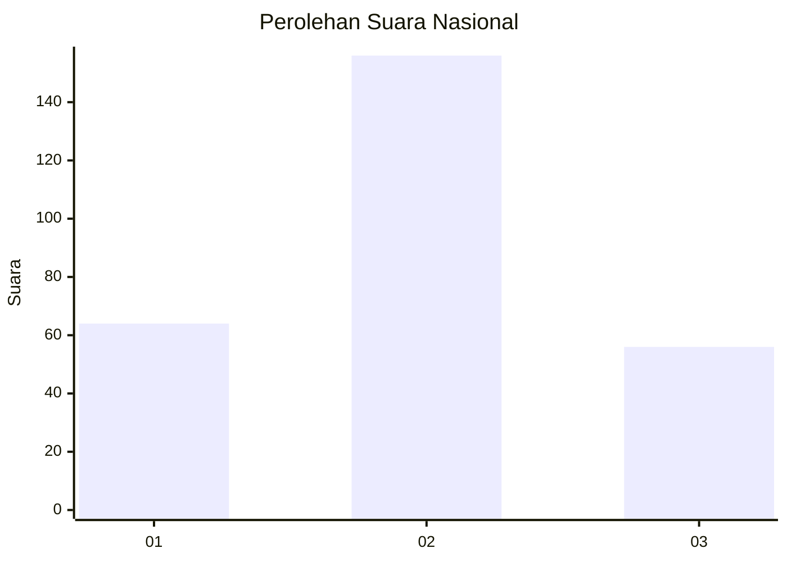
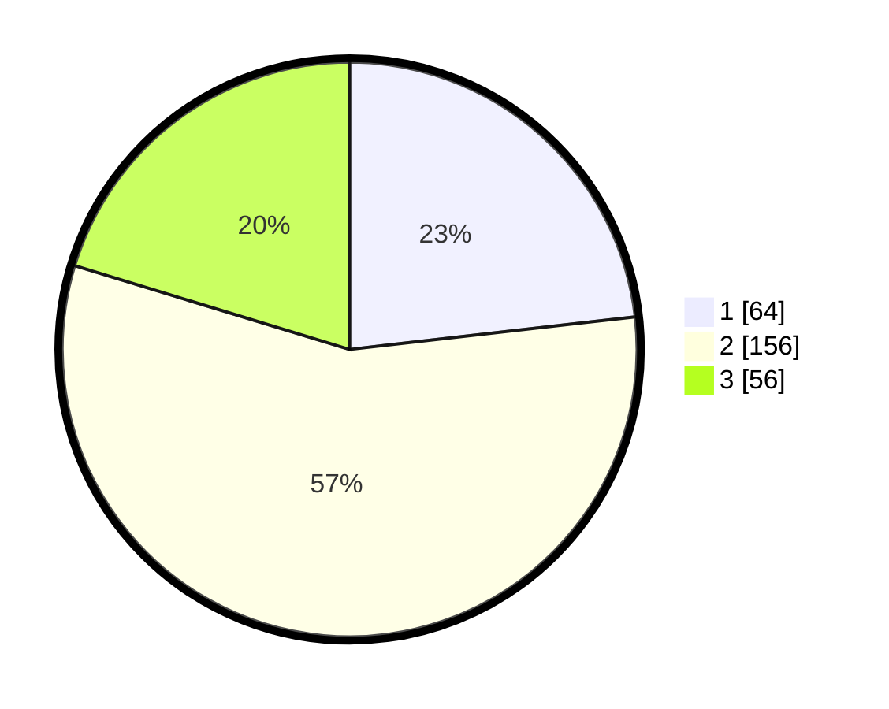

# Hasil

## Grafik

## Tabel

| No. | Nama Paslon    | Suara | Suara (raw) | Persentase |
|:--- |:-------------- | -----:| -----------:| ----------:|
| 1   | ANIES MUHAIMIN | 64    | [64][p-1]   | 23,19      |
| 2   | PRABOWO GIBRAN | 156   | [156][p-2]  | 56,52      |
| 3   | GANJAR MAHFUD  | 56    | [56][p-3]   | 20,29      |

[p-1]: https://github.com/gigit-pemilu/pemilu-2024/blob/main/pilpres/hitung-suara/sub/94-papua-tengah/sub/01-nabire/sub/01-nabire/sub/1009-siriwini/sub/036-tps/sub/paslon-1.txt
[p-2]: https://github.com/gigit-pemilu/pemilu-2024/blob/main/pilpres/hitung-suara/sub/94-papua-tengah/sub/01-nabire/sub/01-nabire/sub/1009-siriwini/sub/036-tps/sub/paslon-2.txt
[p-3]: https://github.com/gigit-pemilu/pemilu-2024/blob/main/pilpres/hitung-suara/sub/94-papua-tengah/sub/01-nabire/sub/01-nabire/sub/1009-siriwini/sub/036-tps/sub/paslon-3.txt

## Foto C Plano

https://sirekap-obj-formc.kpu.go.id/bfd0/pemilu/ppwp/94/01/01/10/09/9401011009036-20240216-133738--24c8c314-a2ed-477e-ae3b-a817ff3ca3bd.jpg

https://sirekap-obj-formc.kpu.go.id/bfd0/pemilu/ppwp/94/01/01/10/09/9401011009036-20240216-133740--acf1a3e4-8d7c-451b-b73b-201cadeea8b0.jpg

https://sirekap-obj-formc.kpu.go.id/bfd0/pemilu/ppwp/94/01/01/10/09/9401011009036-20240216-133739--164f6977-4bbe-4ea0-8427-60c86eda0fdd.jpg

## Metadata

| Key        | Value               |
| ---------- | ------------------- |
| Time Stamp | 2024-02-17 00:28:35 |

## DATA PEMILIH TETAP

Jumlah pemilih dalam DPT: **294**.
 * L: **156**.
 * P: **138**.

## DATA PENGGUNA HAK PILIH

Jumlah pengguna hak pilih dalam DPT: **294**.
 * L: **156**.
 * P: **138**.

Jumlah pengguna hak pilih dalam DPTb: **0**.
 * L: **0**.
 * P: **0**.

Jumlah pengguna hak pilih dalam DPK: **0**.
 * L: **0**.
 * P: **0**.

Jumlah pengguna hak pilih: **294**.
 * L: **156**.
 * P: **138**.

## JUMLAH SUARA SAH DAN TIDAK SAH

JUMLAH SELURUH SUARA SAH: **276**.

JUMLAH SUARA TIDAK SAH: **18**.

JUMLAH SELURUH SUARA SAH DAN SUARA TIDAK SAH: **294**.

