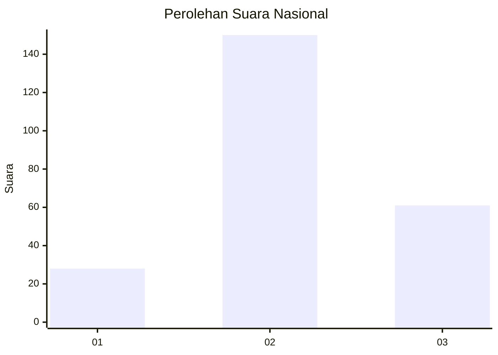
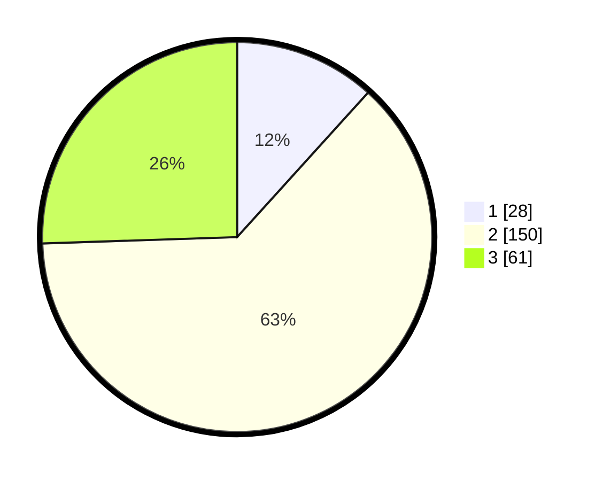

# Hasil

## Grafik

## Tabel

| No. | Nama Paslon    | Suara | Suara (raw) | Persentase |
|:--- |:-------------- | -----:| -----------:| ----------:|
| 1   | ANIES MUHAIMIN | 28    | [28][p-1]   | 11,72      |
| 2   | PRABOWO GIBRAN | 150   | [150][p-2]  | 62,76      |
| 3   | GANJAR MAHFUD  | 61    | [61][p-3]   | 25,52      |

[p-1]: https://github.com/gigit-pemilu/pemilu-2024/blob/main/pilpres/hitung-suara/sub/94-papua-tengah/sub/01-nabire/sub/01-nabire/sub/2010-kalisusu/sub/001-tps/sub/paslon-1.txt
[p-2]: https://github.com/gigit-pemilu/pemilu-2024/blob/main/pilpres/hitung-suara/sub/94-papua-tengah/sub/01-nabire/sub/01-nabire/sub/2010-kalisusu/sub/001-tps/sub/paslon-2.txt
[p-3]: https://github.com/gigit-pemilu/pemilu-2024/blob/main/pilpres/hitung-suara/sub/94-papua-tengah/sub/01-nabire/sub/01-nabire/sub/2010-kalisusu/sub/001-tps/sub/paslon-3.txt

## Foto C Plano

https://sirekap-obj-formc.kpu.go.id/eb1a/pemilu/ppwp/94/01/01/20/10/9401012010001-20240216-155038--833dddcc-8a73-4e72-950d-1f85417d12c0.jpg

https://sirekap-obj-formc.kpu.go.id/eb1a/pemilu/ppwp/94/01/01/20/10/9401012010001-20240216-155039--b939b7fc-4cb3-4993-a72e-c3d610ba43c6.jpg

https://sirekap-obj-formc.kpu.go.id/eb1a/pemilu/ppwp/94/01/01/20/10/9401012010001-20240216-155038--0529906e-50d6-4e93-87e3-70e5fc0889ed.jpg

## Metadata

| Key        | Value               |
| ---------- | ------------------- |
| Time Stamp | 2024-02-17 00:28:35 |

## DATA PEMILIH TETAP

Jumlah pemilih dalam DPT: **299**.
 * L: **150**.
 * P: **149**.

## DATA PENGGUNA HAK PILIH

Jumlah pengguna hak pilih dalam DPT: **0**.
 * L: **0**.
 * P: **0**.

Jumlah pengguna hak pilih dalam DPTb: **0**.
 * L: **0**.
 * P: **0**.

Jumlah pengguna hak pilih dalam DPK: **0**.
 * L: **0**.
 * P: **0**.

Jumlah pengguna hak pilih: **0**.
 * L: **0**.
 * P: **0**.

## JUMLAH SUARA SAH DAN TIDAK SAH

JUMLAH SELURUH SUARA SAH: **239**.

JUMLAH SUARA TIDAK SAH: **10**.

JUMLAH SELURUH SUARA SAH DAN SUARA TIDAK SAH: **249**.

