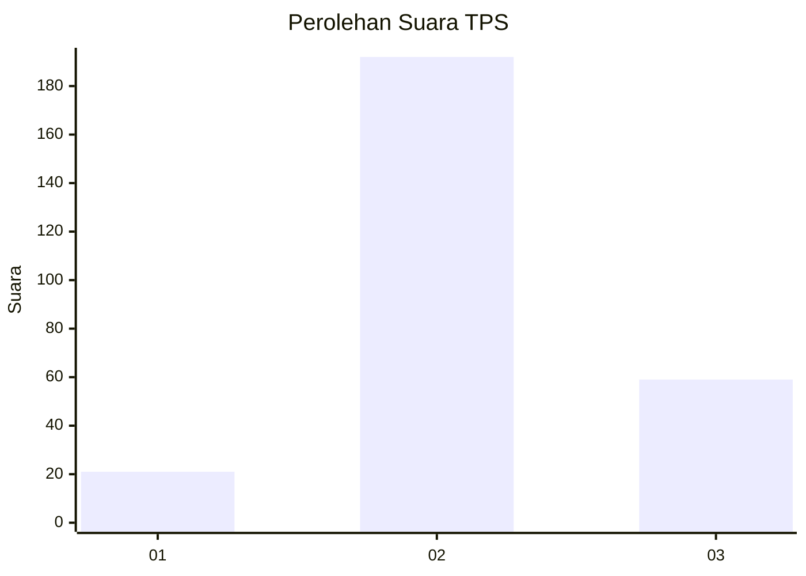
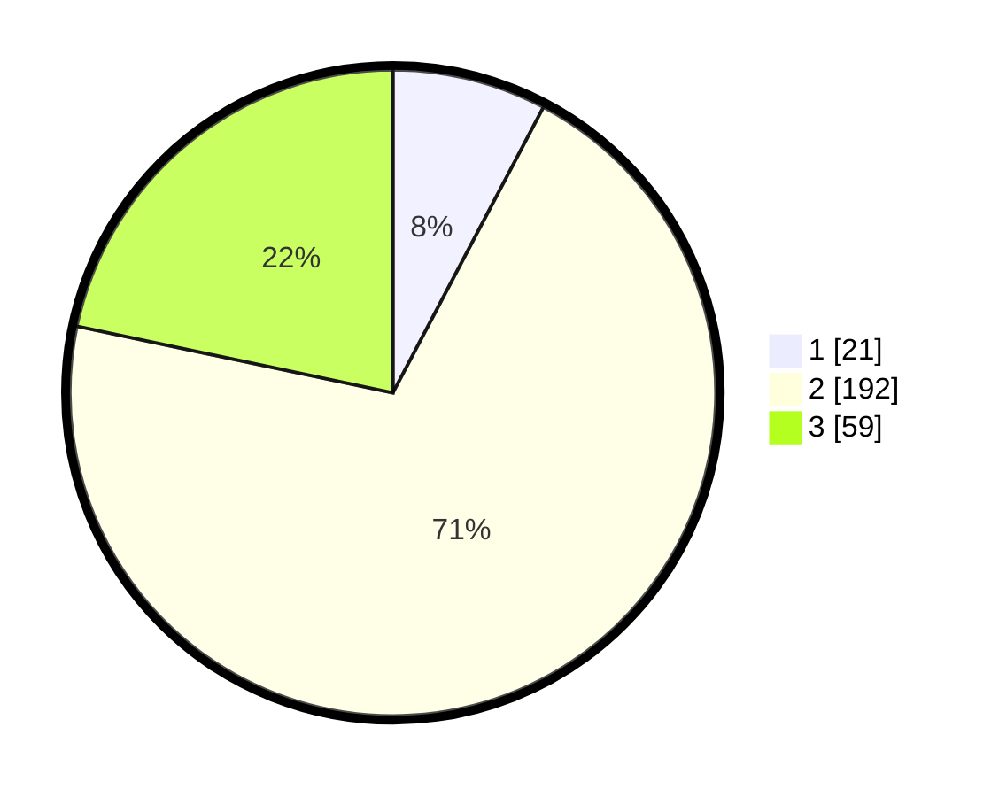

# Hasil

## Grafik

## Tabel

| No. | Nama Paslon    | Suara | Suara (raw) | Persentase |
|:--- |:-------------- | -----:| -----------:| ----------:|
| 1   | ANIES MUHAIMIN | 21    | [21][p-1]   | 7,72       |
| 2   | PRABOWO GIBRAN | 192   | [192][p-2]  | 70,59      |
| 3   | GANJAR MAHFUD  | 59    | [59][p-3]   | 21,69      |

[p-1]: https://github.com/gigit-pemilu/pemilu-2024-94-papua-tengah/blob/main/pilpres/hitung-suara/sub/94-papua-tengah/sub/01-nabire/sub/01-nabire/sub/2010-kalisusu/sub/004-tps/sub/paslon-1.txt
[p-2]: https://github.com/gigit-pemilu/pemilu-2024-94-papua-tengah/blob/main/pilpres/hitung-suara/sub/94-papua-tengah/sub/01-nabire/sub/01-nabire/sub/2010-kalisusu/sub/004-tps/sub/paslon-2.txt
[p-3]: https://github.com/gigit-pemilu/pemilu-2024-94-papua-tengah/blob/main/pilpres/hitung-suara/sub/94-papua-tengah/sub/01-nabire/sub/01-nabire/sub/2010-kalisusu/sub/004-tps/sub/paslon-3.txt

## Foto C Plano

https://sirekap-obj-formc.kpu.go.id/2734/pemilu/ppwp/94/01/01/20/10/9401012010004-20240216-140710--029638c7-2a7e-4f62-8af6-7518879065f1.jpg

https://sirekap-obj-formc.kpu.go.id/2734/pemilu/ppwp/94/01/01/20/10/9401012010004-20240216-140711--cd2badbb-bcf3-4fb2-b9e4-5a027a56fcfa.jpg

https://sirekap-obj-formc.kpu.go.id/2734/pemilu/ppwp/94/01/01/20/10/9401012010004-20240216-140710--26130733-6b44-440d-898e-21144d5cb191.jpg

## Metadata

| Key        | Value               |
| ---------- | ------------------- |
| Time Stamp | 2024-02-17 00:28:35 |

## DATA PEMILIH TETAP

Jumlah pemilih dalam DPT: **275**.
 * L: **150**.
 * P: **125**.

## DATA PENGGUNA HAK PILIH

Jumlah pengguna hak pilih dalam DPT: **269**.
 * L: **147**.
 * P: **122**.

Jumlah pengguna hak pilih dalam DPTb: **2**.
 * L: **2**.
 * P: **0**.

Jumlah pengguna hak pilih dalam DPK: **2**.
 * L: **1**.
 * P: **1**.

Jumlah pengguna hak pilih: **273**.
 * L: **150**.
 * P: **123**.

## JUMLAH SUARA SAH DAN TIDAK SAH

JUMLAH SELURUH SUARA SAH: **272**.

JUMLAH SUARA TIDAK SAH: **1**.

JUMLAH SELURUH SUARA SAH DAN SUARA TIDAK SAH: **273**.

