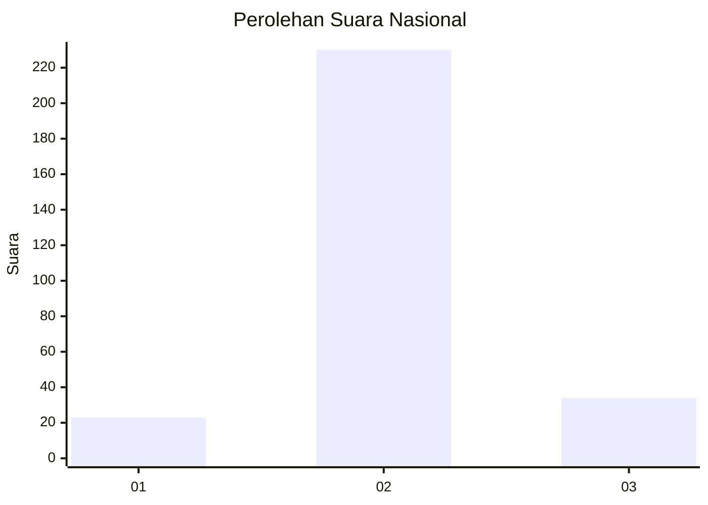
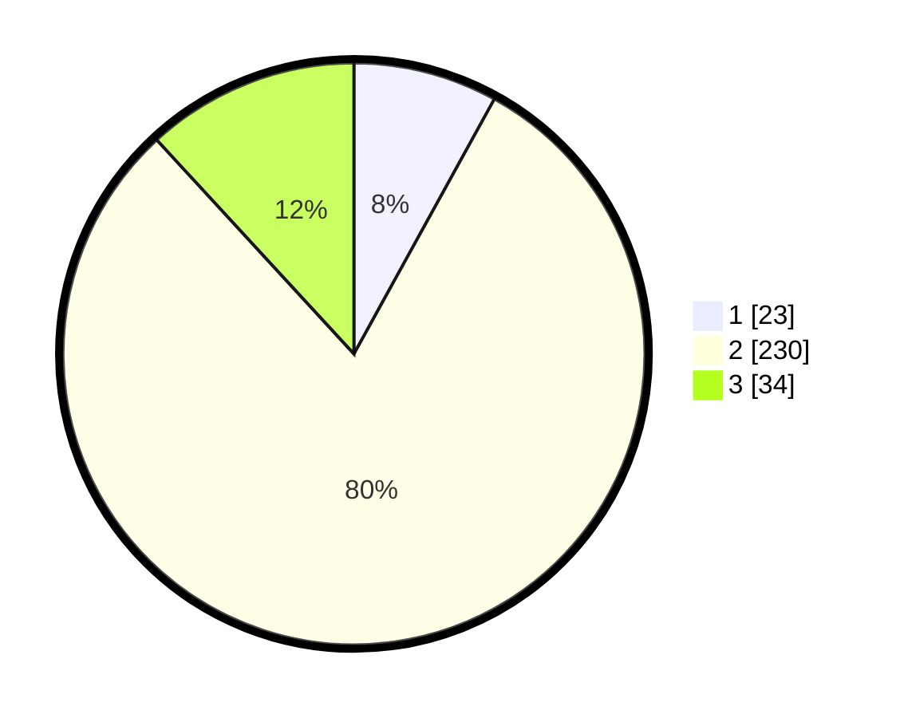

# Hasil

## Grafik

## Tabel

| No. | Nama Paslon    | Suara | Suara (raw) | Persentase |
|:--- |:-------------- | -----:| -----------:| ----------:|
| 1   | ANIES MUHAIMIN | 23    | [23][p-1]   | 8,01       |
| 2   | PRABOWO GIBRAN | 230   | [230][p-2]  | 80,14      |
| 3   | GANJAR MAHFUD  | 34    | [34][p-3]   | 11,85      |

[p-1]: https://github.com/gigit-pemilu/pemilu-2024/blob/main/pilpres/hitung-suara/sub/94-papua-tengah/sub/01-nabire/sub/01-nabire/sub/2010-kalisusu/sub/006-tps/sub/paslon-1.txt
[p-2]: https://github.com/gigit-pemilu/pemilu-2024/blob/main/pilpres/hitung-suara/sub/94-papua-tengah/sub/01-nabire/sub/01-nabire/sub/2010-kalisusu/sub/006-tps/sub/paslon-2.txt
[p-3]: https://github.com/gigit-pemilu/pemilu-2024/blob/main/pilpres/hitung-suara/sub/94-papua-tengah/sub/01-nabire/sub/01-nabire/sub/2010-kalisusu/sub/006-tps/sub/paslon-3.txt

## Foto C Plano

https://sirekap-obj-formc.kpu.go.id/4a15/pemilu/ppwp/94/01/01/20/10/9401012010006-20240217-064029--60df7f9c-e8f7-4176-9054-7d8892f6cfab.jpg

https://sirekap-obj-formc.kpu.go.id/4a15/pemilu/ppwp/94/01/01/20/10/9401012010006-20240217-064030--d11e3347-34f0-47da-8a34-9eb19c621419.jpg

https://sirekap-obj-formc.kpu.go.id/4a15/pemilu/ppwp/94/01/01/20/10/9401012010006-20240217-064029--c4bb2c98-689b-4081-91fc-d4eb5bb74324.jpg

## Metadata

| Key        | Value               |
| ---------- | ------------------- |
| Time Stamp | 2024-02-17 09:30:03 |

## DATA PEMILIH TETAP

Jumlah pemilih dalam DPT: **296**.
 * L: **144**.
 * P: **152**.

## DATA PENGGUNA HAK PILIH

Jumlah pengguna hak pilih dalam DPT: **290**.
 * L: **140**.
 * P: **150**.

Jumlah pengguna hak pilih dalam DPTb: **0**.
 * L: **0**.
 * P: **0**.

Jumlah pengguna hak pilih dalam DPK: **0**.
 * L: **0**.
 * P: **0**.

Jumlah pengguna hak pilih: **290**.
 * L: **140**.
 * P: **150**.

## JUMLAH SUARA SAH DAN TIDAK SAH

JUMLAH SELURUH SUARA SAH: **287**.

JUMLAH SUARA TIDAK SAH: **3**.

JUMLAH SELURUH SUARA SAH DAN SUARA TIDAK SAH: **290**.

