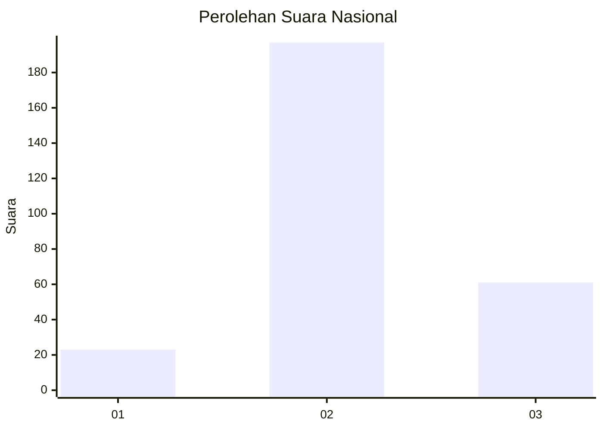
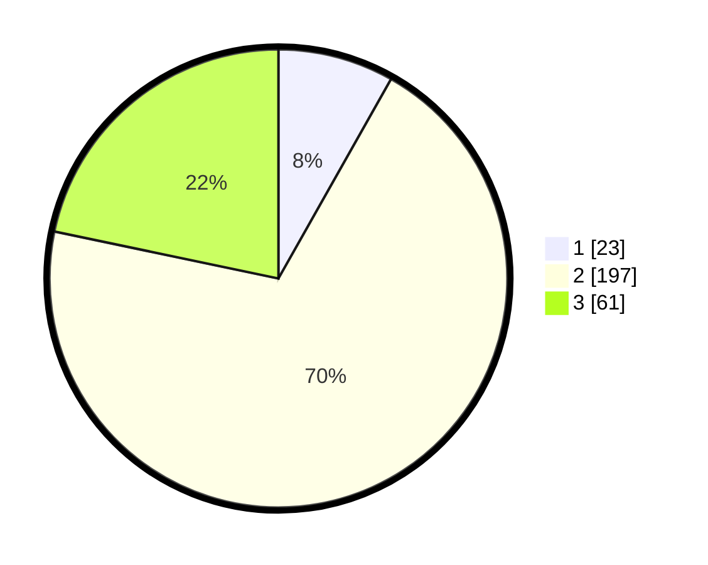

# Hasil

## Grafik

## Tabel

| No. | Nama Paslon    | Suara | Suara (raw) | Persentase |
|:--- |:-------------- | -----:| -----------:| ----------:|
| 1   | ANIES MUHAIMIN | 23    | [23][p-1]   | 8,19       |
| 2   | PRABOWO GIBRAN | 197   | [197][p-2]  | 70,11      |
| 3   | GANJAR MAHFUD  | 61    | [61][p-3]   | 21,71      |

[p-1]: https://github.com/gigit-pemilu/pemilu-2024/blob/main/pilpres/hitung-suara/sub/94-papua-tengah/sub/01-nabire/sub/01-nabire/sub/2010-kalisusu/sub/007-tps/sub/paslon-1.txt
[p-2]: https://github.com/gigit-pemilu/pemilu-2024/blob/main/pilpres/hitung-suara/sub/94-papua-tengah/sub/01-nabire/sub/01-nabire/sub/2010-kalisusu/sub/007-tps/sub/paslon-2.txt
[p-3]: https://github.com/gigit-pemilu/pemilu-2024/blob/main/pilpres/hitung-suara/sub/94-papua-tengah/sub/01-nabire/sub/01-nabire/sub/2010-kalisusu/sub/007-tps/sub/paslon-3.txt

## Foto C Plano

https://sirekap-obj-formc.kpu.go.id/b62b/pemilu/ppwp/94/01/01/20/10/9401012010007-20240216-102005--dc057cea-4a2f-4dc5-8fa5-eac7e015a2ff.jpg

https://sirekap-obj-formc.kpu.go.id/b62b/pemilu/ppwp/94/01/01/20/10/9401012010007-20240216-102010--a9b05243-93da-4e68-b04d-7c386a8aedc3.jpg

https://sirekap-obj-formc.kpu.go.id/b62b/pemilu/ppwp/94/01/01/20/10/9401012010007-20240216-102007--d87190f5-46c1-4d58-a9d1-9c0ec65bdd2d.jpg

## Metadata

| Key        | Value               |
| ---------- | ------------------- |
| Time Stamp | 2024-02-17 00:28:35 |

## DATA PEMILIH TETAP

Jumlah pemilih dalam DPT: **297**.
 * L: **160**.
 * P: **137**.

## DATA PENGGUNA HAK PILIH

Jumlah pengguna hak pilih dalam DPT: **290**.
 * L: **155**.
 * P: **135**.

Jumlah pengguna hak pilih dalam DPTb: **2**.
 * L: **0**.
 * P: **2**.

Jumlah pengguna hak pilih dalam DPK: **0**.
 * L: **0**.
 * P: **0**.

Jumlah pengguna hak pilih: **292**.
 * L: **156**.
 * P: **138**.

## JUMLAH SUARA SAH DAN TIDAK SAH

JUMLAH SELURUH SUARA SAH: **281**.

JUMLAH SUARA TIDAK SAH: **11**.

JUMLAH SELURUH SUARA SAH DAN SUARA TIDAK SAH: **292**.

