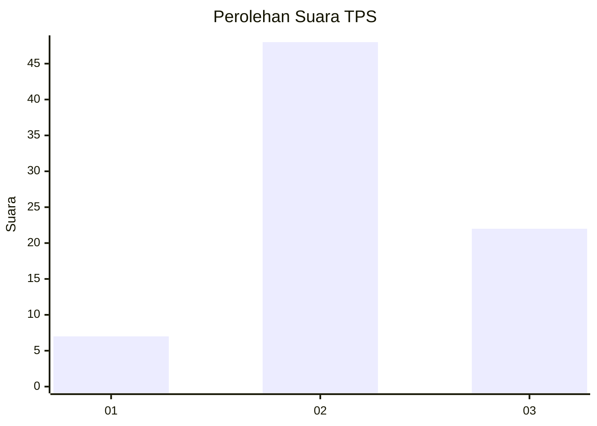
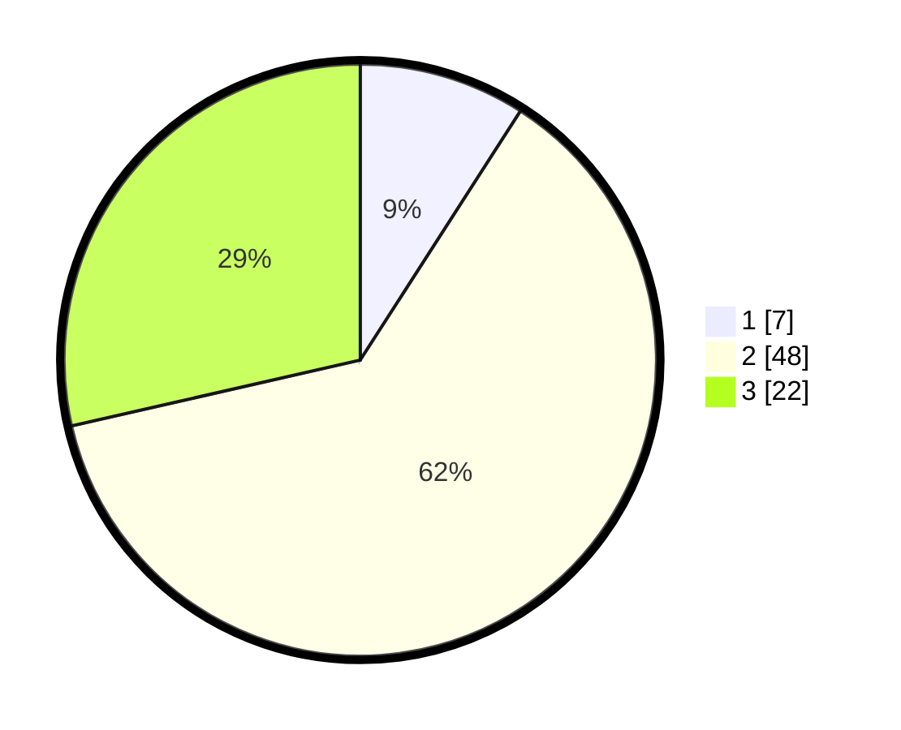

# Hasil

## Grafik

## Tabel

| No. | Nama Paslon    | Suara | Suara (raw) | Persentase |
|:--- |:-------------- | -----:| -----------:| ----------:|
| 1   | ANIES MUHAIMIN | 7     | [7][p-1]    | 9,09       |
| 2   | PRABOWO GIBRAN | 48    | [48][p-2]   | 62,34      |
| 3   | GANJAR MAHFUD  | 22    | [22][p-3]   | 28,57      |

[p-1]: https://github.com/gigit-pemilu/pemilu-2024-94-papua-tengah/blob/main/pilpres/hitung-suara/sub/94-papua-tengah/sub/01-nabire/sub/01-nabire/sub/2010-kalisusu/sub/010-tps/sub/paslon-1.txt
[p-2]: https://github.com/gigit-pemilu/pemilu-2024-94-papua-tengah/blob/main/pilpres/hitung-suara/sub/94-papua-tengah/sub/01-nabire/sub/01-nabire/sub/2010-kalisusu/sub/010-tps/sub/paslon-2.txt
[p-3]: https://github.com/gigit-pemilu/pemilu-2024-94-papua-tengah/blob/main/pilpres/hitung-suara/sub/94-papua-tengah/sub/01-nabire/sub/01-nabire/sub/2010-kalisusu/sub/010-tps/sub/paslon-3.txt

## Foto C Plano

https://sirekap-obj-formc.kpu.go.id/5604/pemilu/ppwp/94/01/01/20/10/9401012010010-20240216-134335--0c6474ab-61b4-45df-85e4-5e8d142898f4.jpg

https://sirekap-obj-formc.kpu.go.id/5604/pemilu/ppwp/94/01/01/20/10/9401012010010-20240216-134337--46ea714f-1c68-4223-8f2c-7b038b99d049.jpg

https://sirekap-obj-formc.kpu.go.id/5604/pemilu/ppwp/94/01/01/20/10/9401012010010-20240216-134336--ad3e7b06-fc87-42d7-9c90-fe9627157ec5.jpg

## Metadata

| Key        | Value               |
| ---------- | ------------------- |
| Time Stamp | 2024-02-17 00:28:35 |

## DATA PEMILIH TETAP

Jumlah pemilih dalam DPT: **75**.
 * L: **36**.
 * P: **39**.

## DATA PENGGUNA HAK PILIH

Jumlah pengguna hak pilih dalam DPT: **75**.
 * L: **36**.
 * P: **39**.

Jumlah pengguna hak pilih dalam DPTb: **2**.
 * L: **0**.
 * P: **2**.

Jumlah pengguna hak pilih dalam DPK: **0**.
 * L: **0**.
 * P: **0**.

Jumlah pengguna hak pilih: **77**.
 * L: **36**.
 * P: **41**.

## JUMLAH SUARA SAH DAN TIDAK SAH

JUMLAH SELURUH SUARA SAH: **77**.

JUMLAH SUARA TIDAK SAH: **0**.

JUMLAH SELURUH SUARA SAH DAN SUARA TIDAK SAH: **77**.

